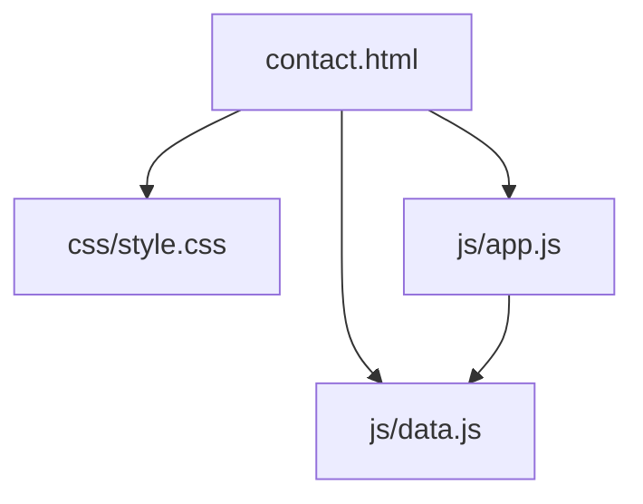
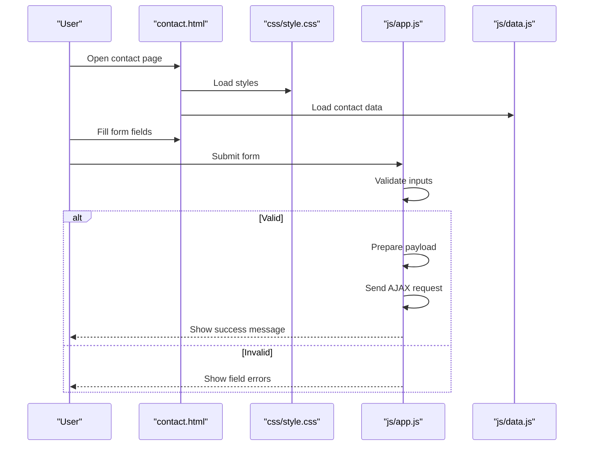
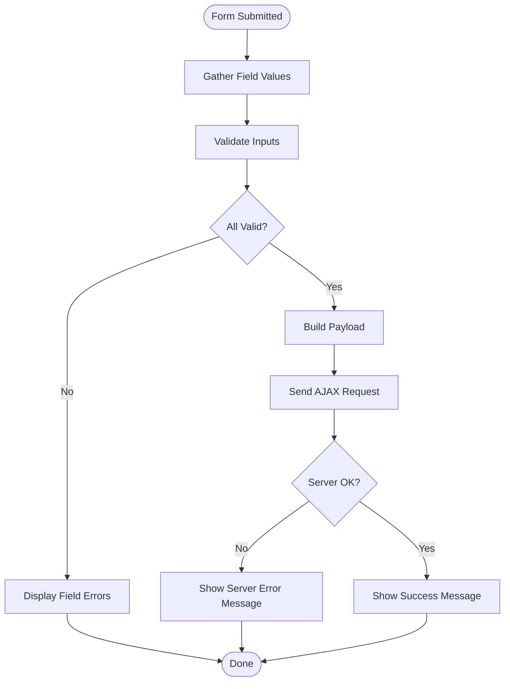
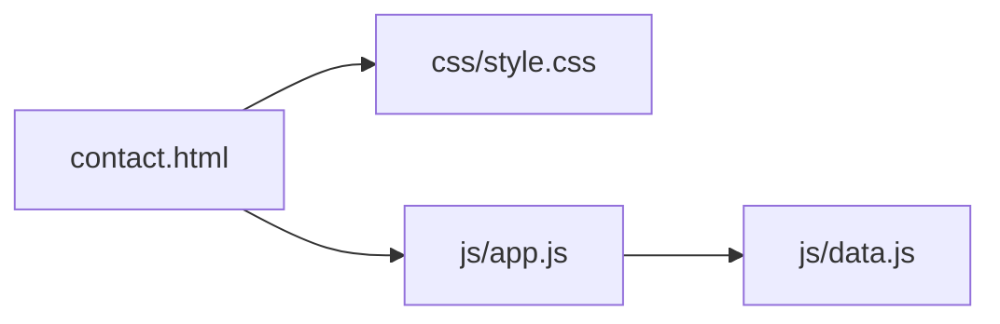

# Contact Page Documentation

<cite>
**Referenced Files in This Document**
- [contact.html](file://contact.html)
- [style.css](file://css/style.css)
- [app.js](file://js/app.js)
- [data.js](file://js/data.js)
</cite>

## Table of Contents
1. [Introduction](#introduction)
2. [Project Structure](#project-structure)
3. [Core Components](#core-components)
4. [Architecture Overview](#architecture-overview)
5. [Detailed Component Analysis](#detailed-component-analysis)
6. [Dependency Analysis](#dependency-analysis)
7. [Performance Considerations](#performance-considerations)
8. [Troubleshooting Guide](#troubleshooting-guide)
9. [Conclusion](#conclusion)
10. [Appendices](#appendices)

## Introduction
This document provides comprehensive documentation for the contact page, focusing on the contact form implementation, location information display, and social media integration. It explains the HTML structure, validation attributes, submission handling, CSS styling for form elements and feedback states, and JavaScript functionality for validation, AJAX submission, and user feedback. It also includes customization guidelines, examples of common modifications, security considerations, spam prevention measures, and accessibility compliance recommendations.

## Project Structure
The contact page is implemented as a standalone HTML file with associated CSS and JavaScript assets:
- contact.html: The main markup for the contact page, including the form, location details, and social links.
- css/style.css: Styles for the contact page, including form layout, error/success states, and responsive design.
- js/app.js: Client-side logic for form validation, AJAX submission, and user feedback.
- js/data.js: Static data used by the page (e.g., contact details, social links).

**Diagram sources**
- [contact.html](file://contact.html)
- [style.css](file://css/style.css)
- [app.js](file://js/app.js)
- [data.js](file://js/data.js)

**Section sources**
- [contact.html](file://contact.html)
- [style.css](file://css/style.css)
- [app.js](file://js/app.js)
- [data.js](file://js/data.js)

## Core Components
- Contact Form
  - Fields include name, email, subject, and message.
  - Uses HTML5 validation attributes to enforce required fields and email format.
  - Submission is handled via JavaScript to prevent default form behavior and perform AJAX submission.
- Location Information Display
  - Displays address, phone number, and business hours.
  - Data sourced from static data module for consistency across pages.
- Social Media Integration
  - Links to social profiles are rendered using icons and URLs defined in the data module.
  - Includes accessible labels and target attributes for external links.

Key responsibilities:
- HTML defines semantic structure and accessibility attributes.
- CSS styles form elements, error/success messages, and responsive layout.
- JavaScript validates inputs, submits data via AJAX, and updates UI feedback.

**Section sources**
- [contact.html](file://contact.html)
- [style.css](file://css/style.css)
- [app.js](file://js/app.js)
- [data.js](file://js/data.js)

## Architecture Overview
The contact page follows a simple client-side architecture:
- Markup layer (HTML) renders the form and content.
- Presentation layer (CSS) styles the interface and feedback states.
- Behavior layer (JavaScript) handles validation, submission, and dynamic updates.
- Data layer (static JSON-like module) supplies contact details and social links.

**Diagram sources**
- [contact.html](file://contact.html)
- [style.css](file://css/style.css)
- [app.js](file://js/app.js)
- [data.js](file://js/data.js)

## Detailed Component Analysis

### Contact Form Implementation
- HTML Structure
  - Semantic form element with labeled inputs.
  - Required attributes ensure basic browser validation.
  - Input types include text, email, and textarea for appropriate keyboards and validation hints.
- Validation Attributes
  - Required fields marked with required attribute.
  - Email input uses type="email" for built-in format validation.
  - Custom validation rules can be added in JavaScript for stricter checks.
- Submission Handling
  - Prevents default form submission.
  - Gathers values from inputs, validates them, and constructs a payload.
  - Sends an AJAX POST request to a server endpoint.
  - Updates UI with success or error messages based on response.

**Diagram sources**
- [contact.html](file://contact.html)
- [app.js](file://js/app.js)

**Section sources**
- [contact.html](file://contact.html)
- [app.js](file://js/app.js)

### Location Information Display
- Data Source
  - Address, phone, and hours are loaded from the data module.
- Rendering
  - DOM elements are updated with data values at page load.
- Accessibility
  - Uses descriptive headings and lists for screen readers.
  - Ensures proper heading hierarchy and semantic tags.

**Section sources**
- [contact.html](file://contact.html)
- [data.js](file://js/data.js)

### Social Media Integration
- Data Source
  - Social profile URLs and labels are defined in the data module.
- Rendering
  - Icons and links are generated dynamically or pre-rendered with data attributes.
- Accessibility
  - Each link has meaningful aria-labels and rel attributes for external sites.

**Section sources**
- [contact.html](file://contact.html)
- [data.js](file://js/data.js)

### CSS Styling for Forms and Feedback
- Form Elements
  - Consistent spacing, typography, and focus styles for usability.
  - Responsive layout adapts to mobile screens.
- Error States
  - Visual indicators (e.g., borders, colors) for invalid fields.
  - Inline error messages displayed near relevant inputs.
- Success Messages
  - Global success banner shown after successful submission.
  - Clear dismissal options for user control.

**Section sources**
- [style.css](file://css/style.css)

### JavaScript Functionality
- Validation
  - Checks required fields and formats before submission.
  - Provides immediate feedback on invalid inputs.
- AJAX Submission
  - Uses fetch or XMLHttpRequest to send data asynchronously.
  - Handles loading state during submission.
- User Feedback
  - Shows inline errors and global success/error banners.
  - Resets form on successful submission.

**Section sources**
- [app.js](file://js/app.js)

## Dependency Analysis
The contact page depends on CSS and JS assets and reads static data from a shared module.

**Diagram sources**
- [contact.html](file://contact.html)
- [style.css](file://css/style.css)
- [app.js](file://js/app.js)
- [data.js](file://js/data.js)

**Section sources**
- [contact.html](file://contact.html)
- [style.css](file://css/style.css)
- [app.js](file://js/app.js)
- [data.js](file://js/data.js)

## Performance Considerations
- Minimize reflows by batching DOM updates when rendering multiple fields.
- Debounce any real-time validation that triggers on input events.
- Use efficient selectors and avoid heavy computations in event handlers.
- Cache references to frequently accessed DOM nodes.
- Ensure images/icons are optimized and use modern formats where possible.

[No sources needed since this section provides general guidance]

## Troubleshooting Guide
- Form does not submit
  - Check console for network errors and verify the server endpoint URL.
  - Ensure the AJAX call is not blocked by CORS policies.
- Validation not working
  - Confirm all required attributes are present and IDs match selectors.
  - Verify custom validation functions are attached to the correct events.
- Error/success messages not showing
  - Inspect CSS classes applied to feedback elements.
  - Ensure DOM elements exist before attempting to update them.
- Data not displaying
  - Verify the data module exports the expected keys.
  - Check for typos in property names used to render content.

**Section sources**
- [app.js](file://js/app.js)
- [style.css](file://css/style.css)
- [data.js](file://js/data.js)

## Conclusion
The contact page combines semantic HTML, accessible markup, robust CSS styling, and client-side JavaScript to deliver a user-friendly experience. By following the customization guidelines and adhering to security and accessibility best practices, you can extend and maintain the page effectively.

[No sources needed since this section summarizes without analyzing specific files]

## Appendices

### Customization Guidelines
- Modify Form Fields
  - Add new inputs in the HTML form with appropriate labels and attributes.
  - Update validation logic in JavaScript to handle new fields.
  - Add corresponding CSS styles if needed.
- Update Contact Information
  - Edit the data module to change address, phone, and hours.
  - Re-render the page or refresh to see changes.
- Integrate With Email Services
  - Replace the current AJAX endpoint with your service’s API URL.
  - Handle authentication headers and response parsing as required.
- Customize Validation Rules
  - Extend the validation function to include regex patterns or length constraints.
  - Provide clear error messages tied to each field.

**Section sources**
- [contact.html](file://contact.html)
- [app.js](file://js/app.js)
- [style.css](file://css/style.css)
- [data.js](file://js/data.js)

### Examples of Common Modifications
- Adding a New Form Field
  - Insert a new input element with a label and id.
  - Include it in the validation routine and payload builder.
  - Style the new field consistently with existing inputs.
- Updating Contact Details
  - Change values in the data module for address, phone, and hours.
  - Ensure the rendering code matches the updated structure.
- Integrating Third-Party Services
  - Configure the AJAX call to post to the third-party endpoint.
  - Map form fields to the service’s expected schema.
  - Handle success and error responses appropriately.
- Customizing Form Styling
  - Adjust CSS variables or class definitions for colors, spacing, and typography.
  - Maintain focus states and contrast ratios for accessibility.

**Section sources**
- [contact.html](file://contact.html)
- [app.js](file://js/app.js)
- [style.css](file://css/style.css)
- [data.js](file://js/data.js)

### Security Considerations
- CSRF Protection
  - Include anti-CSRF tokens in requests if supported by your backend.
- Input Sanitization
  - Validate and sanitize inputs on both client and server sides.
- HTTPS Enforcement
  - Serve the contact page over HTTPS to protect data in transit.
- Rate Limiting
  - Implement rate limiting on the server to mitigate abuse.
- Content Security Policy
  - Restrict allowed sources for scripts and forms to reduce XSS risks.

[No sources needed since this section provides general guidance]

### Spam Prevention Measures
- Hidden honeypot fields
  - Add a hidden field that bots may fill; ignore submissions with values.
- CAPTCHA integration
  - Integrate a CAPTCHA provider and validate responses server-side.
- Bot detection
  - Use behavioral signals (e.g., time-to-submit) to filter automated traffic.
- Email verification
  - Require users to confirm their email via a verification link.

[No sources needed since this section provides general guidance]

### Accessibility Compliance
- Labels and Descriptions
  - Associate every input with a label using for/id attributes.
- Keyboard Navigation
  - Ensure all interactive elements are reachable via keyboard.
- Focus Management
  - Provide visible focus indicators and logical tab order.
- Error Announcements
  - Use aria-live regions to announce validation errors to screen readers.
- Color Contrast
  - Maintain sufficient contrast for text and error indicators.

[No sources needed since this section provides general guidance]