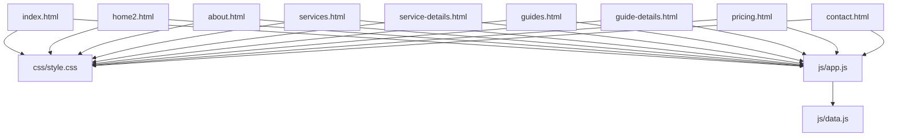
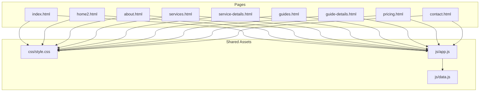
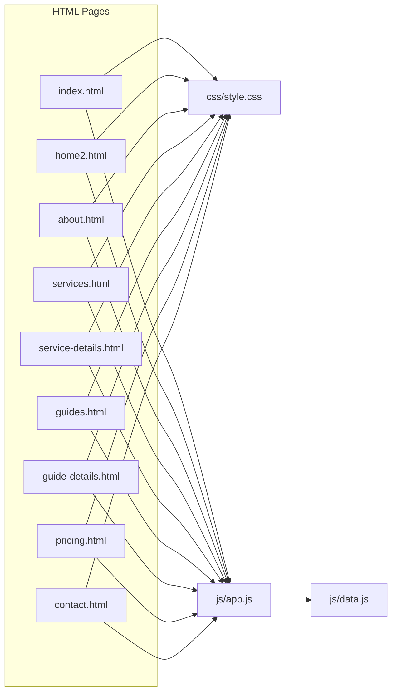

# Core Pages Documentation

<cite>
**Referenced Files in This Document**
- [index.html](file://index.html)
- [home2.html](file://home2.html)
- [about.html](file://about.html)
- [services.html](file://services.html)
- [service-details.html](file://service-details.html)
- [guides.html](file://guides.html)
- [guide-details.html](file://guide-details.html)
- [pricing.html](file://pricing.html)
- [contact.html](file://contact.html)
- [css/style.css](file://css/style.css)
- [js/app.js](file://js/app.js)
- [js/data.js](file://js/data.js)
</cite>

## Table of Contents
1. [Introduction](#introduction)
2. [Project Structure](#project-structure)
3. [Core Components](#core-components)
4. [Architecture Overview](#architecture-overview)
5. [Detailed Component Analysis](#detailed-component-analysis)
6. [Dependency Analysis](#dependency-analysis)
7. [Performance Considerations](#performance-considerations)
8. [Troubleshooting Guide](#troubleshooting-guide)
9. [Conclusion](#conclusion)
10. [Appendices](#appendices)

## Introduction
This document provides comprehensive documentation for all core pages in the website, including homepage variants, about page, services overview and details, guides section, pricing page, and contact page. It explains layout structure, content organization, key sections, interactive elements, HTML structure, CSS classes, JavaScript functionality, customization guidelines, responsive design considerations, and accessibility features.

## Project Structure
The website is organized into static HTML pages under the root directory, with shared styles in css/style.css and shared scripts in js/app.js and js/data.js. Each major page has its own HTML file, enabling clear separation of concerns and straightforward maintenance.

[No sources needed since this diagram shows conceptual workflow, not actual code structure]

## Core Components
Shared components across pages include:
- Global stylesheet: css/style.css
- Shared application logic: js/app.js
- Shared data model: js/data.js

These provide consistent styling, interactivity, and data-driven behavior across all pages.

**Section sources**
- [css/style.css](file://css/style.css)
- [js/app.js](file://js/app.js)
- [js/data.js](file://js/data.js)

## Architecture Overview
Each page composes a common header/footer and a unique main content area. Styles and scripts are loaded globally, while page-specific behaviors are implemented within each HTML file or via app.js where appropriate. Data-driven sections may pull from js/data.js.

[No sources needed since this diagram shows conceptual workflow, not actual code structure]

## Detailed Component Analysis

### Homepage Variant A: index.html
- Layout structure: typical hero, feature highlights, testimonials, call-to-action, footer
- Content organization: modular sections using semantic HTML elements
- Key sections: navigation, hero banner, value propositions, service previews, social proof, newsletter signup, footer links
- Interactive elements: mobile menu toggle, scroll-based animations, form validation
- HTML structure: uses semantic tags (header, nav, main, section, article, footer), accessible landmarks, and descriptive headings
- CSS classes: relies on utility and component classes defined in style.css; maintain consistent naming conventions
- JavaScript functionality: event listeners for navigation toggling, smooth scrolling, dynamic content updates if driven by data.js
- Customization guidelines:
  - Update text content within section containers
  - Replace images by updating src attributes and alt text
  - Add new sections by duplicating existing section blocks and adjusting IDs/classes
  - Maintain design consistency by reusing existing CSS classes
- Responsive design: uses media queries and flexible layouts; verify breakpoints in style.css
- Accessibility: includes aria attributes, keyboard navigable menus, sufficient color contrast, and descriptive labels

**Section sources**
- [index.html](file://index.html)
- [css/style.css](file://css/style.css)
- [js/app.js](file://js/app.js)
- [js/data.js](file://js/data.js)

### Homepage Variant B: home2.html
- Layout structure: alternative hero layout, different feature grid, alternate testimonial carousel
- Content organization: similar semantic structure with varied section order
- Key sections: hero variant, benefits list, portfolio showcase, partner logos, FAQ accordion, footer
- Interactive elements: carousel controls, accordion expand/collapse, lazy loading for images
- HTML structure: semantic markup with proper heading hierarchy and landmark roles
- CSS classes: leverages shared classes; may introduce page-specific modifiers
- JavaScript functionality: carousel initialization, accordion handlers, intersection observers for reveal effects
- Customization guidelines:
  - Swap hero imagery and copy without altering class names
  - Extend feature grid by adding items following existing patterns
  - Keep JS initialization calls aligned with DOM readiness
- Responsive design: ensure image grids collapse gracefully; test on small screens
- Accessibility: ensure carousel has focus management and aria-live regions where appropriate

**Section sources**
- [home2.html](file://home2.html)
- [css/style.css](file://css/style.css)
- [js/app.js](file://js/app.js)
- [js/data.js](file://js/data.js)

### About Page: about.html
- Layout structure: mission statement, team profiles, company timeline, values, certifications
- Content organization: narrative flow with supporting visuals and stats
- Key sections: intro banner, story, team grid, milestones, trust signals, CTA
- Interactive elements: team member hover states, timeline interactions, counters
- HTML structure: semantic sections with descriptive headings and figure/figcaption for images
- CSS classes: consistent typography and spacing utilities; team card components
- JavaScript functionality: animated counters, timeline navigation, modal popups for team bios
- Customization guidelines:
  - Update team members by editing card blocks
  - Modify timeline entries by adding/removing nodes
  - Keep image aspect ratios consistent
- Responsive design: stack team cards vertically on small devices; adjust timeline to vertical on mobile
- Accessibility: provide alt text for team photos, keyboard-accessible timeline navigation, and screen reader-friendly descriptions

**Section sources**
- [about.html](file://about.html)
- [css/style.css](file://css/style.css)
- [js/app.js](file://js/app.js)
- [js/data.js](file://js/data.js)

### Services Overview: services.html
- Layout structure: service categories, cards with icons, brief descriptions, CTAs
- Content organization: grouped by category with filter options
- Key sections: hero, category filters, service cards grid, featured service highlight, related resources
- Interactive elements: category filtering, card hover effects, quick view modals
- HTML structure: use lists or grid containers for services; link each card to service-details.html
- CSS classes: card components, filter buttons, grid utilities
- JavaScript functionality: client-side filtering by category, modal open/close, keyboard navigation
- Customization guidelines:
  - Add new services by duplicating card templates
  - Update categories by modifying filter button sets and data attributes
  - Ensure href links point to correct detail pages
- Responsive design: grid adapts from multi-column to single column; filters become stacked on small screens
- Accessibility: filter buttons have aria-pressed state, cards are focusable, modal traps focus

**Section sources**
- [services.html](file://services.html)
- [css/style.css](file://css/style.css)
- [js/app.js](file://js/app.js)
- [js/data.js](file://js/data.js)

### Service Details: service-details.html
- Layout structure: detailed description, features list, deliverables, process steps, FAQs, related services
- Content organization: top-down narrative with supporting visuals and step-by-step guidance
- Key sections: hero, overview, capabilities, process timeline, outcomes, testimonials, related services
- Interactive elements: tabbed content, collapsible FAQs, sticky table of contents
- HTML structure: semantic sections, ordered lists for processes, definition lists for terms
- CSS classes: tabs, accordions, sticky nav, content panels
- JavaScript functionality: tab switching, accordion toggles, scroll spy for TOC highlighting
- Customization guidelines:
  - Edit process steps by updating list items
  - Add/remove tabs by following existing panel structure
  - Keep anchor links consistent with section IDs
- Responsive design: tabs convert to stacked sections; sticky TOC collapses to dropdown on mobile
- Accessibility: tabs follow WAI-ARIA pattern, accordions have aria-expanded, TOC links are keyboard accessible

**Section sources**
- [service-details.html](file://service-details.html)
- [css/style.css](file://css/style.css)
- [js/app.js](file://js/app.js)
- [js/data.js](file://js/data.js)

### Guides Section: guides.html
- Layout structure: guide listings with thumbnails, tags, difficulty levels, and read time
- Content organization: categorized and searchable guide catalog
- Key sections: hero, search/filter bar, guide cards grid, pagination or load more
- Interactive elements: search input, tag filters, sort controls, preview modal
- HTML structure: search form, filter buttons, card list with links to guide-details.html
- CSS classes: search input, filter chips, card grid, pagination
- JavaScript functionality: client-side search and filtering, sorting, infinite scroll or pagination handling
- Customization guidelines:
  - Add new guides by inserting card blocks
  - Update tags and metadata consistently
  - Ensure links route to corresponding detail pages
- Responsive design: search bar stacks above filters on small screens; cards adapt to single column
- Accessibility: search input has label, filters have aria-pressed, results update aria-live region

**Section sources**
- [guides.html](file://guides.html)
- [css/style.css](file://css/style.css)
- [js/app.js](file://js/app.js)
- [js/data.js](file://js/data.js)

### Guide Details: guide-details.html
- Layout structure: guide title, metadata, content body, related guides, download/print actions
- Content organization: structured content with headings, lists, figures, and callouts
- Key sections: hero, metadata, content, related resources, feedback form
- Interactive elements: table of contents, print/download buttons, inline expanders
- HTML structure: article element, nested headings, lists, figure/figcaption, aside for notes
- CSS classes: typography utilities, callout boxes, print styles
- JavaScript functionality: TOC generation/highlighting, print handler, expand/collapse for long sections
- Customization guidelines:
  - Update content by editing article body
  - Add related guides by extending list
  - Keep anchors consistent with section IDs
- Responsive design: typography scales appropriately; sidebars collapse below content on mobile
- Accessibility: semantic headings, descriptive links, keyboard-accessible controls, high contrast support

**Section sources**
- [guide-details.html](file://guide-details.html)
- [css/style.css](file://css/style.css)
- [js/app.js](file://js/app.js)
- [js/data.js](file://js/data.js)

### Pricing Page: pricing.html
- Layout structure: plan tiers, comparison table, FAQs, CTA banners
- Content organization: clear tier differentiation with highlighted recommended plan
- Key sections: hero, pricing cards, feature comparison matrix, FAQ, testimonials
- Interactive elements: monthly/yearly toggle, tooltip explanations, FAQ accordion
- HTML structure: tables for comparisons, cards for plans, form inputs for toggles
- CSS classes: pricing cards, table styles, toggle switch, badge styles
- JavaScript functionality: billing cycle toggle updates prices, tooltips, accordion toggles
- Customization guidelines:
  - Add/remove plans by duplicating card templates
  - Update features by editing table rows
  - Keep price formatting consistent
- Responsive design: comparison table becomes horizontally scrollable or stacked on small screens
- Accessibility: table headers associated with cells, toggle has aria-pressed, tooltips have aria-describedby

**Section sources**
- [pricing.html](file://pricing.html)
- [css/style.css](file://css/style.css)
- [js/app.js](file://js/app.js)
- [js/data.js](file://js/data.js)

### Contact Page: contact.html
- Layout structure: contact form, map placeholder, office info, social links
- Content organization: primary form first, then supplementary information
- Key sections: hero, form, location details, social channels, privacy notice
- Interactive elements: form validation, success/error messages, map embed controls
- HTML structure: form with labeled inputs, fieldsets, error messages, address block
- CSS classes: form controls, validation states, message banners
- JavaScript functionality: client-side validation, submission handling, success feedback
- Customization guidelines:
  - Update fields by editing form structure and validation rules
  - Change contact details in address block
  - Integrate backend endpoints for form submission
- Responsive design: form fields stack vertically; map resizes fluidly
- Accessibility: form labels linked to inputs, error messages announced via aria-live, focus management on submit

**Section sources**
- [contact.html](file://contact.html)
- [css/style.css](file://css/style.css)
- [js/app.js](file://js/app.js)
- [js/data.js](file://js/data.js)

## Dependency Analysis
Pages depend on shared assets for styling and behavior. Data-driven pages may consume js/data.js through js/app.js.

[No sources needed since this diagram shows conceptual workflow, not actual code structure]

**Section sources**
- [css/style.css](file://css/style.css)
- [js/app.js](file://js/app.js)
- [js/data.js](file://js/data.js)

## Performance Considerations
- Minimize render-blocking resources by deferring non-critical scripts and inlining critical CSS where feasible.
- Use lazy loading for images and heavy components to improve initial page load.
- Prefer CSS transforms and opacity for animations to leverage GPU acceleration.
- Debounce or throttle frequent events like scroll and resize.
- Cache frequently accessed data in js/data.js to avoid redundant computations.
- Optimize images with modern formats and responsive srcset attributes.

[No sources needed since this section provides general guidance]

## Troubleshooting Guide
Common issues and resolutions:
- Navigation not toggling on mobile: verify event listeners are attached after DOM ready and that target elements exist.
- Filters not working: check data attributes on filter buttons and ensure filtering logic references correct selectors.
- Accordion/tabs not responding: confirm ARIA attributes are updated and focus is managed properly.
- Form validation errors: inspect console for validation rule mismatches and ensure aria-live regions announce errors.
- Images not loading: validate paths and alt text; consider fallbacks and error handling.

**Section sources**
- [js/app.js](file://js/app.js)
- [css/style.css](file://css/style.css)

## Conclusion
This documentation outlines the structure, interactivity, and customization pathways for all core pages. By adhering to shared CSS classes and JS patterns, maintaining semantic HTML, and ensuring responsive and accessible implementations, teams can extend and modify the site efficiently while preserving design consistency and performance.

[No sources needed since this section summarizes without analyzing specific files]

## Appendices

### Common Modifications Examples
- Updating text content: locate the relevant section container and replace text while preserving class names and structure.
- Changing images: update src and alt attributes; ensure responsive sizes and compression.
- Adjusting layouts: duplicate existing section blocks, reuse CSS classes, and verify responsive behavior across breakpoints.
- Adding new sections: follow existing naming conventions for IDs and classes; integrate any necessary JS initialization.

[No sources needed since this section provides general guidance]