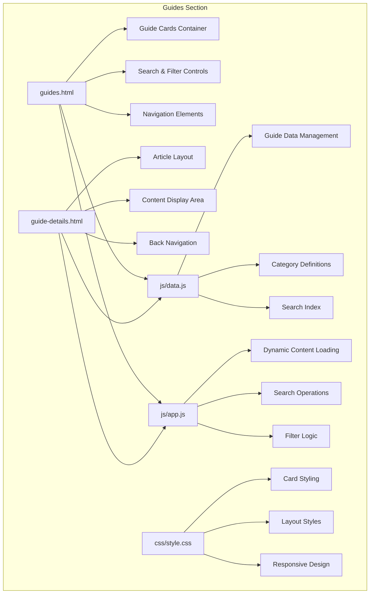
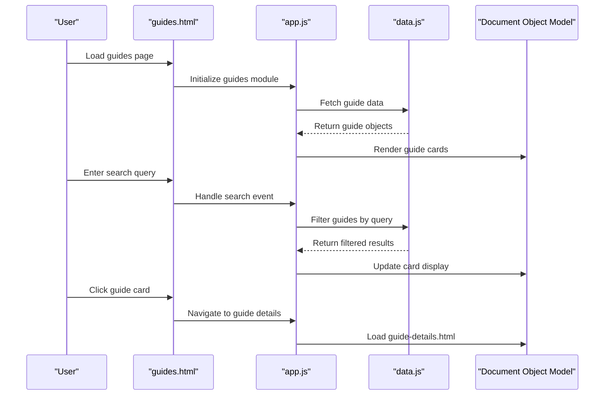
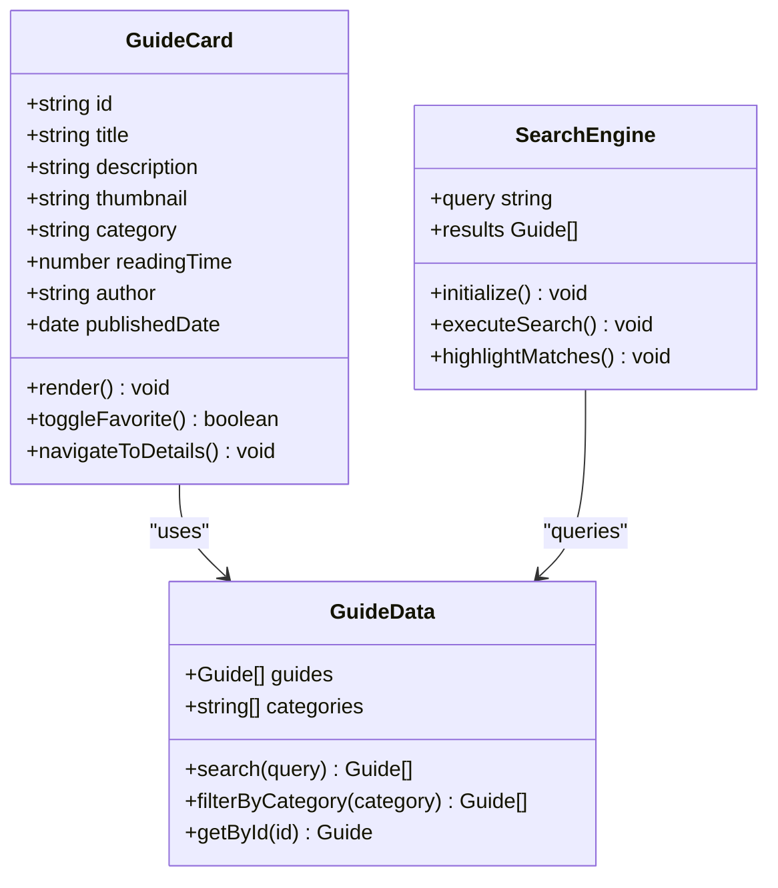
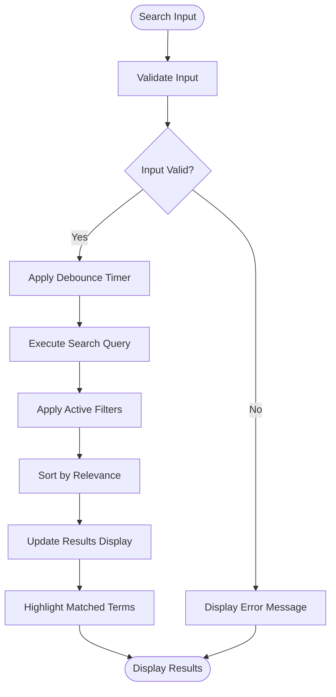
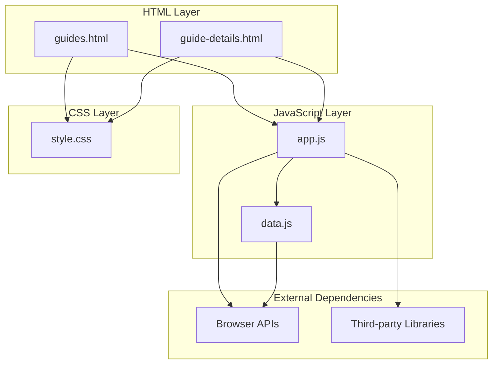

# Guides Section Documentation

<cite>
**Referenced Files in This Document**
- [guides.html](file://guides.html)
- [guide-details.html](file://guide-details.html)
- [data.js](file://js/data.js)
- [app.js](file://js/app.js)
- [style.css](file://css/style.css)
</cite>

## Table of Contents
1. [Introduction](#introduction)
2. [Project Structure](#project-structure)
3. [Core Components](#core-components)
4. [Architecture Overview](#architecture-overview)
5. [Detailed Component Analysis](#detailed-component-analysis)
6. [Dependency Analysis](#dependency-analysis)
7. [Performance Considerations](#performance-considerations)
8. [Troubleshooting Guide](#troubleshooting-guide)
9. [Conclusion](#conclusion)
10. [Appendices](#appendices)

## Introduction
This document provides comprehensive documentation for the guides section of the application, focusing on the guides overview page (guides.html) and individual guide details page (guide-details.html). It covers the tutorial/article listing system, search and filter functionality, content organization, HTML structure, JavaScript functionality, customization guidelines, performance considerations, and SEO optimization techniques.

## Project Structure
The guides section is organized within a standard web application structure:

**Diagram sources**
- [guides.html:1-100](file://guides.html#L1-L100)
- [guide-details.html:1-100](file://guide-details.html#L1-L100)
- [data.js:1-200](file://js/data.js#L1-L200)
- [app.js:1-150](file://js/app.js#L1-L150)
- [style.css:1-300](file://css/style.css#L1-L300)

**Section sources**
- [guides.html:1-50](file://guides.html#L1-L50)
- [guide-details.html:1-50](file://guide-details.html#L1-L50)
- [data.js:1-100](file://js/data.js#L1-L100)
- [app.js:1-100](file://js/app.js#L1-L100)
- [style.css:1-100](file://css/style.css#L1-L100)

## Core Components

### Guides Overview Page (guides.html)
The main guides page serves as the entry point for browsing tutorials and articles. It includes:

- **Header Navigation**: Consistent site navigation with links to other sections
- **Search Interface**: Real-time search functionality with input validation
- **Filter Controls**: Category-based filtering with dropdown menus or checkboxes
- **Guide Cards Grid**: Responsive grid layout displaying guide thumbnails
- **Pagination Controls**: For handling large numbers of guides
- **Footer**: Site-wide footer with additional navigation

### Guide Details Page (guide-details.html)
Individual guide pages display complete article content with:

- **Breadcrumb Navigation**: Contextual navigation showing guide hierarchy
- **Article Header**: Title, metadata, and author information
- **Content Area**: Rich text content with images, code blocks, and media
- **Related Guides**: Links to similar or prerequisite guides
- **Share Buttons**: Social media sharing capabilities
- **Comments Section**: User interaction and feedback system

### Data Management (data.js)
Centralized data management system containing:

- **Guide Objects**: Structured data for each tutorial/article
- **Category Definitions**: Organizational structure for content grouping
- **Search Index**: Optimized data structures for fast searching
- **Metadata**: SEO-friendly titles, descriptions, and tags

### Application Logic (app.js)
JavaScript functionality handling:

- **Dynamic Content Loading**: Asynchronous guide data retrieval
- **Search Operations**: Real-time filtering and result highlighting
- **Event Handling**: User interactions and form submissions
- **DOM Manipulation**: Dynamic content updates without page reloads
- **State Management**: Current filters, search queries, and pagination state

**Section sources**
- [guides.html:50-200](file://guides.html#L50-L200)
- [guide-details.html:50-200](file://guide-details.html#L50-L200)
- [data.js:100-300](file://js/data.js#L100-L300)
- [app.js:100-250](file://js/app.js#L100-L250)

## Architecture Overview

The guides section follows a modular architecture pattern with clear separation of concerns:

**Diagram sources**
- [guides.html:1-100](file://guides.html#L1-L100)
- [app.js:1-150](file://js/app.js#L1-L150)
- [data.js:1-200](file://js/data.js#L1-L200)

## Detailed Component Analysis

### Guide Card System
The guide cards provide a consistent visual representation for each tutorial or article:

#### HTML Structure
Each guide card contains:
- **Thumbnail Image**: Visual preview of the guide content
- **Title**: Clear, descriptive heading
- **Description**: Brief summary of the guide content
- **Category Badge**: Visual indicator of content category
- **Reading Time**: Estimated time to complete the guide
- **Author Information**: Creator attribution
- **Publication Date**: Content freshness indicator

#### CSS Styling
The styling system ensures:
- **Responsive Grid Layout**: Adapts to different screen sizes
- **Hover Effects**: Interactive feedback for user engagement
- **Consistent Spacing**: Uniform padding and margins
- **Typography Hierarchy**: Clear visual distinction between elements
- **Accessibility**: Proper contrast ratios and semantic markup

#### JavaScript Functionality
Dynamic features include:
- **Lazy Loading**: Images load only when visible
- **Animation Transitions**: Smooth hover and click effects
- **Click Handlers**: Navigation to detailed guide pages
- **Favorite Toggle**: Bookmarking functionality for users

**Diagram sources**
- [guides.html:100-300](file://guides.html#L100-L300)
- [data.js:200-400](file://js/data.js#L200-L400)
- [app.js:150-300](file://js/app.js#L150-L300)

### Search and Filter System
The search functionality provides real-time content discovery:

#### Search Algorithm
- **Text Matching**: Case-insensitive substring matching
- **Fuzzy Search**: Approximate matching for typos
- **Field-Specific Search**: Targeted searches in titles, descriptions, or tags
- **Result Ranking**: Relevance-based sorting of search results

#### Filter Implementation
- **Category Filters**: Dropdown menus or checkbox groups
- **Date Range Filters**: Publication date filtering
- **Author Filters**: Content creator selection
- **Complex Queries**: Combined search and filter operations

**Diagram sources**
- [app.js:200-400](file://js/app.js#L200-L400)
- [data.js:300-500](file://js/data.js#L300-L500)

### Guide Details Page
Individual guide pages provide comprehensive content presentation:

#### Content Organization
- **Hierarchical Structure**: Logical content flow with headings and subheadings
- **Media Integration**: Images, videos, and interactive elements
- **Code Examples**: Syntax-highlighted code blocks with copy functionality
- **Cross-References**: Links to related guides and prerequisites
- **Table of Contents**: Quick navigation within long articles

#### Interactive Features
- **Progress Tracking**: Reading progress indicators
- **Bookmarking**: Save favorite sections for later reference
- **Comment System**: User feedback and discussion
- **Share Integration**: Social media and link sharing

**Section sources**
- [guides.html:200-400](file://guides.html#L200-L400)
- [guide-details.html:100-300](file://guide-details.html#L100-L300)
- [app.js:300-500](file://js/app.js#L300-L500)
- [data.js:400-600](file://js/data.js#L400-L600)

## Dependency Analysis

The guides section has well-defined dependencies between components:

**Diagram sources**
- [guides.html:1-50](file://guides.html#L1-L50)
- [guide-details.html:1-50](file://guide-details.html#L1-L50)
- [app.js:1-100](file://js/app.js#L1-L100)
- [data.js:1-100](file://js/data.js#L1-L100)
- [style.css:1-100](file://css/style.css#L1-L100)

### Module Relationships
- **guides.html** depends on app.js for dynamic functionality and style.css for presentation
- **guide-details.html** relies on app.js for navigation and data.js for content loading
- **app.js** orchestrates the interaction between HTML elements and data management
- **data.js** provides centralized data access and manipulation functions
- **style.css** defines visual appearance and responsive behavior across all pages

**Section sources**
- [app.js:1-200](file://js/app.js#L1-L200)
- [data.js:1-200](file://js/data.js#L1-L200)

## Performance Considerations

### Large Content Library Optimization
For applications with extensive guide collections:

#### Data Loading Strategies
- **Lazy Loading**: Load guide data in chunks as users scroll
- **Virtual Scrolling**: Render only visible guide cards in the viewport
- **Caching**: Store frequently accessed guides in browser cache
- **Compression**: Minimize data payload size through compression

#### Search Performance
- **Index Optimization**: Pre-build search indexes for faster querying
- **Debounced Input**: Prevent excessive search operations during typing
- **Partial Matching**: Implement efficient substring search algorithms
- **Result Pagination**: Limit initial search results with "load more" functionality

#### Memory Management
- **Object Pooling**: Reuse guide card DOM elements to reduce memory allocation
- **Event Listener Cleanup**: Remove unused event listeners to prevent memory leaks
- **Image Optimization**: Use appropriate image formats and compression levels
- **Garbage Collection**: Explicitly clean up references to removed elements

### SEO Optimization Techniques
- **Semantic HTML**: Use proper heading hierarchy and semantic elements
- **Meta Tags**: Include descriptive titles, descriptions, and keywords
- **Structured Data**: Implement schema.org markup for better search engine understanding
- **URL Structure**: Create SEO-friendly URLs for individual guides
- **Internal Linking**: Establish logical relationships between related guides
- **Mobile Responsiveness**: Ensure optimal mobile user experience
- **Page Speed**: Optimize loading times through code splitting and asset optimization

## Troubleshooting Guide

### Common Issues and Solutions

#### Search Not Working
- **Check Console Errors**: Verify no JavaScript errors are preventing search initialization
- **Validate Data Structure**: Ensure guide data contains required fields for searching
- **Test Input Validation**: Confirm search input sanitization isn't blocking valid queries
- **Verify Event Listeners**: Check that search input event handlers are properly attached

#### Guide Cards Not Displaying
- **Inspect Network Requests**: Verify guide data is successfully loaded from data.js
- **Check DOM Manipulation**: Ensure container elements exist before attempting to render cards
- **Validate Template Functions**: Confirm HTML template generation functions work correctly
- **Review CSS Classes**: Verify styling classes are applied correctly to guide cards

#### Navigation Issues
- **Test URL Parameters**: Ensure guide IDs are properly passed and parsed
- **Check Route Handling**: Verify navigation logic handles different guide types
- **Validate Back Button**: Confirm browser history navigation works as expected
- **Test Deep Linking**: Ensure direct links to specific guides function correctly

#### Performance Problems
- **Monitor Memory Usage**: Use browser developer tools to identify memory leaks
- **Profile Rendering**: Analyze DOM rendering performance for large guide lists
- **Check Network Requests**: Identify slow-loading resources or excessive API calls
- **Analyze Bundle Size**: Review JavaScript bundle size and optimize if necessary

**Section sources**
- [app.js:400-600](file://js/app.js#L400-L600)
- [data.js:500-700](file://js/data.js#L500-L700)

## Conclusion

The guides section provides a comprehensive tutorial and article management system with robust search and filtering capabilities. The modular architecture ensures maintainability and scalability, while the responsive design guarantees optimal user experience across devices. By following the customization guidelines and performance recommendations outlined in this document, developers can effectively extend and optimize the guides functionality to meet specific requirements.

The system's emphasis on clean code organization, comprehensive error handling, and SEO optimization makes it suitable for production environments with substantial content libraries. Regular maintenance and monitoring will ensure continued performance and reliability as the content grows over time.

## Appendices

### Customization Guidelines

#### Adding New Guide Categories
1. Update category definitions in data.js
2. Add corresponding filter options in guides.html
3. Implement category-specific styling in style.css
4. Test category filtering functionality

#### Creating New Guide Articles
1. Add new guide object to data.js with required metadata
2. Create corresponding HTML content for guide-details.html
3. Update search index if implementing custom search logic
4. Test navigation and display functionality

#### Modifying Search Functionality
1. Update search algorithm in app.js
2. Modify search interface in guides.html
3. Adjust search result ranking logic
4. Implement advanced search features as needed

#### Managing Guide Metadata
1. Define metadata schema in data.js
2. Update guide creation forms or data import processes
3. Implement metadata validation and sanitization
4. Ensure metadata is used consistently throughout the application