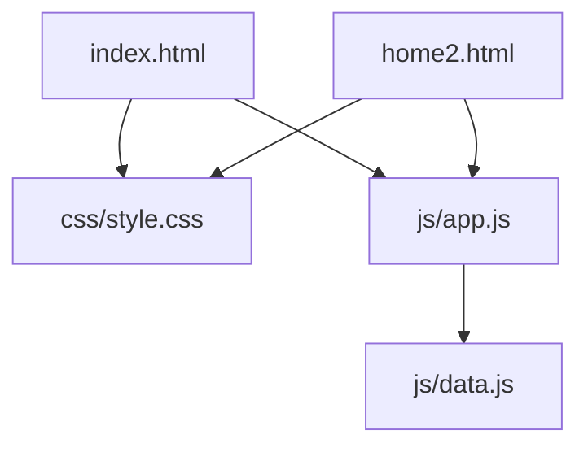
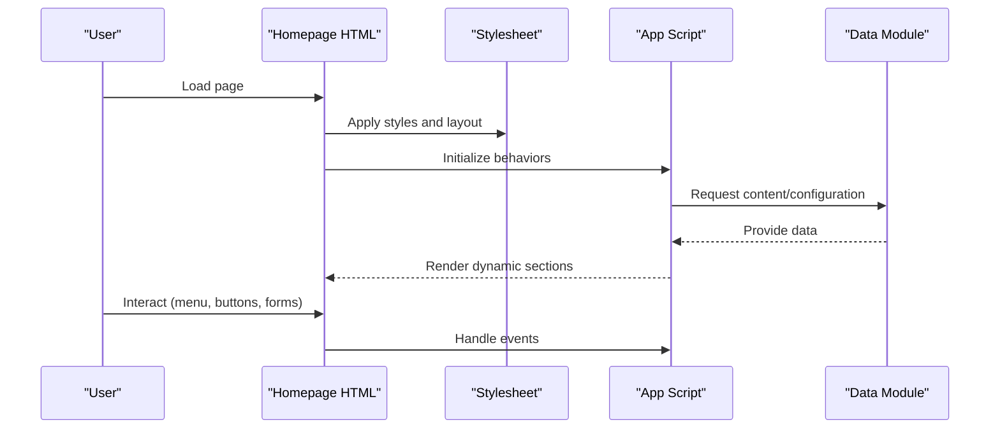
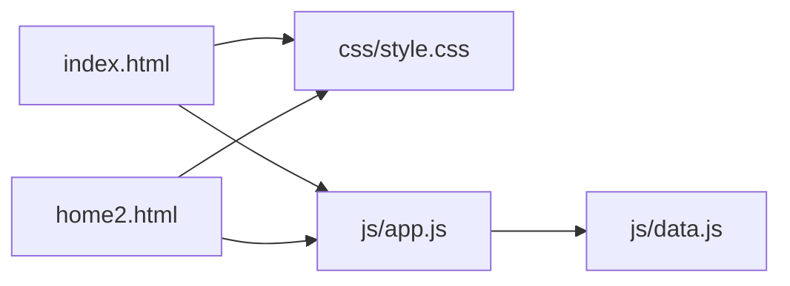

# Homepage Documentation

<cite>
**Referenced Files in This Document**
- [index.html](file://index.html)
- [home2.html](file://home2.html)
- [style.css](file://css/style.css)
- [app.js](file://js/app.js)
- [data.js](file://js/data.js)
</cite>

## Table of Contents
1. [Introduction](#introduction)
2. [Project Structure](#project-structure)
3. [Core Components](#core-components)
4. [Architecture Overview](#architecture-overview)
5. [Detailed Component Analysis](#detailed-component-analysis)
6. [Dependency Analysis](#dependency-analysis)
7. [Performance Considerations](#performance-considerations)
8. [Troubleshooting Guide](#troubleshooting-guide)
9. [Conclusion](#conclusion)
10. [Appendices](#appendices)

## Introduction
This document explains the two homepage variants (index.html and home2.html), their layout structure, hero sections, navigation elements, and content organization. It also covers CSS classes used for styling, JavaScript functionality specific to the homepage, customization guidelines, responsive design considerations, and mobile-first implementation patterns. The goal is to help you understand how each variant works, when to use which, and how to modify them effectively.

## Project Structure
The project includes two homepage files that share common styles and scripts:
- index.html: Primary homepage with a standard layout and hero section.
- home2.html: Alternate homepage variant with a different hero and content arrangement.
- css/style.css: Shared stylesheet defining layout, typography, components, and responsive rules.
- js/app.js: Main application script handling UI interactions and behaviors.
- js/data.js: Data module providing content or configuration consumed by the homepage.

**Diagram sources**
- [index.html](file://index.html)
- [home2.html](file://home2.html)
- [style.css](file://css/style.css)
- [app.js](file://js/app.js)
- [data.js](file://js/data.js)

**Section sources**
- [index.html](file://index.html)
- [home2.html](file://home2.html)
- [style.css](file://css/style.css)
- [app.js](file://js/app.js)
- [data.js](file://js/data.js)

## Core Components
Both homepage variants are composed of shared structural blocks:
- Navigation bar: Top-level menu with links to key pages.
- Hero section: Prominent area with headline, supporting text, and call-to-action buttons.
- Featured sections: Content blocks showcasing services, highlights, or testimonials.
- Footer: Site-wide footer with links and contact information.

Key responsibilities:
- Navigation provides consistent access across pages.
- Hero drives primary messaging and conversion actions.
- Featured sections communicate value propositions and guide users deeper into the site.
- Footer offers secondary navigation and legal/contact details.

Common CSS classes and naming conventions:
- Layout containers and grid utilities control spacing and alignment.
- Component-specific classes style headers, cards, buttons, and media blocks.
- Utility classes handle visibility, spacing, and responsive behavior.

JavaScript hooks:
- app.js initializes interactive features such as mobile menu toggling, scroll effects, and dynamic content rendering.
- data.js supplies structured content or configuration consumed by the homepage’s dynamic sections.

**Section sources**
- [index.html](file://index.html)
- [home2.html](file://home2.html)
- [style.css](file://css/style.css)
- [app.js](file://js/app.js)
- [data.js](file://js/data.js)

## Architecture Overview
The homepage architecture follows a modular pattern:
- HTML defines semantic sections and component markup.
- CSS applies consistent styling and responsive rules.
- JavaScript enhances interactivity and renders dynamic content from data modules.

**Diagram sources**
- [index.html](file://index.html)
- [home2.html](file://home2.html)
- [style.css](file://css/style.css)
- [app.js](file://js/app.js)
- [data.js](file://js/data.js)

## Detailed Component Analysis

### Navigation Bar
- Purpose: Global navigation with links to main sections and pages.
- Structure: Typically uses a header container, logo area, and a list of links. On mobile, it collapses into a toggleable menu.
- Styling: Uses utility classes for spacing, alignment, and responsive breakpoints.
- Interactions: Mobile menu toggle controlled by JavaScript event listeners.

Customization tips:
- Add or remove links by editing the navigation list.
- Adjust colors and spacing via CSS variables or utility classes.
- Ensure accessibility by including proper roles and aria attributes.

**Section sources**
- [index.html](file://index.html)
- [home2.html](file://home2.html)
- [style.css](file://css/style.css)
- [app.js](file://js/app.js)

### Hero Section
- Purpose: Primary attention-grabbing area with headline, subtext, and call-to-action buttons.
- Structure: Container with background image or color overlay, centered content block, and action buttons.
- Styling: Background images are applied through CSS classes; overlays improve readability.
- Interactions: Buttons may trigger smooth scrolling or open modals.

Customization guidelines:
- Change background image by updating the CSS class that sets the background property.
- Update headline and subtext directly in the HTML markup.
- Modify call-to-action labels and destinations by editing button elements and href attributes.

Responsive considerations:
- Hero text scales down on smaller screens.
- Background images adjust via CSS media queries to maintain visual balance.

**Section sources**
- [index.html](file://index.html)
- [home2.html](file://home2.html)
- [style.css](file://css/style.css)

### Featured Sections
- Purpose: Highlight services, benefits, testimonials, or other key content.
- Structure: Grid-based layout using card components with icons, titles, descriptions, and optional links.
- Styling: Card classes define borders, shadows, hover states, and spacing.
- Interactions: Cards may be clickable and link to detail pages.

Customization guidelines:
- Reorder sections by moving card blocks in the HTML.
- Replace placeholder content with real data or integrate with data.js for dynamic rendering.
- Adjust iconography and imagery consistently across cards.

**Section sources**
- [index.html](file://index.html)
- [home2.html](file://home2.html)
- [style.css](file://css/style.css)
- [app.js](file://js/app.js)
- [data.js](file://js/data.js)

### Footer
- Purpose: Secondary navigation, contact info, and legal links.
- Structure: Columns with links, social icons, and copyright notice.
- Styling: Uses grid/flex utilities for alignment and spacing.
- Interactions: Links navigate to respective pages; social icons open external sites.

Customization guidelines:
- Update links and contact details in the footer markup.
- Maintain consistent spacing and typography using existing utility classes.

**Section sources**
- [index.html](file://index.html)
- [home2.html](file://home2.html)
- [style.css](file://css/style.css)

### Differences Between Variants and Use Cases
- index.html: Standard homepage layout optimized for general audiences. Suitable for most marketing sites where clarity and straightforward navigation are priorities.
- home2.html: Alternate homepage variant with a different hero presentation and possibly distinct featured sections. Useful for A/B testing, seasonal campaigns, or targeting different user segments.

When to choose:
- Use index.html for baseline performance and broad appeal.
- Use home2.html when experimenting with alternative messaging or visual emphasis.

**Section sources**
- [index.html](file://index.html)
- [home2.html](file://home2.html)

### JavaScript Functionality Specific to Homepage
- Initialization: app.js runs on DOM ready to attach event listeners and initialize components.
- Dynamic content: Reads from data.js to populate sections like featured items or testimonials.
- Interactions: Handles mobile menu toggle, smooth scrolling, and any modal or form behaviors present on the homepage.

Integration points:
- Ensure data.js exports the expected structure so app.js can render correctly.
- Keep selectors and class names consistent between HTML and JS to avoid runtime errors.

**Section sources**
- [app.js](file://js/app.js)
- [data.js](file://js/data.js)
- [index.html](file://index.html)
- [home2.html](file://home2.html)

### Responsive Design and Mobile-First Approach
- Mobile-first CSS: Base styles target small screens; enhancements apply at larger breakpoints.
- Breakpoints: Media queries adjust layouts, font sizes, and spacing for tablets and desktops.
- Touch-friendly: Buttons and links have adequate tap targets; menus collapse into accessible toggles.
- Performance: Images and backgrounds are optimized for various screen densities.

Implementation tips:
- Prefer relative units (rem, em, %) for scalable typography and spacing.
- Use flexible grids and flexbox to reflow content naturally.
- Test on multiple devices and orientations to ensure usability.

**Section sources**
- [style.css](file://css/style.css)
- [index.html](file://index.html)
- [home2.html](file://home2.html)

## Dependency Analysis
The homepage files depend on shared assets:
- Both index.html and home2.html reference style.css for layout and component styles.
- Both include app.js for interactive behaviors.
- app.js consumes data.js for dynamic content.

**Diagram sources**
- [index.html](file://index.html)
- [home2.html](file://home2.html)
- [style.css](file://css/style.css)
- [app.js](file://js/app.js)
- [data.js](file://js/data.js)

**Section sources**
- [index.html](file://index.html)
- [home2.html](file://home2.html)
- [style.css](file://css/style.css)
- [app.js](file://js/app.js)
- [data.js](file://js/data.js)

## Performance Considerations
- Optimize images and backgrounds for faster loading.
- Minify CSS and JS in production builds.
- Defer non-critical scripts to improve initial paint time.
- Use lazy loading for below-the-fold content if applicable.
- Avoid heavy animations on mobile devices.

[No sources needed since this section provides general guidance]

## Troubleshooting Guide
Common issues and resolutions:
- Missing background image: Verify file paths and ensure the CSS class references the correct asset.
- Menu not toggling: Check that event listeners are attached and selectors match the HTML structure.
- Dynamic content not rendering: Confirm data.js exports the expected shape and app.js reads it correctly.
- Broken links in navigation/footer: Validate href values and ensure target pages exist.

Debugging steps:
- Open browser DevTools console for JavaScript errors.
- Inspect network requests to confirm assets load successfully.
- Use element inspector to verify class names and computed styles.

**Section sources**
- [app.js](file://js/app.js)
- [data.js](file://js/data.js)
- [style.css](file://css/style.css)
- [index.html](file://index.html)
- [home2.html](file://home2.html)

## Conclusion
The two homepage variants provide flexible options for presenting your brand and driving conversions. By understanding the shared structure, styling conventions, and JavaScript integrations, you can customize hero content, update featured sections, and adjust call-to-action elements efficiently. Follow the responsive design principles outlined here to ensure a great experience across devices.

[No sources needed since this section summarizes without analyzing specific files]

## Appendices

### Customization Examples
- Changing background images:
  - Locate the CSS class responsible for the hero background and update the image path.
  - Ensure the new image has appropriate dimensions and compression.
- Updating text content:
  - Edit headline and subtext within the hero section in the HTML file.
  - Keep copy concise and aligned with campaign goals.
- Reorganizing page sections:
  - Move card blocks or section containers in the HTML to reorder content.
  - Maintain consistent spacing and alignment using utility classes.
- Modifying call-to-action elements:
  - Update button labels and href attributes to point to relevant destinations.
  - Ensure contrast and sizing meet accessibility standards.

[No sources needed since this section provides general guidance]