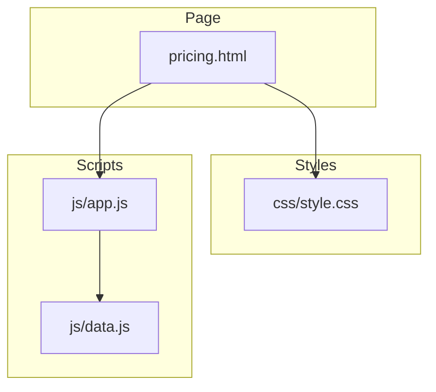
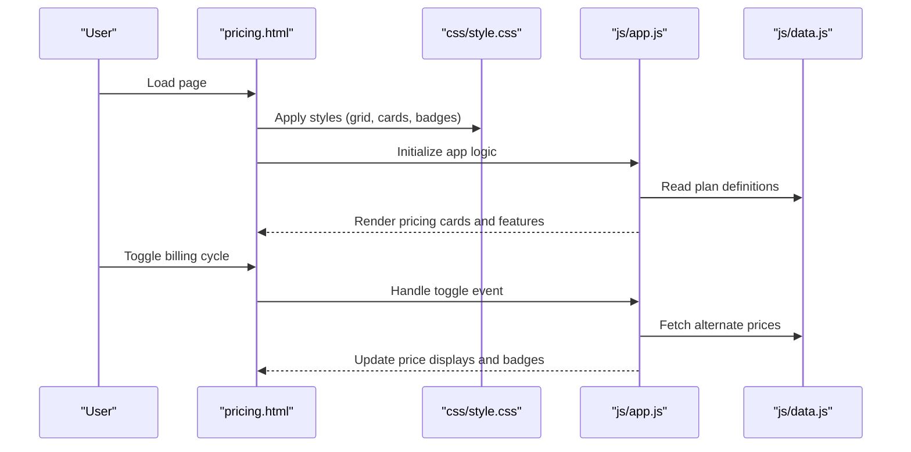
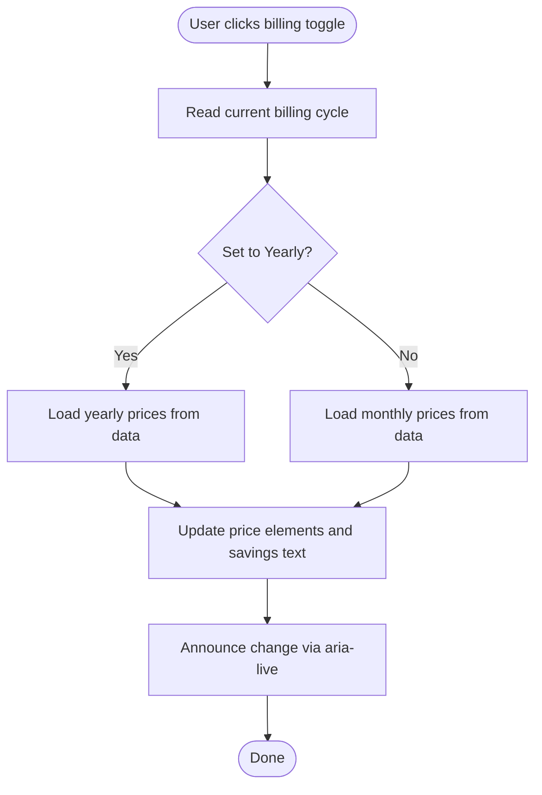
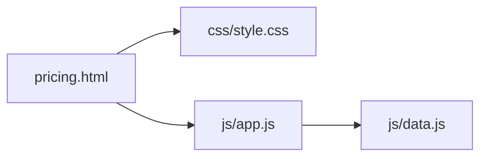

# Pricing Page Documentation

<cite>
**Referenced Files in This Document**
- [pricing.html](file://pricing.html)
- [style.css](file://css/style.css)
- [app.js](file://js/app.js)
- [data.js](file://js/data.js)
</cite>

## Table of Contents
1. [Introduction](#introduction)
2. [Project Structure](#project-structure)
3. [Core Components](#core-components)
4. [Architecture Overview](#architecture-overview)
5. [Detailed Component Analysis](#detailed-component-analysis)
6. [Dependency Analysis](#dependency-analysis)
7. [Performance Considerations](#performance-considerations)
8. [Troubleshooting Guide](#troubleshooting-guide)
9. [Conclusion](#conclusion)
10. [Appendices](#appendices)

## Introduction
This document explains the pricing page implementation, focusing on how pricing tiers are structured and presented, how plan comparisons work, and how subscription options are displayed. It covers HTML layout patterns for tiers, feature lists, and call-to-action buttons; CSS styling strategies for highlighting recommended plans and establishing visual hierarchy; and JavaScript-driven behaviors such as toggling monthly/yearly billing and rendering dynamic content. Customization guidelines are included to help you add new plans, update prices, modify features, and change promotional badges. Responsive design considerations and accessibility guidance are also provided to ensure a consistent experience across devices and assistive technologies.

## Project Structure
The pricing page is composed of:
- A dedicated HTML file that defines the page structure and markup for pricing tiers, feature lists, and CTAs.
- A global stylesheet that provides responsive grid layouts, typography, spacing, and emphasis styles for recommended plans and badges.
- Application scripts that handle interactive behaviors like billing cycle toggles and dynamic rendering from data sources.
- A data module that centralizes plan definitions (names, prices, features, badges, and flags).

**Diagram sources**
- [pricing.html](file://pricing.html)
- [style.css](file://css/style.css)
- [app.js](file://js/app.js)
- [data.js](file://js/data.js)

**Section sources**
- [pricing.html](file://pricing.html)
- [style.css](file://css/style.css)
- [app.js](file://js/app.js)
- [data.js](file://js/data.js)

## Core Components
- Pricing container and grid: The page uses a container with a responsive grid to display multiple pricing cards side-by-side on larger screens and stacked on smaller screens.
- Pricing card per tier: Each card includes a header (plan name), price display (monthly or yearly), optional badge (e.g., “Popular” or “Limited”), a feature list, and a call-to-action button.
- Billing toggle: A control to switch between monthly and yearly pricing, updating displayed amounts and any associated savings messaging.
- Data-driven rendering: Plan metadata is defined in a data module and consumed by the application script to render the UI consistently.

Key responsibilities:
- HTML: Semantic structure, headings, lists, and accessible labels.
- CSS: Grid layout, spacing, typography scale, emphasis for recommended plans, and responsive breakpoints.
- JS: Toggle behavior, price formatting, and dynamic updates based on selected billing cycle.

**Section sources**
- [pricing.html](file://pricing.html)
- [style.css](file://css/style.css)
- [app.js](file://js/app.js)
- [data.js](file://js/data.js)

## Architecture Overview
The pricing page follows a simple separation of concerns:
- Markup (HTML) defines the skeleton and semantics.
- Styles (CSS) provide layout, visual hierarchy, and responsiveness.
- Scripts (JS + data) manage interactivity and content population.

**Diagram sources**
- [pricing.html](file://pricing.html)
- [style.css](file://css/style.css)
- [app.js](file://js/app.js)
- [data.js](file://js/data.js)

## Detailed Component Analysis

### Pricing Card Layout and Semantics
- Use a semantic section for each plan with a clear heading level for the plan name.
- Present the price prominently with a label indicating the billing period.
- Include an unordered list for features to improve readability and screen reader navigation.
- Provide a single primary call-to-action button per card with descriptive text.

Accessibility tips:
- Ensure each card has a unique heading and aria-label if needed.
- Use aria-live regions for dynamic price changes when toggling billing cycles.
- Maintain sufficient color contrast for all text and badges.

**Section sources**
- [pricing.html](file://pricing.html)

### Recommended Plan Highlighting
- One plan can be visually emphasized using a distinct border, background, or shadow.
- Add a prominent badge near the plan title to indicate popularity or promotion.
- Keep focus states visible for keyboard users.

Styling patterns:
- Use a dedicated class for recommended cards to apply elevated visuals.
- Style badges with high-contrast colors and concise labels.
- Ensure hover and focus states do not rely solely on color.

**Section sources**
- [style.css](file://css/style.css)

### Billing Cycle Toggle Behavior
- A toggle control switches between monthly and yearly pricing.
- On change, the script updates price values and optionally shows savings indicators.
- Dynamic updates should preserve focus and announce changes to assistive technologies.

Implementation notes:
- Bind events to the toggle element.
- Read current cycle state and re-render prices accordingly.
- Avoid full page reloads; update only affected nodes.

**Section sources**
- [app.js](file://js/app.js)

### Data Model for Plans
Plan definitions typically include:
- Name
- Monthly and yearly prices
- Feature checklist items
- Badge text (optional)
- Flag indicating recommended status

Benefits:
- Centralized configuration makes it easy to add or edit plans.
- Consistent rendering across the page.
- Simplifies localization and currency formatting.

**Section sources**
- [data.js](file://js/data.js)

### Call-to-Action Buttons
- Each plan card contains a single primary action button.
- Button text should clearly describe the next step (e.g., “Choose Plan”).
- Ensure keyboard navigability and visible focus rings.

**Section sources**
- [pricing.html](file://pricing.html)
- [style.css](file://css/style.css)

### Flowchart: Billing Toggle and Price Update

**Diagram sources**
- [app.js](file://js/app.js)
- [data.js](file://js/data.js)

## Dependency Analysis
- pricing.html depends on style.css for layout and visual presentation.
- pricing.html initializes app.js to attach behaviors and render dynamic content.
- app.js reads plan data from data.js to populate the UI.

**Diagram sources**
- [pricing.html](file://pricing.html)
- [style.css](file://css/style.css)
- [app.js](file://js/app.js)
- [data.js](file://js/data.js)

**Section sources**
- [pricing.html](file://pricing.html)
- [style.css](file://css/style.css)
- [app.js](file://js/app.js)
- [data.js](file://js/data.js)

## Performance Considerations
- Prefer lightweight DOM updates over full reflows when toggling billing cycles.
- Cache references to frequently accessed elements to reduce lookup overhead.
- Keep feature lists concise to minimize layout shifts and improve rendering speed.
- Defer non-critical script execution until after initial paint where possible.

[No sources needed since this section provides general guidance]

## Troubleshooting Guide
Common issues and resolutions:
- Prices not updating on toggle:
  - Verify event listeners are attached to the toggle control.
  - Confirm data module exposes both monthly and yearly prices.
  - Check that the update function targets the correct DOM nodes.
- Missing or misaligned badges:
  - Ensure the recommended flag is set in the data model.
  - Validate CSS classes for badges and recommended cards exist.
- Accessibility problems:
  - Confirm aria-live regions are present and updated when prices change.
  - Test keyboard navigation and focus order across cards.
- Responsive layout issues:
  - Inspect grid breakpoints and ensure cards stack correctly on small screens.
  - Adjust padding and font sizes for readability at various widths.

**Section sources**
- [app.js](file://js/app.js)
- [style.css](file://css/style.css)
- [data.js](file://js/data.js)

## Conclusion
The pricing page combines semantic HTML, responsive CSS, and minimal JavaScript to deliver a clear, accessible, and maintainable pricing experience. By centralizing plan data and leveraging a consistent card pattern, teams can easily customize offerings, highlight recommendations, and keep the interface readable across devices. Following the customization guidelines and accessibility tips will help ensure a smooth user journey and long-term maintainability.

[No sources needed since this section summarizes without analyzing specific files]

## Appendices

### Customization Guidelines

- Adding a new pricing plan
  - Define a new entry in the data module with name, monthly and yearly prices, features, optional badge, and recommended flag.
  - Ensure the rendering logic iterates over all entries and creates a card for each.
  - If adding a special tier, consider adjusting grid columns or spacing to accommodate additional cards.

- Modifying plan features
  - Update the feature array in the data module for the relevant plan.
  - Keep feature descriptions concise and parallel in structure for consistency.

- Updating pricing amounts
  - Change monthly and/or yearly values in the data module.
  - If offering discounts, adjust the savings indicator logic accordingly.

- Changing plan names and badges
  - Edit the name field in the data module.
  - For badges, set or remove the badge text and ensure the recommended flag is applied where appropriate.

- Promotional badges
  - Use the badge field to display short labels like “Popular” or “New”.
  - Keep badge text under three words for clarity and visual balance.

- Call-to-action text
  - Update button labels directly in the HTML or via the data module if rendered dynamically.
  - Ensure action text reflects the intended outcome (e.g., “Start Free Trial”, “Subscribe Now”).

**Section sources**
- [data.js](file://js/data.js)
- [app.js](file://js/app.js)
- [pricing.html](file://pricing.html)

### Responsive Design Considerations
- Use a responsive grid that stacks cards vertically on narrow viewports and arranges them horizontally on wider screens.
- Limit the number of visible columns on very small screens to avoid cramped layouts.
- Scale typography and spacing proportionally to maintain readability.
- Ensure touch targets for buttons meet minimum size guidelines.

**Section sources**
- [style.css](file://css/style.css)

### Accessibility Compliance
- Provide meaningful headings for each plan and use consistent heading levels.
- Use lists for features to enable efficient navigation by screen readers.
- Announce dynamic price changes with aria-live regions.
- Maintain high contrast and visible focus indicators for keyboard users.
- Label the billing toggle control with descriptive text and associate it with its purpose.

**Section sources**
- [pricing.html](file://pricing.html)
- [app.js](file://js/app.js)