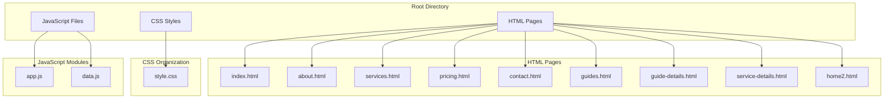
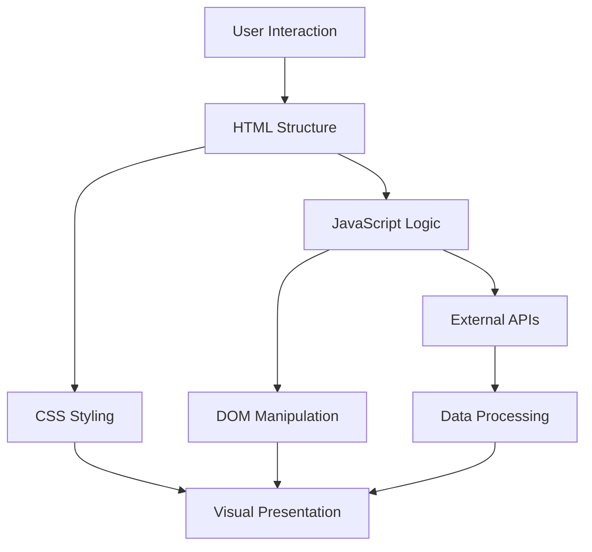
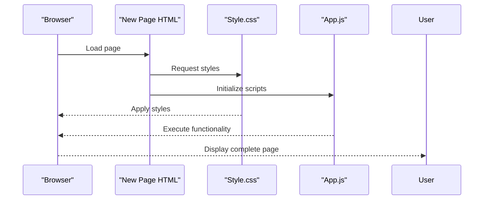
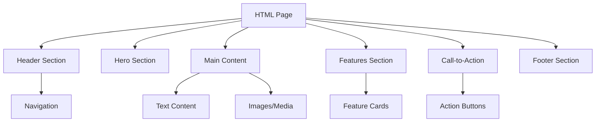
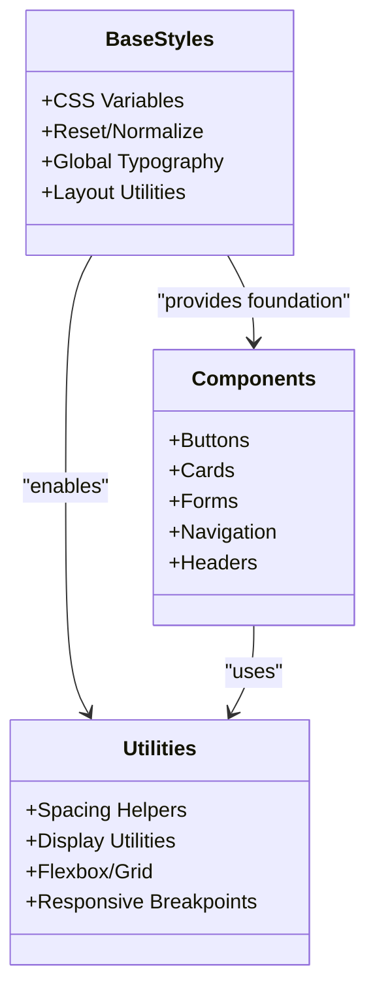
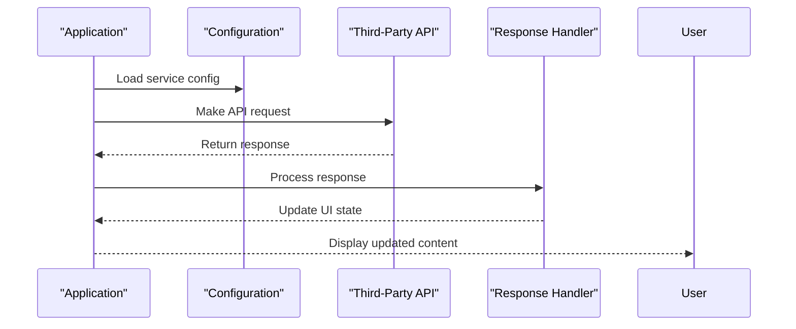

# Customization Guide

<cite>
**Referenced Files in This Document**
- [index.html](file://index.html)
- [about.html](file://about.html)
- [services.html](file://services.html)
- [pricing.html](file://pricing.html)
- [contact.html](file://contact.html)
- [guides.html](file://guides.html)
- [guide-details.html](file://guide-details.html)
- [service-details.html](file://service-details.html)
- [home2.html](file://home2.html)
- [css/style.css](file://css/style.css)
- [js/app.js](file://js/app.js)
- [js/data.js](file://js/data.js)
</cite>

## Table of Contents
1. [Introduction](#introduction)
2. [Project Structure Overview](#project-structure-overview)
3. [Core Architecture](#core-architecture)
4. [Adding New Pages](#adding-new-pages)
5. [Modifying Existing Content](#modifying-existing-content)
6. [Custom Styling and Theming](#custom-styling-and-theming)
7. [Extending JavaScript Functionality](#extending-javascript-functionality)
8. [Common Customization Tasks](#common-customization-tasks)
9. [Templates and Examples](#templates-and-examples)
10. [Best Practices](#best-practices)
11. [Troubleshooting Guide](#troubleshooting-guide)
12. [Performance Optimization](#performance-optimization)
13. [Conclusion](#conclusion)

## Introduction

This customization guide provides comprehensive instructions for extending and modifying your website. Whether you're adding new pages, implementing custom styling, or integrating third-party services, this guide will help you maintain consistency while making your desired changes.

The website follows a modular architecture with separate HTML, CSS, and JavaScript files, making it easy to customize individual components without affecting the entire site structure.

## Project Structure Overview

Your website is organized using a feature-based structure that separates concerns effectively:



**Diagram sources**
- [index.html](file://index.html)
- [css/style.css](file://css/style.css)
- [js/app.js](file://js/app.js)
- [js/data.js](file://js/data.js)

**Section sources**
- [index.html](file://index.html)
- [css/style.css](file://css/style.css)
- [js/app.js](file://js/app.js)
- [js/data.js](file://js/data.js)

## Core Architecture

The website follows a clean separation of concerns pattern:

### HTML Structure Pattern
All pages follow a consistent HTML5 structure with semantic elements, proper meta tags, and organized content sections.

### CSS Architecture
Styles are centralized in a single stylesheet with logical organization by component type and utility classes.

### JavaScript Organization
Functionality is split between application logic (app.js) and data management (data.js), promoting code reusability.



**Diagram sources**
- [index.html](file://index.html)
- [css/style.css](file://css/style.css)
- [js/app.js](file://js/app.js)

## Adding New Pages

### Step-by-Step Guide to Create New Pages

#### 1. Create the HTML File
Follow the established template pattern from existing pages:

**Template Reference**: Use [index.html](file://index.html) as your base template

Key elements to include:
- Proper DOCTYPE and meta tags
- Link to main stylesheet
- Include JavaScript files at the bottom
- Semantic HTML5 structure
- Consistent navigation and footer

#### 2. Implement Navigation Integration
Update the navigation menu to include your new page:

**Navigation Pattern**: Check [index.html](file://index.html) for navigation structure

Add your new page link following the existing pattern:
```html
<a href="your-page.html">Page Name</a>
```

#### 3. Add Page-Specific Content
Structure your content using the established section patterns:

**Content Organization**: Refer to [about.html](file://about.html) for content structure examples

Common section types:
- Hero/Header section
- Main content area
- Call-to-action sections
- Footer integration

#### 4. Test Your New Page
- Verify all links work correctly
- Check responsive design on different devices
- Ensure JavaScript functionality loads properly
- Validate cross-browser compatibility

### Page Template Structure



**Diagram sources**
- [index.html](file://index.html)
- [css/style.css](file://css/style.css)
- [js/app.js](file://js/app.js)

**Section sources**
- [index.html](file://index.html)
- [about.html](file://about.html)
- [services.html](file://services.html)

## Modifying Existing Content

### Content Management Strategy

#### Text Content Updates
Most text content is embedded directly in HTML files. To modify:

1. Open the relevant HTML file
2. Locate the text content within appropriate semantic tags
3. Update the content while maintaining HTML structure
4. Save and test the changes

#### Image and Media Updates
Media files are typically referenced in HTML with relative paths:

**Image Pattern**: Check [services.html](file://services.html) for image implementation

Best practices:
- Maintain consistent image dimensions
- Optimize file sizes for performance
- Use descriptive alt attributes for accessibility
- Keep media files organized in dedicated folders

#### Layout Modifications
Layout changes should be made in the CSS file:

**Layout Reference**: Examine [css/style.css](file://css/style.css) for layout patterns

Common layout modifications:
- Grid system adjustments
- Flexbox container updates
- Spacing and padding changes
- Responsive breakpoint modifications

### Section-Based Content Organization



**Diagram sources**
- [index.html](file://index.html)
- [about.html](file://about.html)

**Section sources**
- [css/style.css](file://css/style.css)
- [services.html](file://services.html)

## Custom Styling and Theming

### CSS Architecture Understanding

The styling system uses a centralized approach with logical organization:

#### Color System Implementation
Colors are defined using CSS custom properties for easy theming:

**Color Reference**: Review [css/style.css](file://css/style.css) for color definitions

To change the color scheme:
1. Locate CSS custom property definitions
2. Modify color values while maintaining contrast ratios
3. Test accessibility compliance
4. Verify visual consistency across all pages

#### Typography Customization
Font settings are managed through CSS variables:

**Typography Pattern**: Check font declarations in [css/style.css](file://css/style.css)

Font modification steps:
1. Update font-family properties
2. Adjust font sizes and line heights
3. Ensure web-safe fallbacks
4. Test readability across devices

#### Component Styling Patterns



**Diagram sources**
- [css/style.css](file://css/style.css)

### Advanced Styling Techniques

#### Creating Custom Themes
To implement multiple themes:

1. Define theme-specific CSS custom properties
2. Create theme toggle functionality
3. Store user preferences in localStorage
4. Apply theme classes dynamically

#### Responsive Design Modifications
Breakpoint adjustments and mobile-first approach:

**Responsive Pattern**: Examine media queries in [css/style.css](file://css/style.css)

Mobile optimization tips:
- Touch-friendly button sizes
- Optimized image loading
- Simplified navigation for mobile
- Performance-conscious animations

**Section sources**
- [css/style.css](file://css/style.css)

## Extending JavaScript Functionality

### JavaScript Architecture Overview

The JavaScript codebase is organized into logical modules:

#### Application Logic (app.js)
Contains core functionality and event handlers:

**Core Logic**: Review [js/app.js](file://js/app.js) for main application logic

Common extension points:
- Event listener additions
- Utility function creation
- Plugin initialization
- Third-party service integration

#### Data Management (data.js)
Handles data structures and API interactions:

**Data Layer**: Examine [js/data.js](file://js/data.js) for data handling patterns

Data management strategies:
- Centralized configuration objects
- API endpoint definitions
- Data transformation utilities
- Error handling patterns

### Adding New JavaScript Features

#### Event Handler Extension
To add new interactive features:

1. Identify the target element or component
2. Create event listeners in app.js
3. Implement handler functions
4. Test cross-browser compatibility

#### Creating Reusable Components
Follow the established component patterns:

**Component Pattern**: Study existing components in [js/app.js](file://js/app.js)

Component development workflow:
1. Define component interface
2. Implement core functionality
3. Add configuration options
4. Create initialization method
5. Document usage examples

#### Third-Party Service Integration



**Diagram sources**
- [js/app.js](file://js/app.js)
- [js/data.js](file://js/data.js)

### Debugging and Testing JavaScript

#### Console Logging Strategy
Implement structured logging for debugging:

**Logging Pattern**: Check console usage in [js/app.js](file://js/app.js)

Debugging best practices:
- Use descriptive log messages
- Implement error boundaries
- Test in multiple browsers
- Monitor performance metrics

**Section sources**
- [js/app.js](file://js/app.js)
- [js/data.js](file://js/data.js)

## Common Customization Tasks

### Changing the Color Scheme

#### Quick Color Updates
1. Open [css/style.css](file://css/style.css)
2. Locate CSS custom property definitions
3. Update primary, secondary, and accent colors
4. Test contrast ratios for accessibility
5. Verify visual consistency across all pages

#### Brand Color Implementation
Replace brand colors systematically:

**Color Reference Points**: 
- Primary brand color
- Secondary brand color  
- Accent/highlight colors
- Neutral color palette

### Updating Branding Elements

#### Logo and Favicon Updates
1. Replace logo images in appropriate directories
2. Update favicon files
3. Ensure proper file formats and sizes
4. Test loading performance

#### Meta Information Updates
Update SEO and social media metadata:

**Meta Reference**: Check [index.html](file://index.html) for meta tag structure

Essential meta tags to update:
- Title and description
- Open Graph tags
- Twitter Card tags
- Author and copyright information

### Adding New Sections to Existing Pages

#### Section Creation Pattern
Follow the established section structure:

**Section Template**: Use [about.html](file://about.html) as reference

Section development checklist:
- Semantic HTML structure
- Appropriate CSS classes
- Responsive design considerations
- Accessibility compliance
- Cross-browser testing

#### Content Block Implementation
Create reusable content blocks:

**Block Pattern**: Examine content organization in [services.html](file://services.html)

Block types commonly used:
- Feature cards
- Testimonial sections
- Statistics counters
- Image galleries
- Contact forms

### Integrating Third-Party Services

#### Analytics Integration
Add analytics tracking:

**Analytics Pattern**: Check script inclusion in [index.html](file://index.html)

Popular analytics services:
- Google Analytics
- Facebook Pixel
- Hotjar
- Custom tracking solutions

#### Social Media Integration
Embed social sharing and feeds:

**Social Pattern**: Review social media implementations in [contact.html](file://contact.html)

Integration methods:
- Share buttons
- Social feeds
- Follow widgets
- Comment systems

**Section sources**
- [index.html](file://index.html)
- [about.html](file://about.html)
- [services.html](file://services.html)
- [contact.html](file://contact.html)
- [css/style.css](file://css/style.css)

## Templates and Examples

### Page Type Templates

#### Basic Landing Page Template
Based on [index.html](file://index.html):

**Template Structure**:
- Hero section with call-to-action
- Feature highlights
- Testimonials or social proof
- Contact form or newsletter signup
- Footer with navigation

#### Service Details Template
Based on [service-details.html](file://service-details.html):

**Template Structure**:
- Service header with breadcrumb
- Detailed service description
- Feature list with icons
- Pricing information
- Related services
- Contact form

#### Guide/Article Template
Based on [guide-details.html](file://guide-details.html):

**Template Structure**:
- Article header with metadata
- Table of contents
- Rich text content
- Image galleries
- Related articles
- Share buttons

### Component Examples

#### Card Component Pattern
Reusable card component structure:

**Card Reference**: Examine card implementations in [services.html](file://services.html)

Card variations:
- Basic info cards
- Pricing cards
- Team member cards
- Product showcase cards

#### Form Component Pattern
Standardized form implementation:

**Form Reference**: Check form structure in [contact.html](file://contact.html)

Form features:
- Input validation
- Error messaging
- Success feedback
- Accessibility compliance

### Code Organization Templates

#### File Naming Conventions
Follow established naming patterns:
- HTML files: lowercase with hyphens
- CSS classes: BEM methodology
- JavaScript functions: camelCase
- Images: descriptive names with underscores

#### Directory Structure Best Practices
Organize assets logically:
- Separate CSS and JavaScript files
- Group related images
- Maintain clear folder hierarchy
- Use version control effectively

**Section sources**
- [index.html](file://index.html)
- [service-details.html](file://service-details.html)
- [guide-details.html](file://guide-details.html)
- [services.html](file://services.html)
- [contact.html](file://contact.html)

## Best Practices

### Version Control Best Practices

#### Git Workflow Recommendations
1. **Feature Branches**: Create branches for each major change
2. **Commit Messages**: Write clear, descriptive commit messages
3. **Code Reviews**: Review changes before merging
4. **Backup Strategy**: Regular backups of working files

#### Change Documentation
Maintain a changelog of modifications:
- Date and author of changes
- Description of modifications
- Impact assessment
- Testing results

### Testing Customizations

#### Cross-Browser Testing
Test across major browsers:
- Chrome, Firefox, Safari, Edge
- Mobile browsers (iOS Safari, Android Chrome)
- Different screen sizes and resolutions

#### Performance Testing
Monitor performance impact:
- Page load times
- Resource optimization
- Memory usage
- Network requests

### Code Quality Standards

#### HTML Best Practices
- Semantic HTML5 elements
- Proper heading hierarchy
- Alt text for images
- ARIA labels for accessibility

#### CSS Organization
- Logical grouping of styles
- Consistent naming conventions
- Mobile-first responsive design
- Performance-optimized selectors

#### JavaScript Standards
- ES6+ syntax where appropriate
- Modular code organization
- Error handling and logging
- Performance considerations

### Accessibility Compliance

#### WCAG Guidelines
Ensure accessibility compliance:
- Color contrast ratios
- Keyboard navigation
- Screen reader compatibility
- Semantic markup

#### Testing Tools
Use accessibility testing tools:
- Lighthouse audits
- WAVE evaluation tool
- Manual keyboard testing
- Screen reader testing

**Section sources**
- [index.html](file://index.html)
- [css/style.css](file://css/style.css)
- [js/app.js](file://js/app.js)

## Troubleshooting Guide

### Common Styling Issues

#### CSS Not Loading
**Symptoms**: Page displays without styling
**Solutions**:
- Verify CSS file path in HTML
- Check browser cache (hard refresh)
- Inspect network tab for 404 errors
- Validate CSS syntax

#### Responsive Design Problems
**Symptoms**: Layout breaks on mobile devices
**Solutions**:
- Check viewport meta tag
- Verify media query breakpoints
- Test on actual devices
- Use browser developer tools

#### Cross-Browser Compatibility
**Symptoms**: Features work in some browsers but not others
**Solutions**:
- Use browser prefixes for CSS
- Polyfill missing features
- Test in multiple browsers
- Check console for errors

### JavaScript Issues

#### Scripts Not Executing
**Symptoms**: Interactive features don't work
**Solutions**:
- Check script loading order
- Verify DOM ready state
- Inspect console for errors
- Validate JavaScript syntax

#### Event Handlers Not Working
**Symptoms**: Click events or user interactions fail
**Solutions**:
- Ensure elements exist before binding events
- Check event delegation for dynamic content
- Verify selector accuracy
- Test event propagation

#### Performance Problems
**Symptoms**: Slow page load or interaction lag
**Solutions**:
- Minimize DOM manipulation
- Optimize image sizes
- Use efficient selectors
- Implement lazy loading

### Content and Layout Issues

#### Images Not Displaying
**Symptoms**: Broken image links or missing images
**Solutions**:
- Verify image file paths
- Check file permissions
- Validate image formats
- Use proper alt text

#### Navigation Problems
**Symptoms**: Links don't work or menu items missing
**Solutions**:
- Check URL paths
- Verify file existence
- Test link targets
- Validate HTML structure

### Debugging Strategies

#### Browser Developer Tools
Use built-in debugging tools:
- Elements panel for HTML/CSS inspection
- Console for JavaScript errors
- Network tab for resource loading
- Performance tab for optimization

#### Systematic Problem Solving
1. **Isolate the Issue**: Determine if problem is HTML, CSS, or JavaScript
2. **Check Recent Changes**: Review recent modifications
3. **Test Incrementally**: Revert changes to identify problematic code
4. **Consult Documentation**: Reference original templates and examples

**Section sources**
- [index.html](file://index.html)
- [css/style.css](file://css/style.css)
- [js/app.js](file://js/app.js)

## Performance Optimization

### Frontend Performance Tips

#### HTML Optimization
- Minimize HTML size
- Use semantic elements efficiently
- Optimize meta tags
- Implement proper caching headers

#### CSS Optimization
- Minify CSS files
- Remove unused styles
- Use efficient selectors
- Implement critical CSS inline

#### JavaScript Optimization
- Defer non-critical scripts
- Minimize DOM manipulation
- Use efficient algorithms
- Implement code splitting

### Asset Optimization

#### Image Optimization
- Compress images appropriately
- Use modern formats (WebP, AVIF)
- Implement responsive images
- Enable lazy loading

#### Font Optimization
- Subset fonts to required characters
- Use font-display property
- Preload critical fonts
- Consider system fonts

### Monitoring and Maintenance

#### Performance Monitoring
Track key metrics:
- First Contentful Paint (FCP)
- Largest Contentful Paint (LCP)
- Cumulative Layout Shift (CLS)
- Time to Interactive (TTI)

#### Regular Maintenance Tasks
- Update dependencies regularly
- Clean up unused code
- Monitor performance metrics
- Test after major updates

**Section sources**
- [css/style.css](file://css/style.css)
- [js/app.js](file://js/app.js)

## Conclusion

This customization guide provides a comprehensive framework for extending and modifying your website while maintaining code quality and performance. By following the established patterns and best practices outlined in this document, you can confidently make changes that enhance your site's functionality and appearance.

Key takeaways:
- Always follow the established architectural patterns
- Test thoroughly across different browsers and devices
- Maintain code organization and documentation
- Prioritize performance and accessibility
- Use version control effectively

Remember that customization is an iterative process. Start with small changes, test thoroughly, and gradually build more complex features. The modular architecture of your website makes it well-suited for incremental improvements and long-term maintenance.

For additional support, refer back to specific sections of this guide and examine the example implementations in the existing codebase. Happy customizing!