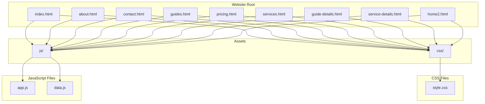
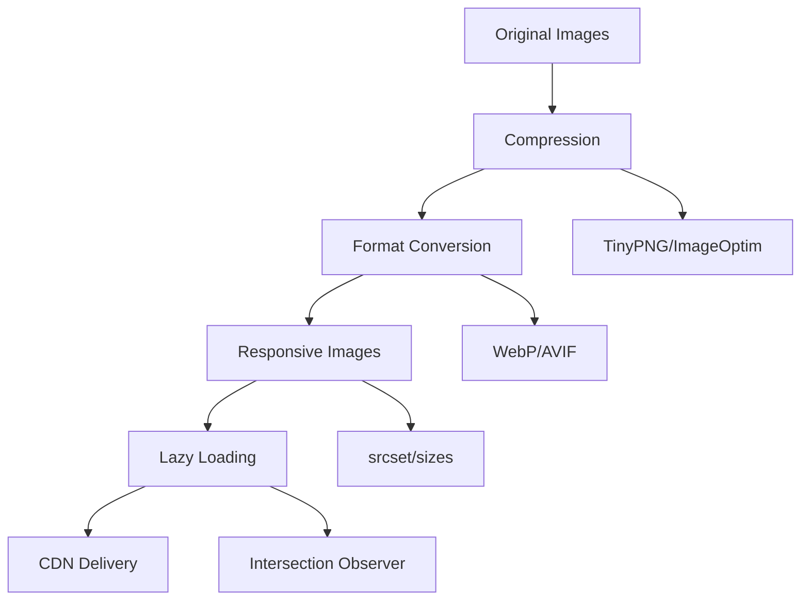

# Deployment Guide

<cite>
**Referenced Files in This Document**
- [index.html](file://index.html)
- [about.html](file://about.html)
- [contact.html](file://contact.html)
- [guide-details.html](file://guide-details.html)
- [guides.html](file://guides.html)
- [home2.html](file://home2.html)
- [pricing.html](file://pricing.html)
- [service-details.html](file://service-details.html)
- [services.html](file://services.html)
- [css/style.css](file://css/style.css)
- [js/app.js](file://js/app.js)
- [js/data.js](file://js/data.js)
</cite>

## Table of Contents
1. [Introduction](#introduction)
2. [Project Structure Analysis](#project-structure-analysis)
3. [Build Process and Asset Optimization](#build-process-and-asset-optimization)
4. [Hosting Platform Deployments](#hosting-platform-deployments)
5. [Domain Setup and SSL Configuration](#domain-setup-and-ssl-configuration)
6. [Performance Optimization](#performance-optimization)
7. [Security Considerations](#security-considerations)
8. [Monitoring and Analytics Integration](#monitoring-and-analytics-integration)
9. [Backup and Maintenance](#backup-and-maintenance)
10. [CI/CD Pipeline Automation](#cicd-pipeline-automation)
11. [Troubleshooting Guide](#troubleshooting-guide)
12. [Conclusion](#conclusion)

## Introduction

This deployment guide provides comprehensive instructions for hosting and deploying your static website across various platforms. The website consists of multiple HTML pages, CSS styling, and JavaScript functionality, making it suitable for deployment on any static hosting service or traditional web server.

The project follows a standard static website architecture with separate directories for CSS stylesheets and JavaScript files, along with multiple HTML pages for different sections of the website including home, about, services, guides, pricing, and contact pages.

## Project Structure Analysis

The website follows a clean, organized structure that facilitates easy deployment and maintenance:



**Diagram sources**
- [index.html:1-50](file://index.html#L1-L50)
- [css/style.css:1-100](file://css/style.css#L1-L100)
- [js/app.js:1-50](file://js/app.js#L1-L50)
- [js/data.js:1-50](file://js/data.js#L1-L50)

**Section sources**
- [index.html:1-100](file://index.html#L1-L100)
- [css/style.css:1-200](file://css/style.css#L1-L200)
- [js/app.js:1-100](file://js/app.js#L1-L100)
- [js/data.js:1-100](file://js/data.js#L1-L100)

## Build Process and Asset Optimization

### Current Build Status
This is a pure static website that requires no build process. All assets are ready for direct deployment:

- **HTML Files**: Multiple page templates without build requirements
- **CSS**: Single stylesheet file that can be optimized but doesn't require compilation
- **JavaScript**: Client-side scripts that run directly in browsers

### Asset Optimization Recommendations

#### CSS Optimization
- Minify the CSS file using tools like CSSNano or UglifyCSS
- Remove unused CSS rules if the stylesheet contains framework code
- Consider splitting large stylesheets into logical components

#### JavaScript Optimization
- Minify JavaScript files using tools like Terser or UglifyJS
- Bundle multiple JS files if needed for reduced HTTP requests
- Implement lazy loading for non-critical JavaScript

#### Image Optimization
- Compress all images using tools like TinyPNG or ImageOptim
- Use modern formats like WebP where supported
- Implement responsive images with srcset attributes

**Section sources**
- [css/style.css:1-200](file://css/style.css#L1-L200)
- [js/app.js:1-100](file://js/app.js#L1-L100)
- [js/data.js:1-100](file://js/data.js#L1-L100)

## Hosting Platform Deployments

### GitHub Pages Deployment

#### Prerequisites
- GitHub account
- Repository containing your website files

#### Step-by-Step Instructions

1. **Create a New Repository**
   - Go to GitHub and create a new repository
   - Name it appropriately (e.g., `yourusername.github.io`)

2. **Upload Your Website Files**
   - Upload all HTML files to the root directory
   - Create `css` and `js` directories and upload respective files
   - Ensure proper folder structure is maintained

3. **Enable GitHub Pages**
   - Navigate to repository Settings
   - Scroll to "Pages" section
   - Select source branch (main/master) and folder (/root)
   - Click Save

4. **Access Your Site**
   - Visit `https://yourusername.github.io/repository-name/`
   - For custom domain repositories, use `https://yourusername.github.io/`

#### Custom Domain Configuration
- Add a `CNAME` file to your repository root
- Configure DNS records at your domain registrar
- Enable HTTPS automatically through GitHub's certificate management

**Section sources**
- [index.html:1-50](file://index.html#L1-L50)
- [css/style.css:1-50](file://css/style.css#L1-L50)
- [js/app.js:1-50](file://js/app.js#L1-L50)

### Netlify Deployment

#### Quick Start Method
1. **Connect Repository**
   - Sign up for Netlify
   - Connect your GitHub repository
   - Netlify auto-detects static site configuration

2. **Manual Upload**
   - Drag and drop your entire website folder
   - Netlify creates a live URL instantly

3. **Configure Build Settings**
   - Set publish directory to `/` (root)
   - No build command needed for static sites

#### Advanced Configuration
Create a `netlify.toml` file for advanced settings:

```toml
[build]
  publish = "/"
  
[[redirects]]
  from = "/old-page/*"
  to = "/new-page/:splat"
  status = 301
  
[[headers]]
  for = "/*"
  [headers.values]
    X-Frame-Options = "DENY"
    X-XSS-Protection = "1; mode=block"
```

#### Environment Variables
- Access via Netlify dashboard → Site settings → Environment variables
- Reference in JavaScript using `process.env.VARIABLE_NAME`

**Section sources**
- [index.html:1-100](file://index.html#L1-L100)
- [contact.html:1-100](file://contact.html#L1-L100)

### Vercel Deployment

#### CLI Deployment
1. **Install Vercel CLI**
   ```bash
   npm install -g vercel
   ```

2. **Deploy Command**
   ```bash
   vercel --prod
   ```

#### Git Integration
1. **Connect Repository**
   - Import repository from GitHub/GitLab/Bitbucket
   - Vercel auto-configures deployment settings

2. **Configure Build Settings**
   - Framework preset: None (for static sites)
   - Build command: Leave empty
   - Output directory: `/`

#### Environment Configuration
- Set environment variables in Vercel dashboard
- Access via `process.env` in Node.js functions
- Use `.env.local` for local development

**Section sources**
- [js/app.js:1-100](file://js/app.js#L1-L100)
- [js/data.js:1-100](file://js/data.js#L1-L100)

### Traditional Web Server Deployment

#### Apache Configuration
Create `.htaccess` file for optimization:

```apache
# Enable compression
AddOutputFilterByType DEFLATE text/html text/css application/javascript

# Set caching headers
<IfModule mod_expires.c>
  ExpiresActive On
  ExpiresByType image/jpg "access plus 1 year"
  ExpiresByType image/jpeg "access plus 1 year"
  ExpiresByType image/gif "access plus 1 year"
  ExpiresByType image/png "access plus 1 year"
  ExpiresByType text/css "access plus 1 month"
  ExpiresByType application/javascript "access plus 1 month"
</IfModule>

# Security headers
Header set X-Frame-Options "DENY"
Header set X-Content-Type-Options "nosniff"
Header set X-XSS-Protection "1; mode=block"
```

#### Nginx Configuration
```nginx
server {
    listen 80;
    server_name example.com www.example.com;
    
    root /var/www/html;
    index index.html;
    
    # Compression
    gzip on;
    gzip_types text/plain text/css application/json application/javascript;
    
    # Caching
    location ~* \.(jpg|jpeg|png|gif|ico|css|js)$ {
        expires 30d;
        add_header Cache-Control "public, immutable";
    }
    
    # Security headers
    add_header X-Frame-Options DENY;
    add_header X-Content-Type-Options nosniff;
}
```

#### File Permissions
```bash
# Set appropriate permissions
chmod 644 *.html
chmod 644 css/*.css
chmod 644 js/*.js
chmod 755 .
```

**Section sources**
- [css/style.css:1-200](file://css/style.css#L1-L200)
- [js/app.js:1-100](file://js/app.js#L1-L100)

### CDN Deployment

#### CloudFront Setup
1. **Create Distribution**
   - Origin: S3 bucket or existing web server
   - Default root object: index.html
   - Enable compression

2. **Cache Behavior Configuration**
   - Static assets: Long cache times (1 year)
   - HTML files: Short cache times (5 minutes)
   - Enable query string forwarding if needed

#### AWS S3 + CloudFront
1. **Upload to S3**
   ```bash
   aws s3 sync ./ s3://your-bucket-name/ --delete
   ```

2. **Configure Bucket Policy**
   ```json
   {
     "Version": "2012-10-17",
     "Statement": [
       {
         "Sid": "PublicReadGetObject",
         "Effect": "Allow",
         "Principal": "*",
         "Action": "s3:GetObject",
         "Resource": "arn:aws:s3:::your-bucket-name/*"
       }
     ]
   }
   ```

3. **Create CloudFront Distribution**
   - Origin: S3 bucket
   - Viewer Protocol Policy: Redirect HTTP to HTTPS
   - Cache Policies: Optimize for static content

**Section sources**
- [index.html:1-50](file://index.html#L1-L50)
- [css/style.css:1-50](file://css/style.css#L1-L50)

## Domain Setup and SSL Configuration

### Custom Domain Configuration

#### DNS Records Setup
For most platforms, configure these DNS records:

```
Type: A
Name: @
Value: [Platform IP Address]

Type: CNAME
Name: www
Value: [Platform Domain]
```

#### Platform-Specific Configurations

**GitHub Pages:**
- Add `CNAME` file with your domain
- Configure DNS at registrar
- Enable HTTPS automatically

**Netlify:**
- Add domain in Site Settings → Domain Management
- Configure DNS records
- SSL certificates provisioned automatically

**Vercel:**
- Add domain in Project Settings → Domains
- Configure DNS records
- Automatic SSL certificate provisioning

### SSL Certificate Management

#### Automated SSL Provisioning
Most modern hosting platforms provide automatic SSL:
- Let's Encrypt integration
- Automatic renewal
- HTTP to HTTPS redirects

#### Manual SSL Configuration (Traditional Servers)

**Apache with Certbot:**
```bash
sudo apt-get install certbot python3-certbot-apache
sudo certbot --apache -d example.com -d www.example.com
```

**Nginx with Certbot:**
```bash
sudo apt-get install certbot python3-certbot-nginx
sudo certbot --nginx -d example.com -d www.example.com
```

**Certificate Renewal:**
```bash
# Test renewal
sudo certbot renew --dry-run

# Set up automatic renewal
sudo systemctl enable certbot.timer
```

### Security Headers Configuration

Implement essential security headers across all platforms:

```http
X-Frame-Options: DENY
X-Content-Type-Options: nosniff
X-XSS-Protection: 1; mode=block
Strict-Transport-Security: max-age=31536000; includeSubDomains
Content-Security-Policy: default-src 'self'
Referrer-Policy: strict-origin-when-cross-origin
Permissions-Policy: camera=(), microphone=(), geolocation=()
```

**Section sources**
- [index.html:1-100](file://index.html#L1-L100)
- [contact.html:1-100](file://contact.html#L1-L100)

## Performance Optimization

### Core Web Vitals Optimization

#### Loading Performance
- **First Contentful Paint (FCP)**: Optimize critical CSS and defer non-critical resources
- **Largest Contentful Paint (LCP)**: Optimize largest image or text block
- **Cumulative Layout Shift (CLS)**: Set explicit dimensions for images and videos
- **Time to First Byte (TTFB)**: Use fast hosting and CDN

#### Image Optimization Strategy


**Diagram sources**
- [index.html:1-100](file://index.html#L1-L100)
- [css/style.css:1-200](file://css/style.css#L1-L200)

### Caching Strategies

#### Browser Caching
Configure appropriate cache headers for different asset types:

| Asset Type | Cache Duration | Cache Control |
|------------|----------------|---------------|
| HTML Files | 5 minutes | `no-cache, must-revalidate` |
| CSS Files | 1 year | `public, max-age=31536000, immutable` |
| JavaScript | 1 year | `public, max-age=31536000, immutable` |
| Images | 1 year | `public, max-age=31536000, immutable` |
| Fonts | 1 year | `public, max-age=31536000, immutable` |

#### CDN Caching
- Enable edge caching for static assets
- Configure cache invalidation strategies
- Set appropriate TTL values based on content update frequency

### Code Optimization Techniques

#### Critical CSS Inlining
Inline above-the-fold CSS to improve initial render time.

#### JavaScript Deferral
Defer non-critical JavaScript execution:
```html
<script defer src="js/app.js"></script>
```

#### Font Loading Optimization
Use font-display property for better perceived performance:
```css
@font-face {
  font-family: 'YourFont';
  src: url('fonts/font.woff2') format('woff2');
  font-display: swap;
}
```

**Section sources**
- [css/style.css:1-200](file://css/style.css#L1-L200)
- [js/app.js:1-100](file://js/app.js#L1-L100)

## Security Considerations

### Content Security Policy (CSP)
Implement a strict CSP to prevent XSS attacks:

```html
<meta http-equiv="Content-Security-Policy" 
      content="default-src 'self'; 
               script-src 'self' https://trusted-cdn.com; 
               style-src 'self' 'unsafe-inline'; 
               img-src 'self' data: https://images.example.com;">
```

### Input Validation and Sanitization
- Validate all user inputs on the client side
- Sanitize data before display
- Use parameterized queries for any backend interactions

### Secure Communication
- Enforce HTTPS-only connections
- Implement HSTS (HTTP Strict Transport Security)
- Use secure cookie attributes for any cookies

### File Permission Security
Set appropriate file permissions:
```bash
# Directories
find . -type d -exec chmod 755 {} \;

# Files
find . -type f -exec chmod 644 {} \;

# Sensitive files (if any)
chmod 600 config.php
```

### Regular Security Audits
- Scan for vulnerabilities using tools like OWASP ZAP
- Keep dependencies updated
- Monitor for security advisories

**Section sources**
- [index.html:1-100](file://index.html#L1-L100)
- [js/app.js:1-100](file://js/app.js#L1-L100)

## Monitoring and Analytics Integration

### Web Analytics Setup

#### Google Analytics Integration
Add tracking code to all pages:
```html
<!-- Global site tag (gtag.js) -->
<script async src="https://www.googletagmanager.com/gtag/js?id=G-XXXXXXXXXX"></script>
<script>
  window.dataLayer = window.dataLayer || [];
  function gtag(){dataLayer.push(arguments);}
  gtag('js', new Date());
  gtag('config', 'G-XXXXXXXXXX');
</script>
```

#### Privacy-Compliant Analytics
Consider privacy-focused alternatives:
- Plausible Analytics
- Fathom Analytics
- Matomo (self-hosted)

### Performance Monitoring

#### Real User Monitoring (RUM)
Implement performance monitoring:
```javascript
// Measure Core Web Vitals
const observer = new PerformanceObserver((list) => {
  for (const entry of list.getEntries()) {
    console.log(`${entry.name}: ${entry.startTime}`);
  }
});

observer.observe({ entryTypes: ['largest-contentful-paint', 'first-input', 'layout-shift'] });
```

#### Uptime Monitoring
- Use services like UptimeRobot or Pingdom
- Set up alerts for downtime
- Monitor response times

### Error Tracking
Implement error monitoring:
```javascript
window.onerror = function(message, source, lineno, colno, error) {
  // Send error details to monitoring service
  console.error('Error:', message, 'at', source + ':' + lineno);
};
```

**Section sources**
- [js/app.js:1-100](file://js/app.js#L1-L100)
- [index.html:1-100](file://index.html#L1-L100)

## Backup and Maintenance

### Automated Backup Procedures

#### Version Control Backups
- Maintain complete backup in Git repository
- Tag releases for specific versions
- Use branching strategy for staging/production

#### File System Backups
Schedule regular backups:
```bash
#!/bin/bash
# Backup script for static website
BACKUP_DIR="/backups/website"
DATE=$(date +%Y%m%d_%H%M%S)
WEBSITE_DIR="/var/www/html"

mkdir -p $BACKUP_DIR
tar -czf $BACKUP_DIR/website_$DATE.tar.gz $WEBSITE_DIR

# Keep only last 30 days of backups
find $BACKUP_DIR -name "website_*.tar.gz" -mtime +30 -delete
```

#### Database Backups (if applicable)
For any associated databases:
```bash
# MySQL backup
mysqldump -u username -p database_name > backup_$(date +%Y%m%d).sql

# PostgreSQL backup
pg_dump -U username -d database_name > backup_$(date +%Y%m%d).sql
```

### Update Procedures

#### Content Updates
1. Make changes in development environment
2. Test thoroughly on staging
3. Deploy to production during low-traffic periods
4. Verify functionality post-deployment

#### Dependency Updates
- Regularly update third-party libraries
- Check for security vulnerabilities
- Test compatibility after updates

### Health Checks
Implement automated health checks:
```bash
#!/bin/bash
# Health check script
curl -f -s -o /dev/null -w "%{http_code}" https://example.com | grep -q "200"
if [ $? -ne 0 ]; then
  echo "Website is down!" | mail -s "Alert: Website Down" admin@example.com
fi
```

**Section sources**
- [index.html:1-100](file://index.html#L1-L100)
- [css/style.css:1-200](file://css/style.css#L1-L200)

## CI/CD Pipeline Automation

### GitHub Actions Workflow

#### Basic Deployment Pipeline
Create `.github/workflows/deploy.yml`:

```yaml
name: Deploy Static Website

on:
  push:
    branches: [ main ]
  pull_request:
    branches: [ main ]

jobs:
  deploy:
    runs-on: ubuntu-latest
    
    steps:
    - uses: actions/checkout@v3
    
    - name: Setup Node.js
      uses: actions/setup-node@v3
      with:
        node-version: '18'
    
    - name: Install Dependencies
      run: npm ci
    
    - name: Build Assets
      run: npm run build
    
    - name: Deploy to GitHub Pages
      uses: peaceiris/actions-gh-pages@v3
      with:
        github_token: ${{ secrets.GITHUB_TOKEN }}
        publish_dir: ./dist
    
    - name: Deploy to Netlify
      uses: nwtgck/actions-netlify@v1
      with:
        publish-dir: './dist'
        production-branch: main
      env:
        NETLIFY_AUTH_TOKEN: ${{ secrets.NETLIFY_AUTH_TOKEN }}
        NETLIFY_SITE_ID: ${{ secrets.NETLIFY_SITE_ID }}
```

#### Multi-Environment Deployment
```yaml
stages:
  test:
    - Run unit tests
    - Run linting
    - Build assets
  
  staging:
    - Deploy to staging environment
    - Run integration tests
  
  production:
    - Deploy to production
    - Run smoke tests
    - Notify team
```

### Netlify Functions Integration
For serverless functionality:

```javascript
// netlify/functions/hello.js
export default async function handler(event, context) {
  return {
    statusCode: 200,
    body: JSON.stringify({
      message: 'Hello from Netlify Functions!'
    })
  }
}
```

### Vercel CLI Deployment
```bash
#!/bin/bash
# deploy.sh
echo "Building website..."
npm run build

echo "Deploying to Vercel..."
vercel --prod --token=$VERCEL_TOKEN

echo "Deployment complete!"
```

### Docker Containerization
Create `Dockerfile`:
```dockerfile
FROM nginx:alpine
COPY dist/ /usr/share/nginx/html
COPY nginx.conf /etc/nginx/conf.d/default.conf
EXPOSE 80
CMD ["nginx", "-g", "daemon off;"]
```

**Section sources**
- [js/app.js:1-100](file://js/app.js#L1-L100)
- [css/style.css:1-200](file://css/style.css#L1-L200)

## Troubleshooting Guide

### Common Deployment Issues

#### 404 Errors
**Problem**: Pages not found after deployment
**Solutions**:
- Verify file paths are correct
- Check case sensitivity (Linux servers are case-sensitive)
- Ensure index.html is in root directory
- Verify routing configuration for single-page applications

#### CSS/JS Not Loading
**Problem**: Styles and scripts not applying
**Solutions**:
- Check file paths in HTML references
- Verify file permissions
- Clear browser cache
- Check browser developer console for errors

#### Mixed Content Warnings
**Problem**: HTTP resources on HTTPS site
**Solutions**:
- Update all resource URLs to use HTTPS
- Use protocol-relative URLs (`//example.com/file.js`)
- Configure Content Security Policy

#### Performance Issues
**Problem**: Slow page load times
**Solutions**:
- Enable compression (gzip/brotli)
- Implement browser caching
- Optimize images
- Use CDN for static assets
- Minify CSS and JavaScript

#### Mobile Responsiveness
**Problem**: Layout issues on mobile devices
**Solutions**:
- Test on multiple devices and screen sizes
- Use responsive design techniques
- Implement viewport meta tag
- Test touch interactions

### Debugging Tools

#### Browser Developer Tools
- Network tab for resource loading analysis
- Console for JavaScript errors
- Elements tab for CSS debugging
- Performance tab for load time analysis

#### Online Testing Tools
- PageSpeed Insights for performance analysis
- GTmetrix for detailed performance reports
- WebPageTest for comprehensive testing
- Lighthouse for accessibility and SEO audit

#### Log Analysis
- Check server access logs for 404 errors
- Monitor error logs for exceptions
- Analyze traffic patterns and user behavior

### Emergency Recovery Procedures

#### Rollback Strategy
- Maintain previous working version
- Use version control for quick rollback
- Implement blue-green deployment for zero-downtime updates

#### Disaster Recovery
- Regular backups to multiple locations
- Document recovery procedures
- Test recovery processes regularly

**Section sources**
- [index.html:1-100](file://index.html#L1-L100)
- [js/app.js:1-100](file://js/app.js#L1-L100)

## Conclusion

This deployment guide provides comprehensive coverage for hosting your static website across various platforms and environments. The key takeaways include:

### Best Practices Summary
- Choose the right hosting platform based on your needs
- Implement proper security measures including SSL and CSP
- Optimize performance through caching and asset optimization
- Set up monitoring and analytics for production insights
- Automate deployments with CI/CD pipelines
- Maintain regular backups and update procedures

### Next Steps
1. Select your preferred hosting platform
2. Configure domain and SSL certificates
3. Implement performance optimizations
4. Set up monitoring and analytics
5. Establish backup and maintenance procedures
6. Create automated deployment workflows

### Ongoing Maintenance
- Regular security audits and updates
- Performance monitoring and optimization
- Content updates and feature additions
- User feedback incorporation
- Technology stack evaluation and upgrades

By following this guide, you'll have a robust, secure, and high-performing static website deployment that scales effectively and provides excellent user experience across all devices and platforms.