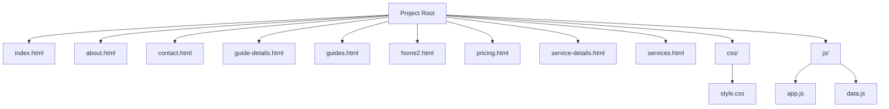
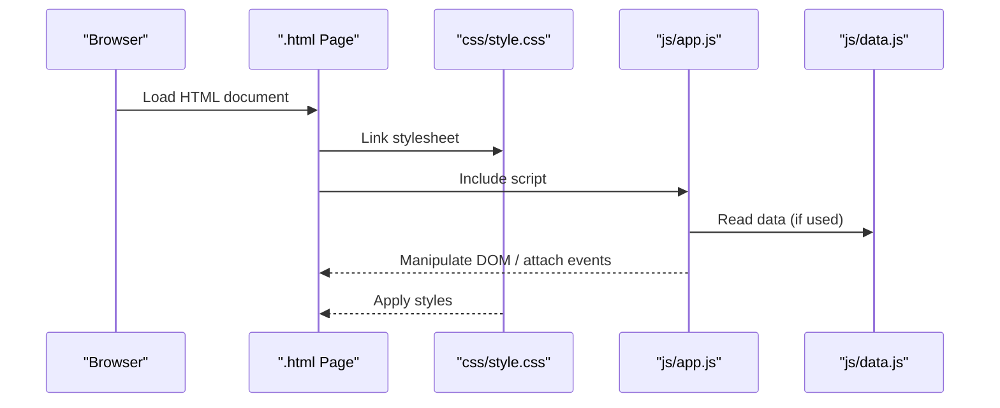
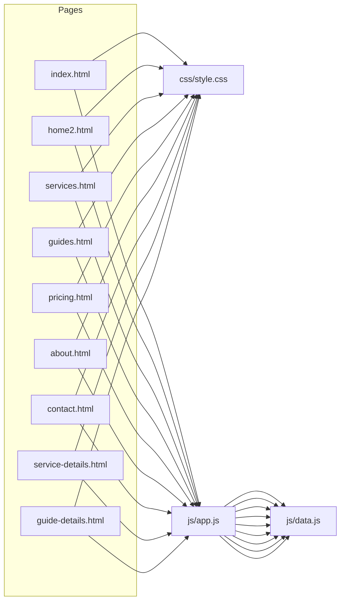

# Getting Started

<cite>
**Referenced Files in This Document**
- [index.html](file://index.html)
- [about.html](file://about.html)
- [contact.html](file://contact.html)
- [guide-details.html](file://guide-details.html)
- [guides.html](file://guides.html)
- [home2.html](file://home2.html)
- [pricing.html](file://pricing.html)
- [service-details.html](file://service-details.html)
- [services.html](file://services.html)
- [css/style.css](file://css/style.css)
- [js/app.js](file://js/app.js)
- [js/data.js](file://js/data.js)
</cite>

## Table of Contents
1. Introduction
2. Project Structure
3. Core Components
4. Architecture Overview
5. Detailed Component Analysis
6. Dependency Analysis
7. Performance Considerations
8. Troubleshooting Guide
9. Conclusion

## Introduction
This static website project is a collection of HTML pages, shared CSS styles, and JavaScript modules designed to be opened directly in a browser or served by a local development server. It includes multiple pages such as home, about, services, guides, pricing, and contact, along with detail pages for services and guides. The site uses a single global stylesheet and a small set of JavaScript files for behavior and data.

Prerequisites:
- Basic understanding of HTML structure and semantics
- Familiarity with CSS selectors and the box model
- Basic knowledge of JavaScript DOM manipulation and event handling
- A modern web browser (Chrome, Firefox, Edge, Safari)
- Optional: a simple local server (e.g., VS Code Live Server, Python http.server, Node http-server)

## Project Structure
The project follows a flat page layout with shared assets organized into css and js directories. Each .html file represents a standalone page that links to the shared stylesheet and scripts.

**Diagram sources**
- [index.html](file://index.html)
- [about.html](file://about.html)
- [contact.html](file://contact.html)
- [guide-details.html](file://guide-details.html)
- [guides.html](file://guides.html)
- [home2.html](file://home2.html)
- [pricing.html](file://pricing.html)
- [service-details.html](file://service-details.html)
- [services.html](file://services.html)
- [css/style.css](file://css/style.css)
- [js/app.js](file://js/app.js)
- [js/data.js](file://js/data.js)

How to navigate:
- Open index.html in your browser to see the default entry point.
- Explore other pages like about.html, services.html, guides.html, pricing.html, and contact.html.
- Shared styles live in css/style.css; shared scripts are in js/app.js and js/data.js.

**Section sources**
- [index.html](file://index.html)
- [css/style.css](file://css/style.css)
- [js/app.js](file://js/app.js)
- [js/data.js](file://js/data.js)

## Core Components
- Pages: Each .html file is a self-contained page. They typically link to the shared stylesheet and scripts.
- Styles: All visual styling is centralized in css/style.css.
- Behavior: Interactive features and dynamic content are implemented in js/app.js and js/data.js.

What to edit first:
- Change text and structure in any .html file to update page content.
- Modify colors, fonts, spacing, and layout in css/style.css.
- Add interactivity or load data from js/app.js and js/data.js.

Examples of common tasks:
- Edit content: Update headings, paragraphs, lists, and images within the target .html file.
- Customize styling: Add new rules or override existing ones in css/style.css using selectors that match elements in your pages.
- Add a new page: Create a new .html file, link it to css/style.css and js/app.js, and add navigation links from existing pages.

**Section sources**
- [index.html](file://index.html)
- [css/style.css](file://css/style.css)
- [js/app.js](file://js/app.js)
- [js/data.js](file://js/data.js)

## Architecture Overview
At runtime, each page loads the shared stylesheet and scripts. The JavaScript may read data from js/data.js and manipulate the DOM via js/app.js.

**Diagram sources**
- [index.html](file://index.html)
- [css/style.css](file://css/style.css)
- [js/app.js](file://js/app.js)
- [js/data.js](file://js/data.js)

## Detailed Component Analysis

### Pages and Navigation
- Entry points: index.html and home2.html provide alternative landing pages.
- Feature pages: services.html, guides.html, pricing.html, about.html, contact.html.
- Detail pages: service-details.html, guide-details.html.

To add a new page:
1. Create a new .html file in the project root.
2. Link css/style.css and js/app.js at the top or bottom of the document.
3. Add navigation links from existing pages to the new page.

To edit an existing page:
- Locate the relevant .html file and modify its markup.
- Use semantic tags (header, main, section, footer) for clarity and accessibility.

**Section sources**
- [index.html](file://index.html)
- [home2.html](file://home2.html)
- [services.html](file://services.html)
- [guides.html](file://guides.html)
- [pricing.html](file://pricing.html)
- [about.html](file://about.html)
- [contact.html](file://contact.html)
- [service-details.html](file://service-details.html)
- [guide-details.html](file://guide-details.html)

### Styling System
- Centralized styles in css/style.css.
- Use descriptive class names and avoid inline styles to keep changes maintainable.
- Organize rules by sections (layout, typography, components) for readability.

Tips:
- Prefer CSS variables for theme values (colors, fonts, spacing).
- Keep selectors specific enough to avoid unintended overrides.

**Section sources**
- [css/style.css](file://css/style.css)

### JavaScript Behavior and Data
- js/app.js contains application logic and DOM interactions.
- js/data.js holds data consumed by the app (e.g., arrays or objects).

Workflow:
- On page load, app.js can initialize UI, bind events, and render data from data.js.
- If you need to change displayed content, update data.js rather than hardcoding in HTML where appropriate.

Best practices:
- Keep logic modular and well-commented.
- Avoid global variable pollution; encapsulate functionality.

**Section sources**
- [js/app.js](file://js/app.js)
- [js/data.js](file://js/data.js)

### Adding New Content Step-by-Step
- To add a new service or guide item:
  - Update data.js with new entries if the page renders from data.
  - Ensure app.js handles the new fields when rendering.
  - Verify the related page displays correctly.

- To create a new informational page:
  - Duplicate an existing .html file as a template.
  - Replace placeholder content with your own.
  - Link to the new page from the navigation.

**Section sources**
- [js/data.js](file://js/data.js)
- [js/app.js](file://js/app.js)
- [services.html](file://services.html)
- [guides.html](file://guides.html)

## Dependency Analysis
Each page depends on the shared stylesheet and scripts. There are no build tools or package managers involved.

**Diagram sources**
- [index.html](file://index.html)
- [home2.html](file://home2.html)
- [services.html](file://services.html)
- [guides.html](file://guides.html)
- [pricing.html](file://pricing.html)
- [about.html](file://about.html)
- [contact.html](file://contact.html)
- [service-details.html](file://service-details.html)
- [guide-details.html](file://guide-details.html)
- [css/style.css](file://css/style.css)
- [js/app.js](file://js/app.js)
- [js/data.js](file://js/data.js)

## Performance Considerations
- Keep css/style.css organized and remove unused rules over time.
- Minimize heavy images and use appropriate formats (WebP, AVIF) and sizes.
- Defer non-critical JavaScript or place scripts at the bottom of the page to improve initial render.
- Use browser caching by serving files with proper cache headers when using a local server.

[No sources needed since this section provides general guidance]

## Troubleshooting Guide
Common issues and fixes:
- Styles not applied:
  - Ensure the link to css/style.css exists and the path is correct relative to the HTML file.
  - Check the browser DevTools Network tab for 404 errors.

- Scripts not running:
  - Confirm js/app.js and js/data.js are linked and paths are correct.
  - Open the console to check for syntax or runtime errors.

- Images missing:
  - Verify image paths and ensure files exist in the expected locations.

- Local server vs. file:// protocol:
  - Some browsers restrict certain features when opening files directly via file://. Use a local server for full compatibility.

Setup tips:
- Quick start without installing anything:
  - Double-click index.html to open it in your default browser.
- Recommended local server options:
  - VS Code Live Server extension
  - Python: python -m http.server
  - Node: npx http-server

**Section sources**
- [index.html](file://index.html)
- [css/style.css](file://css/style.css)
- [js/app.js](file://js/app.js)
- [js/data.js](file://js/data.js)

## Conclusion
You now have everything you need to run, explore, and customize this static website. Start by opening index.html, then branch out to other pages. Make your first edits in the HTML files, refine the look in css/style.css, and extend behavior in js/app.js and js/data.js. For smoother development, consider using a local server and browser developer tools.

[No sources needed since this section summarizes without analyzing specific files]