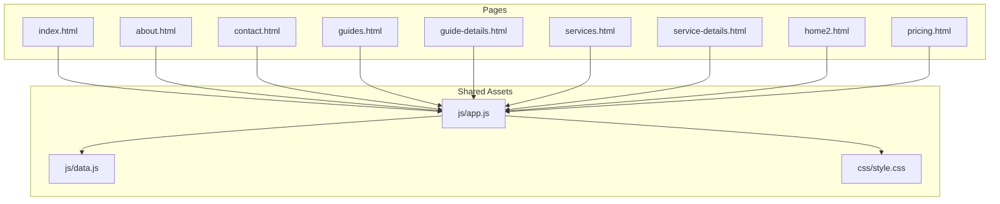
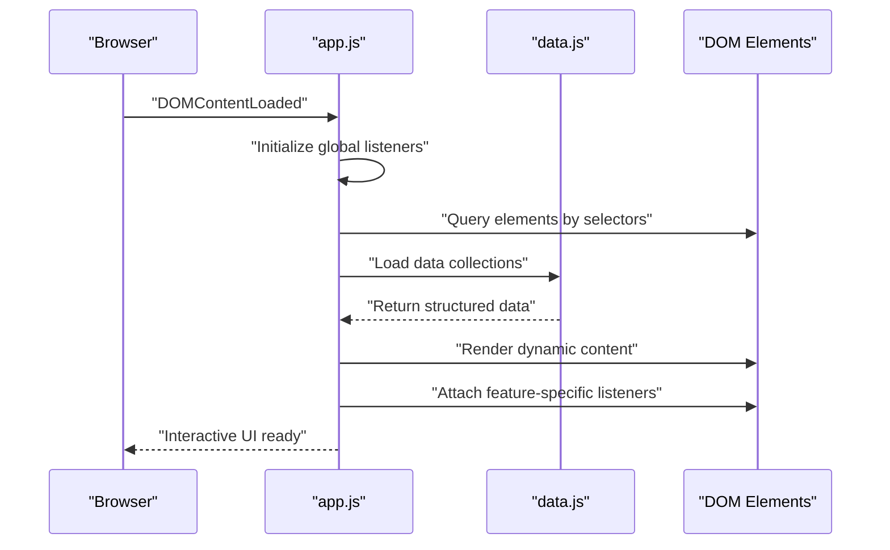
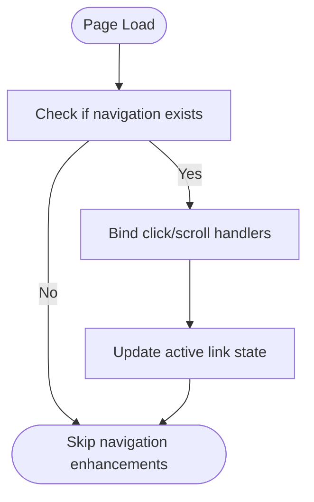
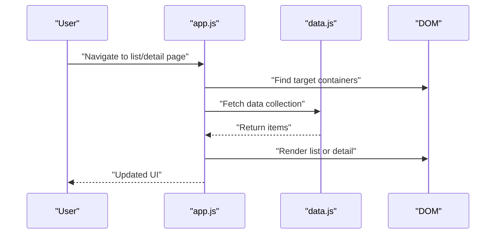
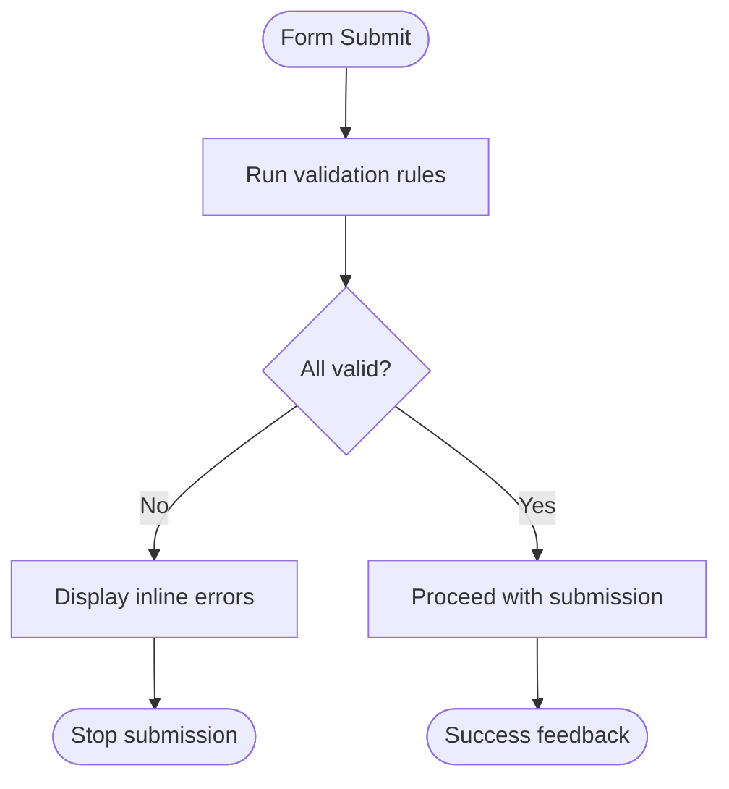
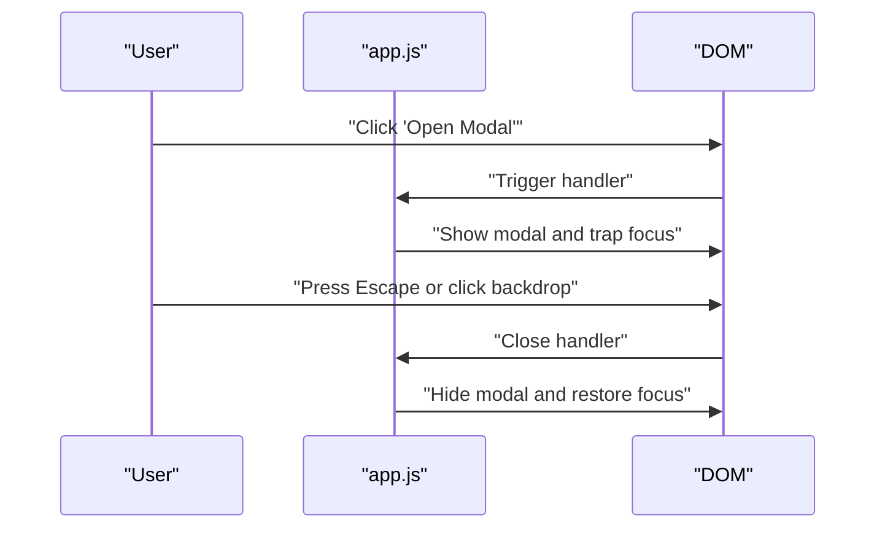
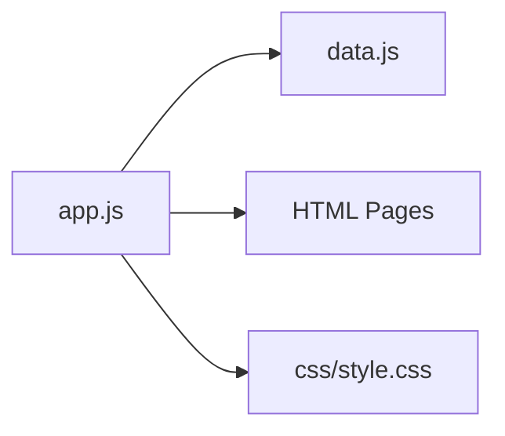

# Application Logic (app.js)

<cite>
**Referenced Files in This Document**
- [app.js](file://js/app.js)
- [data.js](file://js/data.js)
- [index.html](file://index.html)
- [about.html](file://about.html)
- [contact.html](file://contact.html)
- [guides.html](file://guides.html)
- [guide-details.html](file://guide-details.html)
- [services.html](file://services.html)
- [service-details.html](file://service-details.html)
- [home2.html](file://home2.html)
- [pricing.html](file://pricing.html)
- [style.css](file://css/style.css)
</cite>

## Table of Contents
1. [Introduction](#introduction)
2. [Project Structure](#project-structure)
3. [Core Components](#core-components)
4. [Architecture Overview](#architecture-overview)
5. [Detailed Component Analysis](#detailed-component-analysis)
6. [Dependency Analysis](#dependency-analysis)
7. [Performance Considerations](#performance-considerations)
8. [Troubleshooting Guide](#troubleshooting-guide)
9. [Conclusion](#conclusion)
10. [Appendices](#appendices)

## Introduction
This document explains the main application logic implemented in app.js and how it powers interactive features across the site. It covers event handling, DOM manipulation, user interactions, dynamic content loading, navigation enhancements, form validation, modal dialogs, and dynamic UI behaviors. It also provides guidance on extending functionality, maintaining clean modular code, error handling strategies, performance optimization techniques, and debugging approaches.

## Project Structure
The project is a multi-page static website with shared JavaScript and CSS assets:
- Shared scripts: js/app.js and js/data.js
- Styles: css/style.css
- Pages: index.html, about.html, contact.html, guides.html, guide-details.html, services.html, service-details.html, home2.html, pricing.html

[No sources needed since this diagram shows conceptual structure]

## Core Components
- Event-driven initialization: The script attaches listeners for navigation, forms, modals, and dynamic content rendering after the DOM is ready.
- Data-driven UI: Dynamic lists and detail views are populated from data structures defined in data.js.
- Navigation enhancement: Active link highlighting and smooth transitions between pages or sections.
- Form validation: Client-side checks for required fields, format validation, and inline feedback.
- Modal dialogs: Open/close behavior, focus management, and keyboard accessibility.
- Dynamic content loading: Rendering lists and details based on URL parameters or user actions.

Key responsibilities:
- Initialize page-specific behaviors safely without interfering with other pages.
- Provide reusable helpers for DOM queries, event binding, and data rendering.
- Centralize error handling and logging to improve maintainability.

**Section sources**
- [app.js](file://js/app.js)
- [data.js](file://js/data.js)

## Architecture Overview
The application follows a lightweight, module-like organization within a single script file:
- Initialization layer: Runs once per page load to set up global behaviors.
- Feature modules: Self-contained functions for navigation, forms, modals, and content rendering.
- Data layer: A separate module providing structured data consumed by the UI.

**Diagram sources**
- [app.js](file://js/app.js)
- [data.js](file://js/data.js)

## Detailed Component Analysis

### Navigation Enhancements
- Active link highlighting: Updates the active state on navigation links based on current page or section.
- Smooth scrolling: Optional smooth scroll behavior for anchor links.
- Conditional activation: Ensures navigation enhancements only run when relevant elements exist.

**Section sources**
- [app.js](file://js/app.js)

### Dynamic Content Loading
- List rendering: Populates lists (e.g., guides, services) from data.js into container elements.
- Detail view routing: Reads URL parameters to render specific items.
- Error fallbacks: Displays friendly messages when data is missing or malformed.

**Section sources**
- [app.js](file://js/app.js)
- [data.js](file://js/data.js)

### Form Validation
- Required field checks: Validates presence of mandatory inputs.
- Format validation: Enforces patterns such as email addresses.
- Inline feedback: Shows success/error messages near inputs.
- Submission gating: Prevents submission until all validations pass.

**Section sources**
- [app.js](file://js/app.js)

### Modal Dialogs
- Open/close triggers: Buttons and links toggle modal visibility.
- Focus management: Moves focus into modal on open and returns on close.
- Keyboard support: Escape key closes modal; backdrop clicks can dismiss.
- Accessibility: Uses appropriate roles and aria attributes.

**Section sources**
- [app.js](file://js/app.js)

### Adding New Interactive Elements
To add a new interactive element:
- Ensure the HTML includes an identifiable container or trigger element.
- Add a dedicated function in app.js that:
  - Checks for element existence before attaching listeners.
  - Binds minimal, necessary events.
  - Updates the DOM safely using existing helper patterns.
- If the feature uses data, import or reference the relevant dataset from data.js.
- Test across pages where the element may or may not be present.

Example pattern references:
- Safe element query and conditional binding
- Event delegation for dynamic children
- Render loop over data arrays

**Section sources**
- [app.js](file://js/app.js)
- [data.js](file://js/data.js)

### Modifying Existing Behaviors
- Locate the feature’s initialization block in app.js.
- Adjust event bindings or DOM updates while preserving existing contracts.
- For data-driven features, extend data.js structures and update renderers accordingly.
- Keep changes localized to avoid unintended side effects on other pages.

**Section sources**
- [app.js](file://js/app.js)
- [data.js](file://js/data.js)

### Extending Functionality
- Create small, focused functions for each behavior.
- Use consistent naming and parameter shapes.
- Centralize common utilities (e.g., safe querySelector, event attach).
- Maintain clear separation between UI updates and data operations.

**Section sources**
- [app.js](file://js/app.js)

## Dependency Analysis
- app.js depends on:
  - data.js for structured content used by dynamic components.
  - Page HTML for DOM targets (selectors must match markup).
  - style.css for visual states (e.g., active classes, modal overlays).

**Diagram sources**
- [app.js](file://js/app.js)
- [data.js](file://js/data.js)
- [index.html](file://index.html)
- [style.css](file://css/style.css)

**Section sources**
- [app.js](file://js/app.js)
- [data.js](file://js/data.js)
- [index.html](file://index.html)
- [style.css](file://css/style.css)

## Performance Considerations
- Defer heavy work until DOMContentLoaded to avoid blocking initial paint.
- Cache frequently accessed DOM nodes instead of querying repeatedly.
- Use event delegation for lists or dynamically generated items.
- Avoid layout thrashing by batching DOM reads/writes.
- Minimize reflows by toggling classes rather than inline styles.
- Debounce high-frequency events like scroll or resize.

[No sources needed since this section provides general guidance]

## Troubleshooting Guide
Common issues and resolutions:
- Selectors not found: Verify that IDs/classes in app.js match the HTML on the current page.
- Events not firing: Ensure listeners are attached after DOM readiness and only when elements exist.
- Data rendering failures: Inspect data.js structures and ensure keys align with renderer expectations.
- Modal focus traps: Confirm focus management logic runs on open/close and that Escape/backdrop handlers are bound.
- Cross-page inconsistencies: Wrap page-specific code in guards that check for element presence.

Debugging tips:
- Log entry points and key variables during initialization.
- Use browser DevTools breakpoints around event handlers and render functions.
- Temporarily disable non-essential listeners to isolate issues.

**Section sources**
- [app.js](file://js/app.js)

## Conclusion
The application logic in app.js orchestrates interactive behaviors across multiple pages through a clear, modular approach. By leveraging data.js for content, careful DOM queries, and robust event handling, the site delivers dynamic navigation, forms, modals, and content rendering. Following the guidelines here will help you extend features safely, maintain performance, and keep the codebase clean and testable.

[No sources needed since this section summarizes without analyzing specific files]

## Appendices

### Page-Specific Integration Notes
- Ensure each page includes the shared script and has the expected DOM elements referenced by app.js.
- Align class names and IDs with those used in app.js for consistent styling and behavior.

**Section sources**
- [index.html](file://index.html)
- [about.html](file://about.html)
- [contact.html](file://contact.html)
- [guides.html](file://guides.html)
- [guide-details.html](file://guide-details.html)
- [services.html](file://services.html)
- [service-details.html](file://service-details.html)
- [home2.html](file://home2.html)
- [pricing.html](file://pricing.html)