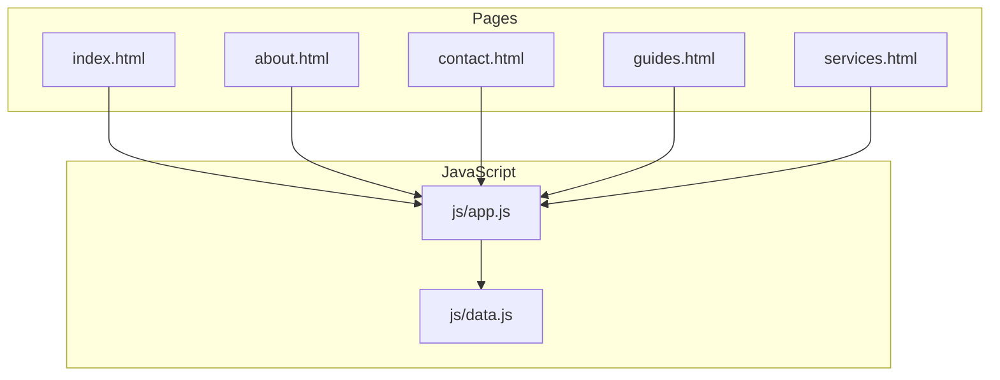
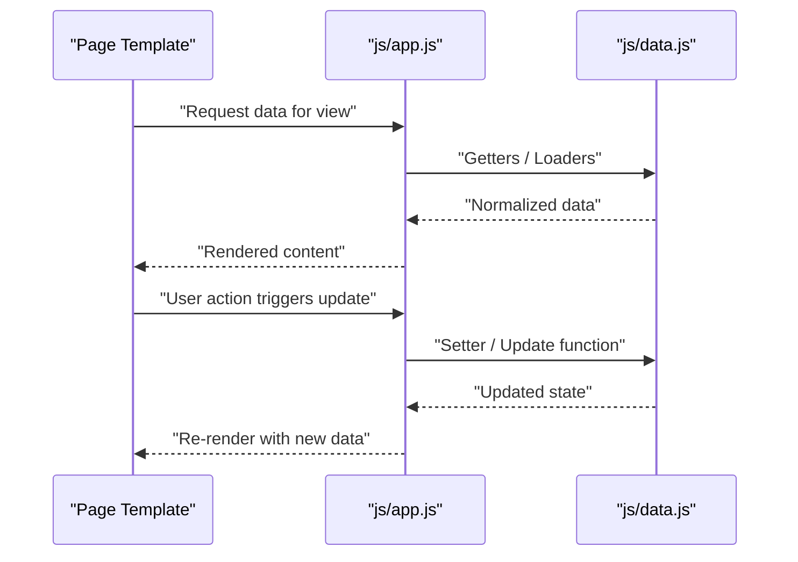
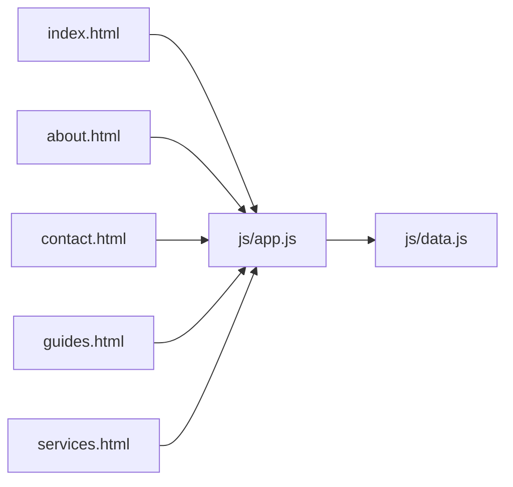

# Data Management (data.js)

<cite>
**Referenced Files in This Document**
- [data.js](file://js/data.js)
- [app.js](file://js/app.js)
- [index.html](file://index.html)
- [about.html](file://about.html)
- [contact.html](file://contact.html)
- [guides.html](file://guides.html)
- [services.html](file://services.html)
</cite>

## Table of Contents
1. [Introduction](#introduction)
2. [Project Structure](#project-structure)
3. [Core Components](#core-components)
4. [Architecture Overview](#architecture-overview)
5. [Detailed Component Analysis](#detailed-component-analysis)
6. [Dependency Analysis](#dependency-analysis)
7. [Performance Considerations](#performance-considerations)
8. [Troubleshooting Guide](#troubleshooting-guide)
9. [Conclusion](#conclusion)
10. [Appendices](#appendices)

## Introduction
This document explains the data management system implemented in data.js, including content structure, configuration settings, and data organization patterns used across pages and components. It covers how data is structured, stored, accessed, transformed, validated, and maintained throughout the application lifecycle. It also provides guidelines for extending the data model and maintaining consistency.

## Project Structure
The application organizes JavaScript logic under js/ and HTML pages at the root. The data layer resides in js/data.js and is consumed by the application entry point js/app.js and various page templates.

[No sources needed since this diagram shows conceptual workflow, not actual code structure]

## Core Components
- Centralized data store: A single source of truth for application content and configuration.
- Page-specific data modules: Organized by feature or page to keep related data together.
- Utility functions: Helpers for validation, transformation, and safe access.
- Accessors and setters: Controlled interfaces for reading and updating data.
- Initialization routines: Functions that prepare and hydrate data before rendering.

Key responsibilities:
- Define schemas and default values for each data entity.
- Provide methods to load, update, and persist data where applicable.
- Expose typed getters and validators to ensure consistency.
- Centralize error handling and logging for data operations.

**Section sources**
- [data.js](file://js/data.js)
- [app.js](file://js/app.js)

## Architecture Overview
The data architecture follows a unidirectional flow: pages request data through app.js, which delegates to data.js for retrieval and transformation. Updates follow the same path, ensuring consistent state propagation.

**Diagram sources**
- [app.js](file://js/app.js)
- [data.js](file://js/data.js)

## Detailed Component Analysis

### Data Store and Configuration
- Central configuration object holds global settings such as defaults, feature flags, and environment-specific options.
- Content sections are grouped by domain (e.g., guides, services, about, contact).
- Each section defines a schema with required fields, types, and constraints.

Guidelines:
- Keep configuration immutable after initialization unless explicitly updated via provided setters.
- Use descriptive keys and avoid magic strings.
- Group related settings into namespaces for clarity.

**Section sources**
- [data.js](file://js/data.js)

### Data Organization Patterns
- Feature-based grouping: Related entities live together (e.g., guide items, service entries).
- Flat lists with IDs: Prefer arrays of objects with unique identifiers for easier updates and lookups.
- Reference integrity: Use IDs to link related records rather than duplicating nested structures.

Best practices:
- Normalize repeated content into reusable entities.
- Maintain consistent naming conventions for keys and values.
- Separate static content from dynamic runtime state.

**Section sources**
- [data.js](file://js/data.js)

### Accessors and Mutators
- Getters: Provide read-only access to data with optional filtering and sorting.
- Setters: Enforce validation before applying changes; return success/failure status.
- Batch operations: Support multiple updates atomically when possible.

Error handling:
- Return explicit errors or throw typed exceptions for invalid operations.
- Log warnings for non-critical issues and continue safely.

**Section sources**
- [data.js](file://js/data.js)

### Data Transformation Utilities
- Normalizers: Convert raw inputs into canonical shapes expected by views.
- Validators: Check presence, type, length, and format constraints.
- Formatters: Prepare data for display (e.g., dates, currency, labels).

Lifecycle hooks:
- Pre-save transformations to enforce business rules.
- Post-load normalization to ensure compatibility across versions.

**Section sources**
- [data.js](file://js/data.js)

### Integration with Pages and Components
- Pages import or reference data via app.js, which exposes stable APIs.
- Components subscribe to data changes and re-render accordingly.
- Routing or navigation may trigger data prefetching to improve performance.

Consistency:
- Always use app.js as the single integration point to avoid bypassing validation.
- Avoid direct mutations outside of provided mutators.

**Section sources**
- [app.js](file://js/app.js)
- [index.html](file://index.html)
- [about.html](file://about.html)
- [contact.html](file://contact.html)
- [guides.html](file://guides.html)
- [services.html](file://services.html)

### Adding New Content
Steps:
1. Define the new entity schema in the central configuration.
2. Add default entries if appropriate.
3. Implement getter/setter methods for the new data.
4. Expose an API in app.js for pages to consume.
5. Update any relevant validators and formatters.
6. Add tests or manual checks to verify behavior.

Example references:
- Schema definition location
- Default data population
- Getter/setter implementation
- Public API exposure

**Section sources**
- [data.js](file://js/data.js)
- [app.js](file://js/app.js)

### Modifying Existing Data Structures
Approach:
- Introduce versioned migrations when changing schemas.
- Provide migration functions to transform old data to new formats.
- Keep backward compatibility during transition periods.
- Validate existing data against new constraints.

Migration checklist:
- Identify breaking changes.
- Write migration scripts.
- Test with sample datasets.
- Roll out incrementally.

**Section sources**
- [data.js](file://js/data.js)

### Extending the Data Model
Recommendations:
- Prefer additive changes over destructive ones.
- Use optional fields with sensible defaults.
- Document field semantics and allowed values.
- Centralize enums and constants to avoid drift.

**Section sources**
- [data.js](file://js/data.js)

### Data Validation and Error Handling
Validation rules:
- Required fields and types.
- Range and format checks (e.g., email, URL).
- Cross-field dependencies and business constraints.

Error strategy:
- Fail fast for critical violations.
- Aggregate non-critical warnings.
- Provide actionable messages for developers and users.

**Section sources**
- [data.js](file://js/data.js)

### Data Lifecycle Management
Phases:
- Initialization: Load defaults and merge with persisted state.
- Hydration: Normalize and validate incoming data.
- Runtime updates: Apply changes via controlled mutators.
- Persistence: Save changes securely and efficiently.
- Cleanup: Release resources and reset state on teardown.

Persistence considerations:
- Choose storage mechanism appropriate for data size and sensitivity.
- Debounce frequent writes.
- Handle offline scenarios gracefully.

**Section sources**
- [data.js](file://js/data.js)

## Dependency Analysis
The following diagram illustrates how pages depend on app.js, which in turn depends on data.js.

**Diagram sources**
- [index.html](file://index.html)
- [about.html](file://about.html)
- [contact.html](file://contact.html)
- [guides.html](file://guides.html)
- [services.html](file://services.html)
- [app.js](file://js/app.js)
- [data.js](file://js/data.js)

**Section sources**
- [app.js](file://js/app.js)
- [data.js](file://js/data.js)

## Performance Considerations
- Cache frequently accessed data to reduce recomputation.
- Lazy-load heavy datasets only when needed.
- Minimize deep cloning; prefer shallow copies where safe.
- Batch updates to limit re-renders.
- Profile memory usage for large collections.

[No sources needed since this section provides general guidance]

## Troubleshooting Guide
Common issues and resolutions:
- Missing fields: Ensure schema definitions match actual payloads; add defaults where appropriate.
- Type mismatches: Normalize inputs early; enforce types in setters.
- Circular references: Flatten structures or break cycles before serialization.
- Stale state: Verify that updates propagate through the correct channels and subscriptions.
- Persistence failures: Inspect storage permissions and quotas; implement fallbacks.

Debugging tips:
- Log data transitions around key boundaries.
- Snapshot state before and after mutations.
- Use deterministic test fixtures.

**Section sources**
- [data.js](file://js/data.js)

## Conclusion
A robust data management system centers on clear schemas, controlled access, and predictable transformations. By centralizing configuration, enforcing validation, and providing well-defined APIs, the application maintains consistency and extensibility. Follow the guidelines above to add features safely and keep the data layer maintainable over time.

[No sources needed since this section summarizes without analyzing specific files]

## Appendices

### Quick Start: Adding a New Section
- Define schema and defaults in the central configuration.
- Implement getters/setters and expose them via app.js.
- Wire up page templates to consume the new API.
- Validate and test end-to-end.

References:
- [data.js](file://js/data.js)
- [app.js](file://js/app.js)

### Migration Checklist
- Audit breaking changes.
- Write migration functions.
- Run against production-like datasets.
- Monitor for regressions post-deploy.

References:
- [data.js](file://js/data.js)