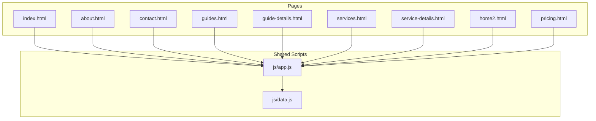
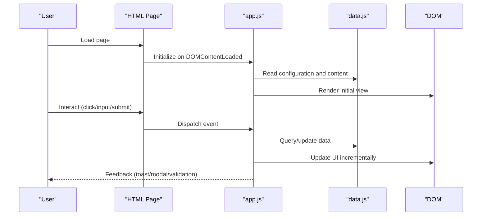
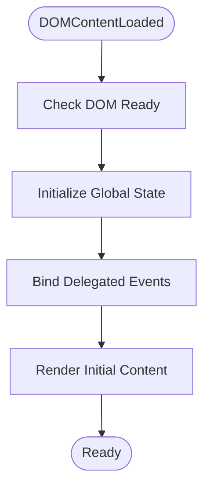
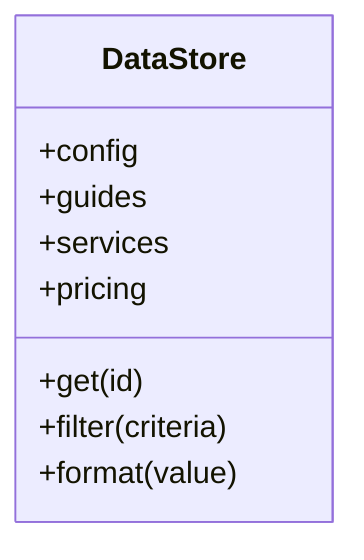
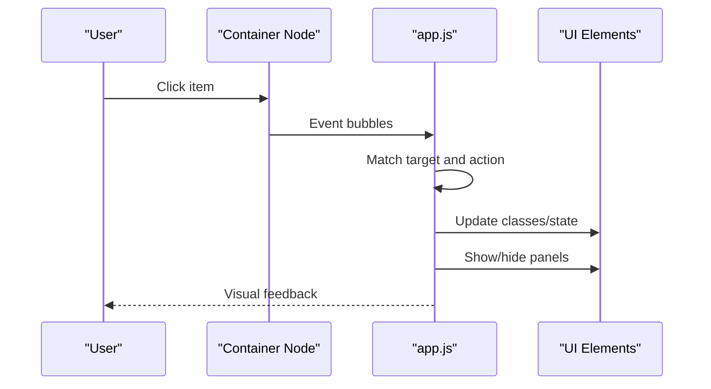
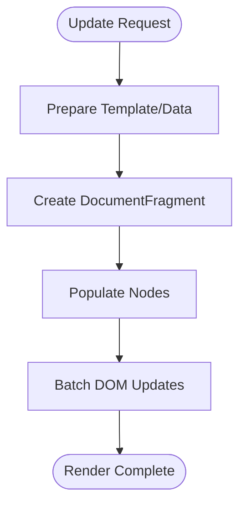
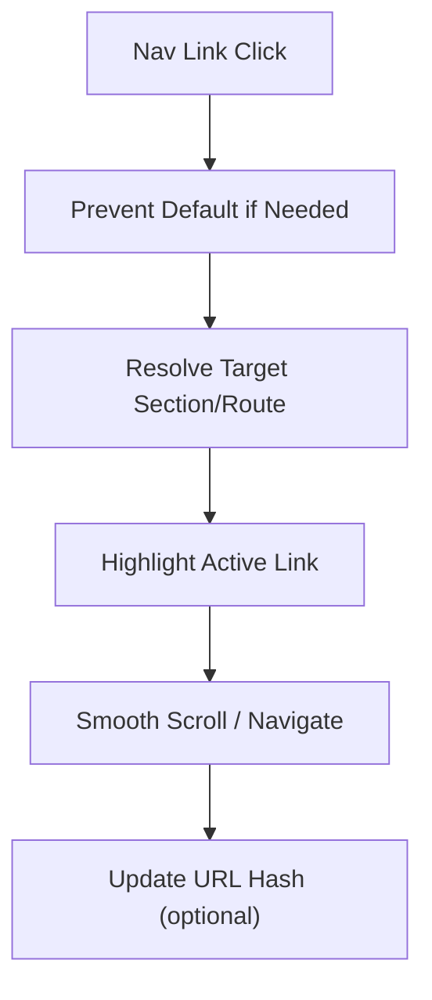
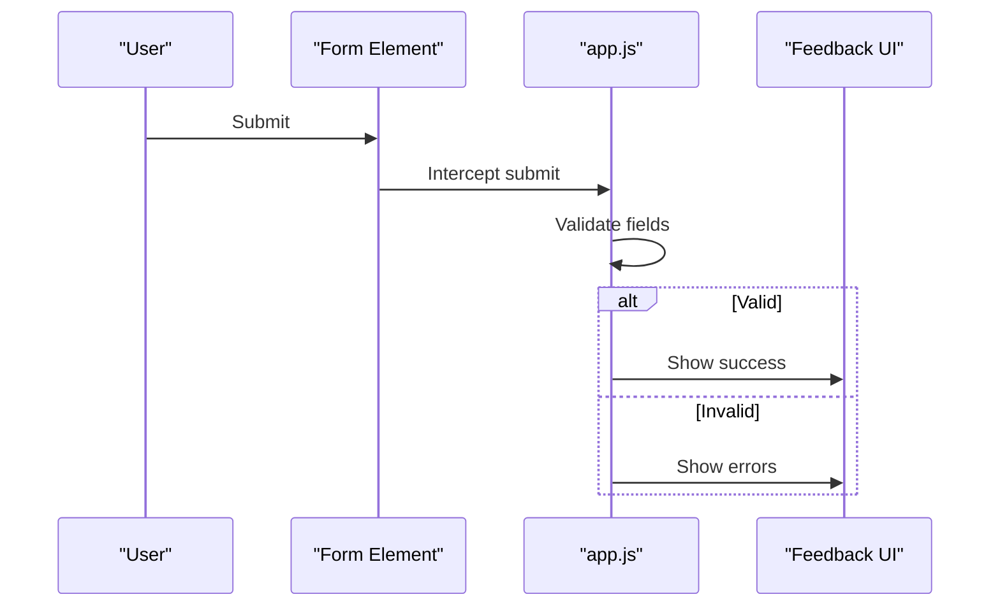
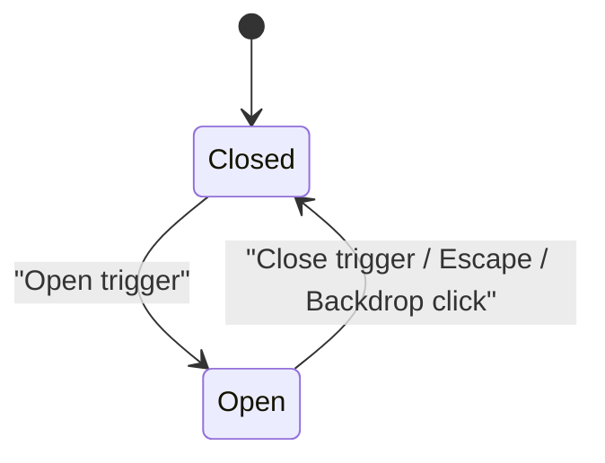
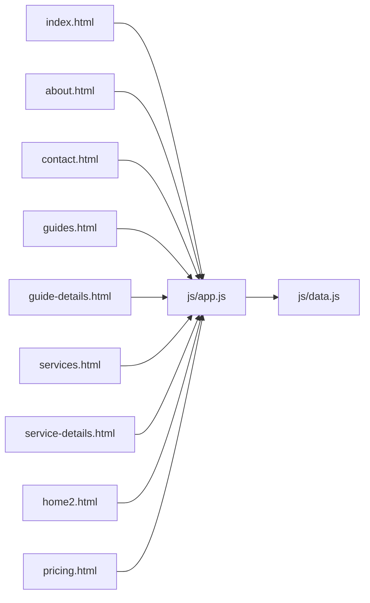

# JavaScript Functionality

<cite>
**Referenced Files in This Document**
- [app.js](file://js/app.js)
- [data.js](file://js/data.js)
- [index.html](file://index.html)
- [about.html](file://about.html)
- [contact.html](file://contact.html)
- [guides.html](file://guides.html)
- [guide-details.html](file://guide-details.html)
- [services.html](file://services.html)
- [service-details.html](file://service-details.html)
- [home2.html](file://home2.html)
- [pricing.html](file://pricing.html)
</cite>

## Table of Contents
1. [Introduction](#introduction)
2. [Project Structure](#project-structure)
3. [Core Components](#core-components)
4. [Architecture Overview](#architecture-overview)
5. [Detailed Component Analysis](#detailed-component-analysis)
6. [Dependency Analysis](#dependency-analysis)
7. [Performance Considerations](#performance-considerations)
8. [Troubleshooting Guide](#troubleshooting-guide)
9. [Conclusion](#conclusion)
10. [Appendices](#appendices)

## Introduction
This document explains the client-side JavaScript functionality and logic for the project. It focuses on:
- Main application behavior in app.js, including event handling, DOM manipulation, user interactions, and dynamic content loading
- Data management in data.js, covering content structure, configuration settings, and organization patterns
- Interactive features such as navigation enhancements, form validation, modal dialogs, and dynamic UI behaviors
- Extension points to add new interactive elements and modify existing behaviors
- Performance considerations, error handling strategies, and debugging techniques
- Guidelines for maintaining clean, modular JavaScript code and best practices for client-side development

## Project Structure
The project is a multi-page site with shared JavaScript modules:
- js/app.js: Central client-side logic (event binding, DOM updates, dynamic rendering, UX behaviors)
- js/data.js: Shared data store and configuration used by app.js
- HTML pages reference the shared scripts and may include page-specific markup that app.js enhances

[No sources needed since this diagram shows conceptual workflow, not actual code structure]

## Core Components
- Application bootstrap and initialization
  - Waits for DOM ready, then initializes global state, binds events, and renders initial views
- Event handling layer
  - Delegates clicks, inputs, and keyboard actions; uses event delegation for performance
- DOM manipulation utilities
  - Helpers to create, update, and remove nodes safely; avoids reflows where possible
- Dynamic content loader
  - Fetches or renders content from data.js; supports partial updates and skeleton loaders
- Navigation enhancement
  - Highlights active links, smooth scrolling, and optional hash-based routing
- Form validation and submission
  - Client-side validation, inline feedback, and safe submission flow
- Modal/dialog system
  - Open/close handlers, focus trapping, and backdrop click dismissal
- Accessibility helpers
  - ARIA attributes, focus management, and keyboard support

**Section sources**
- [app.js](file://js/app.js)
- [data.js](file://js/data.js)

## Architecture Overview
The client architecture follows a simple MVC-like pattern:
- Model: data.js provides structured content and configuration
- View: app.js manipulates the DOM based on model changes
- Controller: app.js handles user input and orchestrates updates

**Diagram sources**
- [app.js](file://js/app.js)
- [data.js](file://js/data.js)

## Detailed Component Analysis

### Application Bootstrap and Initialization
- Purpose: Set up global state, bind top-level listeners, and render initial content
- Responsibilities:
  - Ensure DOM is ready before attaching listeners
  - Initialize theme, language, or feature flags from configuration
  - Attach event delegation for dynamic lists and navigation
  - Render static sections from data.js

**Diagram sources**
- [app.js](file://js/app.js)

**Section sources**
- [app.js](file://js/app.js)

### Data Management System (data.js)
- Purpose: Provide a single source of truth for content and configuration
- Typical structure:
  - Configuration object (site-wide settings, defaults, feature toggles)
  - Content collections (arrays/objects for guides, services, pricing, etc.)
  - Utility functions for filtering, sorting, and formatting
- Organization patterns:
  - Flat arrays with unique IDs for listable items
  - Nested objects for detail pages
  - Separate namespaces per domain (e.g., guides, services)

**Diagram sources**
- [data.js](file://js/data.js)

**Section sources**
- [data.js](file://js/data.js)

### Event Handling and User Interactions
- Event delegation strategy:
  - Attach one listener to a container and handle child clicks via target matching
  - Reduces memory usage and supports dynamically added elements
- Common interactions:
  - Navigation clicks, tab switching, accordion toggles, filter controls
  - Input change/blur for live validation
  - Keyboard shortcuts and focus management

**Diagram sources**
- [app.js](file://js/app.js)

**Section sources**
- [app.js](file://js/app.js)

### DOM Manipulation and Dynamic Content Loading
- Safe DOM updates:
  - Use DocumentFragment for batched insertions
  - Avoid layout thrashing by batching reads/writes
- Dynamic rendering:
  - Build templates from data.js
  - Replace placeholders without full reloads
- Skeleton and error states:
  - Show loading skeletons while fetching or processing
  - Display friendly errors and retry options

**Diagram sources**
- [app.js](file://js/app.js)

**Section sources**
- [app.js](file://js/app.js)

### Navigation Enhancements
- Active link highlighting based on current path or hash
- Smooth scroll to sections
- Optional hash-based routing for single-page-like experience

**Diagram sources**
- [app.js](file://js/app.js)

**Section sources**
- [app.js](file://js/app.js)

### Form Validation and Submission
- Validation rules:
  - Required fields, format checks, custom validators
- Feedback:
  - Inline messages, field borders, aria-invalid updates
- Submission:
  - Prevent default, validate all fields, serialize data, show success/error states

**Diagram sources**
- [app.js](file://js/app.js)

**Section sources**
- [app.js](file://js/app.js)

### Modal Dialogs and Dynamic UI Behaviors
- Modal lifecycle:
  - Open: trap focus, set aria-modal, disable background scroll
  - Close: restore focus, reset aria attributes
- Triggers:
  - Buttons, links, keyboard Escape key
- Backdrop interaction:
  - Click outside to dismiss

**Diagram sources**
- [app.js](file://js/app.js)

**Section sources**
- [app.js](file://js/app.js)

### Extending Functionality
- Add a new interactive element:
  - Define a data entry in data.js
  - Add a template or container in the relevant HTML page
  - Register an event handler in app.js using delegation
  - Wire up any required validation or modal behavior
- Modify existing behavior:
  - Extend configuration in data.js
  - Update event handlers in app.js to branch on new conditions
  - Keep side effects isolated and testable

**Section sources**
- [app.js](file://js/app.js)
- [data.js](file://js/data.js)

## Dependency Analysis
- app.js depends on data.js for content and configuration
- Each HTML page includes app.js and optionally data.js (or relies on app.js to load it)
- No circular dependencies between modules

**Diagram sources**
- [index.html](file://index.html)
- [about.html](file://about.html)
- [contact.html](file://contact.html)
- [guides.html](file://guides.html)
- [guide-details.html](file://guide-details.html)
- [services.html](file://services.html)
- [service-details.html](file://service-details.html)
- [home2.html](file://home2.html)
- [pricing.html](file://pricing.html)
- [app.js](file://js/app.js)
- [data.js](file://js/data.js)

**Section sources**
- [app.js](file://js/app.js)
- [data.js](file://js/data.js)
- [index.html](file://index.html)
- [about.html](file://about.html)
- [contact.html](file://contact.html)
- [guides.html](file://guides.html)
- [guide-details.html](file://guide-details.html)
- [services.html](file://services.html)
- [service-details.html](file://service-details.html)
- [home2.html](file://home2.html)
- [pricing.html](file://pricing.html)

## Performance Considerations
- Prefer event delegation over many individual listeners
- Batch DOM writes using DocumentFragment and avoid forced reflows
- Debounce/throttle high-frequency events (scroll, resize, input)
- Lazy-load heavy components or images when off-screen
- Cache frequently accessed DOM references and computed values
- Minimize layout thrashing by reading and writing separately
- Use efficient selectors and avoid deep traversals
- Keep data.js lean; split large datasets into modules if needed

[No sources needed since this section provides general guidance]

## Troubleshooting Guide
- Debugging tips:
  - Use browser DevTools console and breakpoints in app.js
  - Log data transformations and DOM mutations around critical paths
  - Inspect network requests if dynamic content is fetched
- Common issues:
  - Event not firing: verify selector matches and element exists at bind time
  - Modal focus lost: ensure focus trap and restoration are implemented
  - Form validation false positives: check rule order and async validators
  - Memory leaks: detach listeners when removing large DOM trees
- Error handling strategies:
  - Wrap risky operations in try/catch and surface user-friendly messages
  - Provide fallback UI when data.js entries are missing or malformed
  - Gracefully degrade features if APIs fail

**Section sources**
- [app.js](file://js/app.js)
- [data.js](file://js/data.js)

## Conclusion
The client-side implementation centers on a clear separation between data (data.js) and behavior (app.js). By leveraging event delegation, efficient DOM updates, and robust validation and modal handling, the application delivers responsive and accessible interactions across multiple pages. Follow the extension guidelines and performance recommendations to maintain a clean, scalable codebase.

[No sources needed since this section summarizes without analyzing specific files]

## Appendices

### Best Practices for Clean, Modular JavaScript
- Single responsibility: keep each function focused on one task
- Encapsulate state: avoid global variables; use modules or IIFEs
- Favor composition over inheritance for utility functions
- Keep selectors and constants centralized
- Write small, testable units and isolate side effects
- Maintain consistent naming and file organization

[No sources needed since this section provides general guidance]