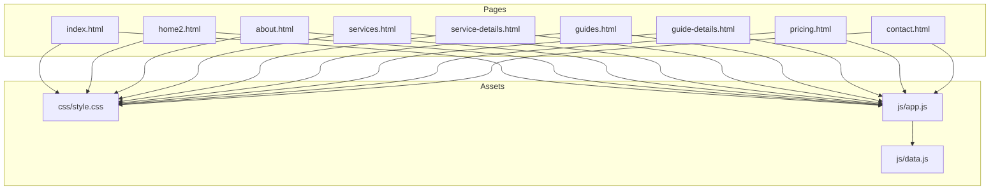
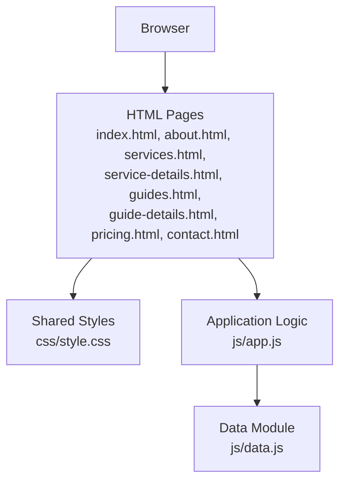
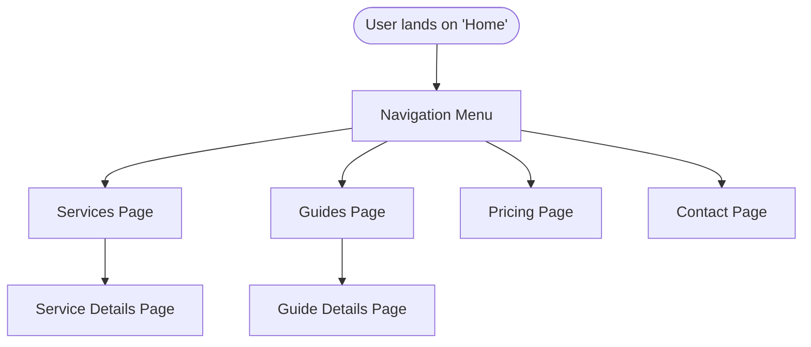
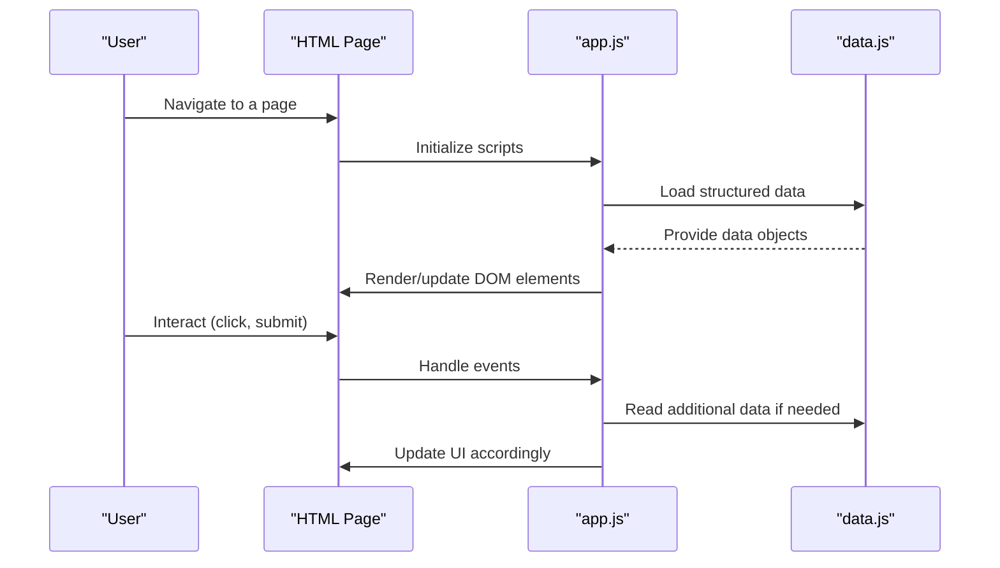
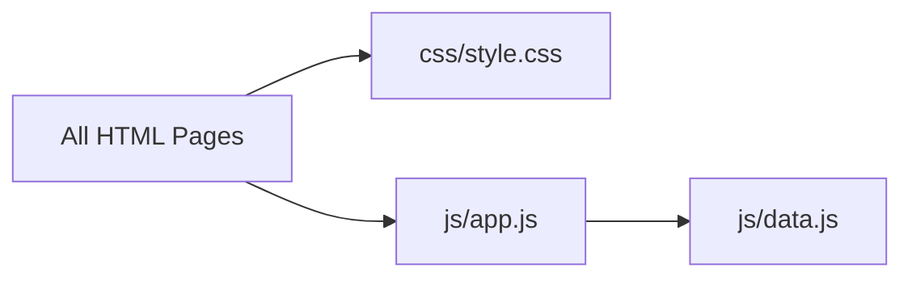

# Project Overview

<cite>
**Referenced Files in This Document**
- [index.html](file://index.html)
- [home2.html](file://home2.html)
- [about.html](file://about.html)
- [services.html](file://services.html)
- [service-details.html](file://service-details.html)
- [guides.html](file://guides.html)
- [guide-details.html](file://guide-details.html)
- [pricing.html](file://pricing.html)
- [contact.html](file://contact.html)
- [css/style.css](file://css/style.css)
- [js/app.js](file://js/app.js)
- [js/data.js](file://js/data.js)
</cite>

## Table of Contents
1. [Introduction](#introduction)
2. [Project Structure](#project-structure)
3. [Core Components](#core-components)
4. [Architecture Overview](#architecture-overview)
5. [Detailed Component Analysis](#detailed-component-analysis)
6. [Dependency Analysis](#dependency-analysis)
7. [Performance Considerations](#performance-considerations)
8. [Troubleshooting Guide](#troubleshooting-guide)
9. [Conclusion](#conclusion)

## Introduction
This project is a multi-page static site built with vanilla HTML, CSS, and JavaScript. It presents a business or service website with multiple pages for navigation, content presentation, and client-side interactivity. The site includes core sections such as home, about, services (with details), guides (with details), pricing, and contact. The architecture emphasizes simplicity and performance by leveraging a static site approach: no server-side rendering or build tools are required, and all assets are served directly to the browser.

Key characteristics:
- Multi-page application structure where each page is an independent HTML document
- Static site deployment model with client-side interactivity powered by JavaScript
- Centralized styling via a single stylesheet
- Shared data and behavior through modular JavaScript files

## Project Structure
The repository follows a clear separation of concerns:
- HTML pages at the root level define the multi-page layout and content
- A dedicated css directory holds styles
- A js directory contains shared scripts for behavior and data

**Diagram sources**
- [index.html](file://index.html)
- [home2.html](file://home2.html)
- [about.html](file://about.html)
- [services.html](file://services.html)
- [service-details.html](file://service-details.html)
- [guides.html](file://guides.html)
- [guide-details.html](file://guide-details.html)
- [pricing.html](file://pricing.html)
- [contact.html](file://contact.html)
- [css/style.css](file://css/style.css)
- [js/app.js](file://js/app.js)
- [js/data.js](file://js/data.js)

**Section sources**
- [index.html](file://index.html)
- [css/style.css](file://css/style.css)
- [js/app.js](file://js/app.js)
- [js/data.js](file://js/data.js)

## Core Components
- Pages (multi-page application): Each .html file represents a distinct route/view within the site. Typical pages include index/home, about, services, service details, guides, guide details, pricing, and contact.
- Stylesheet (CSS3): A single style sheet centralizes visual design and responsive rules across all pages.
- Application script (JavaScript): Shared logic for client-side interactivity, DOM manipulation, and dynamic content rendering.
- Data module (JavaScript): A dedicated module that provides structured data consumed by the application script to render lists and detail views without hardcoding content into HTML.

Relationships:
- All pages reference the shared stylesheet and application script.
- The application script depends on the data module to populate dynamic content such as service listings, guide entries, and pricing tables.
- Detail pages can be driven by data-driven rendering or linked from listing pages.

**Section sources**
- [css/style.css](file://css/style.css)
- [js/app.js](file://js/app.js)
- [js/data.js](file://js/data.js)

## Architecture Overview
At a high level, this static site uses a simple client-side architecture:
- HTML defines page structure and links between routes
- CSS applies consistent styling across pages
- JavaScript enhances user experience with interactivity and dynamic content

**Diagram sources**
- [index.html](file://index.html)
- [about.html](file://about.html)
- [services.html](file://services.html)
- [service-details.html](file://service-details.html)
- [guides.html](file://guides.html)
- [guide-details.html](file://guide-details.html)
- [pricing.html](file://pricing.html)
- [contact.html](file://contact.html)
- [css/style.css](file://css/style.css)
- [js/app.js](file://js/app.js)
- [js/data.js](file://js/data.js)

## Detailed Component Analysis

### Pages and Navigation Flow
The site is organized as a multi-page application. Users navigate between pages using standard HTML links. Common flows include:
- Home to Services: From the homepage, users can access the services overview and then drill down into individual service details.
- Guides Hub to Details: Users browse available guides and open specific guide details.
- Pricing and Contact: Dedicated pages present pricing tiers and a contact form or contact information.

Conceptual flow example:

[No sources needed since this diagram shows conceptual workflow, not actual code structure]

### Services Showcase and Details
- Listing page: Presents an overview of services.
- Detail page: Provides in-depth information for a selected service.
- Dynamic rendering: The application script may read data from the data module to generate service cards and detail content dynamically.

Typical interactions:
- Clicking a service card navigates to its detail page or renders details inline if implemented.
- Content updates are handled by the application script using data from the data module.

**Section sources**
- [services.html](file://services.html)
- [service-details.html](file://service-details.html)
- [js/app.js](file://js/app.js)
- [js/data.js](file://js/data.js)

### Guide System
- Guides hub: Lists available guides.
- Guide details: Displays full content for a selected guide.
- Data-driven content: The data module likely contains structured entries for guides, which the application script consumes to render lists and details consistently.

Common use cases:
- Filtering or searching (if implemented) via client-side logic
- Rendering rich content for each guide entry

**Section sources**
- [guides.html](file://guides.html)
- [guide-details.html](file://guide-details.html)
- [js/app.js](file://js/app.js)
- [js/data.js](file://js/data.js)

### Pricing Display
- Pricing page: Shows one or more pricing tiers with features and calls to action.
- Presentation: Styled uniformly via the shared stylesheet; any interactive toggles or comparisons would be managed by the application script.

**Section sources**
- [pricing.html](file://pricing.html)
- [css/style.css](file://css/style.css)
- [js/app.js](file://js/app.js)

### Contact Functionality
- Contact page: Provides a contact form or contact information.
- Client-side validation and submission handling: If a form is present, the application script can validate inputs and manage submission behavior (e.g., mailto link or API call).

**Section sources**
- [contact.html](file://contact.html)
- [js/app.js](file://js/app.js)

### Styling and Theming
- Centralized styles: All pages import the same stylesheet to ensure consistent look and feel.
- Responsive design: Media queries and flexible layouts enable adaptation across devices.

**Section sources**
- [css/style.css](file://css/style.css)

### Application Script and Data Module
- Application script: Orchestrates client-side interactivity, DOM updates, and event handling across pages.
- Data module: Encapsulates content and configuration used by the application script to render dynamic sections like services and guides.

Interaction pattern:

**Diagram sources**
- [js/app.js](file://js/app.js)
- [js/data.js](file://js/data.js)

**Section sources**
- [js/app.js](file://js/app.js)
- [js/data.js](file://js/data.js)

## Dependency Analysis
The dependency graph highlights how pages depend on shared assets and how the application script depends on the data module.

**Diagram sources**
- [index.html](file://index.html)
- [home2.html](file://home2.html)
- [about.html](file://about.html)
- [services.html](file://services.html)
- [service-details.html](file://service-details.html)
- [guides.html](file://guides.html)
- [guide-details.html](file://guide-details.html)
- [pricing.html](file://pricing.html)
- [contact.html](file://contact.html)
- [css/style.css](file://css/style.css)
- [js/app.js](file://js/app.js)
- [js/data.js](file://js/data.js)

**Section sources**
- [js/app.js](file://js/app.js)
- [js/data.js](file://js/data.js)

## Performance Considerations
- Static site benefits: Fast initial load due to minimal overhead and direct asset delivery.
- Asset optimization: Minify CSS/JS and optimize images for production.
- Efficient DOM updates: Batch DOM changes and avoid unnecessary reflows when rendering dynamic content.
- Caching: Leverage browser caching for static assets to improve repeat visit performance.

[No sources needed since this section provides general guidance]

## Troubleshooting Guide
- Broken links or missing assets: Verify relative paths in HTML references to CSS and JS files.
- Scripts not executing: Ensure scripts are loaded after DOM readiness or placed appropriately in the page.
- Dynamic content not rendering: Confirm that the data module exports expected structures and that the application script correctly reads them.
- Form submission issues: Validate input fields and check event listeners attached to forms.

**Section sources**
- [js/app.js](file://js/app.js)
- [js/data.js](file://js/data.js)

## Conclusion
This multi-page static site demonstrates a clean, maintainable architecture using vanilla web technologies. By separating concerns across HTML pages, a centralized stylesheet, and modular JavaScript, the project achieves clarity and scalability while remaining lightweight. The data-driven approach enables consistent content presentation across services, guides, and other dynamic sections, making it straightforward to extend and customize for real-world business needs.

[No sources needed since this section summarizes without analyzing specific files]