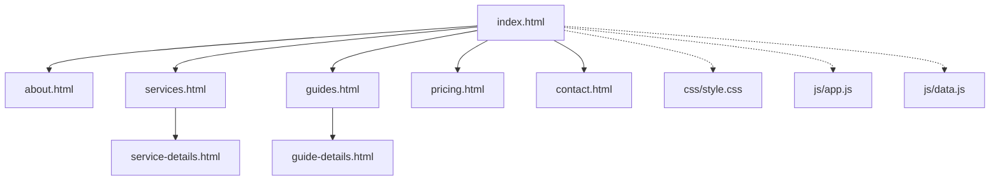
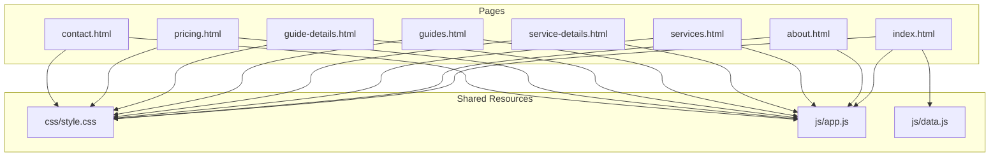
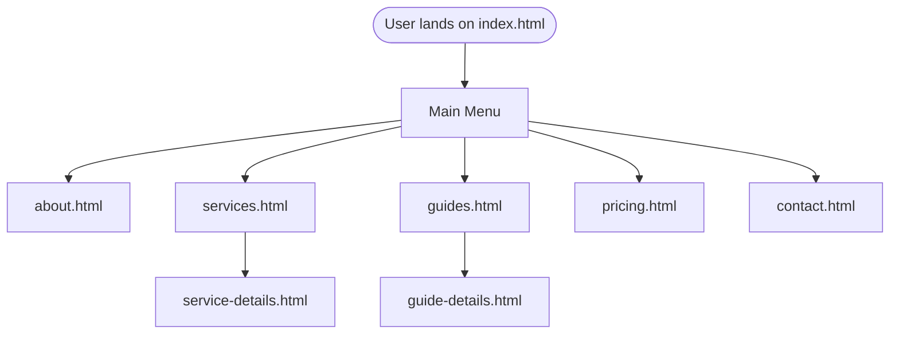
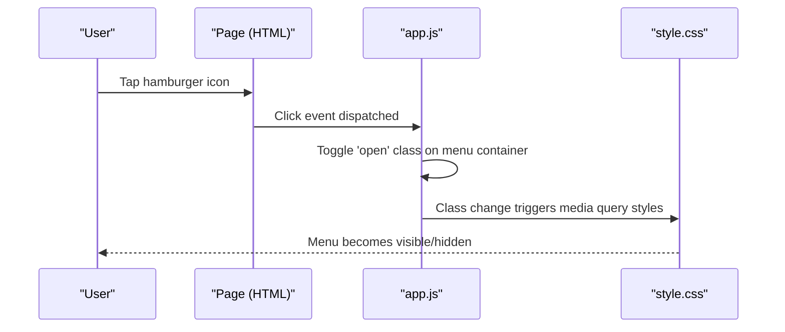
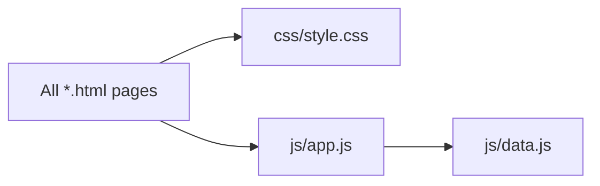

# Site Structure & Navigation

<cite>
**Referenced Files in This Document**
- [index.html](file://index.html)
- [about.html](file://about.html)
- [services.html](file://services.html)
- [service-details.html](file://service-details.html)
- [guides.html](file://guides.html)
- [guide-details.html](file://guide-details.html)
- [pricing.html](file://pricing.html)
- [contact.html](file://contact.html)
- [home2.html](file://home2.html)
- [css/style.css](file://css/style.css)
- [js/app.js](file://js/app.js)
- [js/data.js](file://js/data.js)
</cite>

## Table of Contents
1. [Introduction](#introduction)
2. [Project Structure](#project-structure)
3. [Core Components](#core-components)
4. [Architecture Overview](#architecture-overview)
5. [Detailed Component Analysis](#detailed-component-analysis)
6. [Dependency Analysis](#dependency-analysis)
7. [Performance Considerations](#performance-considerations)
8. [Troubleshooting Guide](#troubleshooting-guide)
9. [Conclusion](#conclusion)
10. [Appendices](#appendices)

## Introduction
This document explains the multi-page site structure and navigation system. The application is a static website composed of individual HTML files for each page section, with shared CSS and JavaScript resources. Navigation is implemented via hyperlinks between pages, and the site includes responsive behavior and mobile menu interactions managed by client-side scripts.

## Project Structure
The project follows a flat, feature-oriented layout:
- Root-level HTML files represent distinct pages (e.g., index.html, about.html, services.html).
- Shared styles are centralized under css/style.css.
- Shared logic resides under js/app.js and js/data.js.

**Diagram sources**
- [index.html](file://index.html)
- [about.html](file://about.html)
- [services.html](file://services.html)
- [service-details.html](file://service-details.html)
- [guides.html](file://guides.html)
- [guide-details.html](file://guide-details.html)
- [pricing.html](file://pricing.html)
- [contact.html](file://contact.html)
- [css/style.css](file://css/style.css)
- [js/app.js](file://js/app.js)
- [js/data.js](file://js/data.js)

**Section sources**
- [index.html](file://index.html)
- [css/style.css](file://css/style.css)
- [js/app.js](file://js/app.js)
- [js/data.js](file://js/data.js)

## Core Components
- Pages: Each .html file represents a standalone page with its own content and links to shared resources.
- Shared Styles: All pages reference css/style.css for consistent design and responsive rules.
- Shared Scripts: All pages include js/app.js for UI behaviors such as mobile menu toggling and other interactive features. Data-driven content or configuration may be provided by js/data.js.

Key responsibilities:
- Navigation: Hyperlinks connect pages; active states and mobile menu toggles are handled by app.js.
- Styling: style.css defines layout, typography, spacing, and responsive breakpoints.
- Interactivity: app.js manages DOM events (e.g., hamburger menu), while data.js can supply reusable data structures used across pages.

**Section sources**
- [css/style.css](file://css/style.css)
- [js/app.js](file://js/app.js)
- [js/data.js](file://js/data.js)

## Architecture Overview
The site uses a classic multi-page architecture:
- Each page is an independent HTML document.
- Routing is achieved through relative hyperlinks.
- Shared assets are loaded from css/ and js/.
- Client-side scripts provide interactivity and stateful UI behaviors like open/close menus.

**Diagram sources**
- [index.html](file://index.html)
- [about.html](file://about.html)
- [services.html](file://services.html)
- [service-details.html](file://service-details.html)
- [guides.html](file://guides.html)
- [guide-details.html](file://guide-details.html)
- [pricing.html](file://pricing.html)
- [contact.html](file://contact.html)
- [css/style.css](file://css/style.css)
- [js/app.js](file://js/app.js)
- [js/data.js](file://js/data.js)

## Detailed Component Analysis

### Navigation Hierarchy and URL Patterns
- Main Menu: Present on most pages, linking to top-level sections such as Home, About, Services, Guides, Pricing, and Contact.
- Subpages: Service details and guide details are nested under their respective list pages.
- URL Patterns:
  - Top-level pages use root filenames (e.g., /about.html, /services.html).
  - Detail pages follow a pattern like /service-details.html and /guide-details.html, typically linked from their parent list pages.

Navigation flow example:
- From the main menu, users navigate to services.html, then select a service to reach service-details.html.
- Similarly, guides.html leads to guide-details.html.

**Diagram sources**
- [index.html](file://index.html)
- [about.html](file://about.html)
- [services.html](file://services.html)
- [service-details.html](file://service-details.html)
- [guides.html](file://guides.html)
- [guide-details.html](file://guide-details.html)
- [pricing.html](file://pricing.html)
- [contact.html](file://contact.html)

**Section sources**
- [index.html](file://index.html)
- [services.html](file://services.html)
- [service-details.html](file://service-details.html)
- [guides.html](file://guides.html)
- [guide-details.html](file://guide-details.html)
- [pricing.html](file://pricing.html)
- [contact.html](file://contact.html)

### Responsive Navigation and Mobile Menu Behavior
- The mobile menu is typically triggered by a toggle button (e.g., hamburger icon).
- app.js listens for click events on the toggle and adds/removes classes to show/hide the menu overlay.
- style.css contains media queries that adjust layout and menu presentation at different viewport widths.

Mobile menu interaction sequence:

**Diagram sources**
- [js/app.js](file://js/app.js)
- [css/style.css](file://css/style.css)

**Section sources**
- [js/app.js](file://js/app.js)
- [css/style.css](file://css/style.css)

### Cross-Browser Compatibility
- Use standard HTML5 elements and widely supported CSS features.
- Ensure event listeners and DOM APIs used in app.js are compatible with target browsers.
- Test responsive breakpoints across devices and browsers.

[No sources needed since this section provides general guidance]

### Adding a New Page
To add a new page consistently:
- Create a new HTML file (e.g., newpage.html) in the repository root.
- Include the same head references to css/style.css and js/app.js as existing pages.
- Add a link to the new page in the main menu of all pages where it should appear.
- If the page requires specific content, consider whether data.js should host reusable data.

Steps:
1. Copy the common <head> block from an existing page into the new file.
2. Link css/style.css and js/app.js in the new file’s <head>.
3. Update the main menu in relevant pages to include a hyperlink to newpage.html.
4. Implement any page-specific markup and ensure accessibility attributes (e.g., aria-labels) are present.

**Section sources**
- [index.html](file://index.html)
- [css/style.css](file://css/style.css)
- [js/app.js](file://js/app.js)

### Modifying Navigation Links
- Locate the navigation block in each page’s HTML.
- Update href values to point to the correct relative paths.
- Maintain consistent label text across pages for the same destination.
- For active states, apply appropriate classes if required by style.css.

**Section sources**
- [index.html](file://index.html)
- [about.html](file://about.html)
- [services.html](file://services.html)
- [guides.html](file://guides.html)
- [pricing.html](file://pricing.html)
- [contact.html](file://contact.html)

### Maintaining Consistent Design
- Centralize global styles in css/style.css to avoid duplication.
- Reuse component patterns (headers, footers, cards) across pages.
- Keep naming conventions consistent for classes and IDs.
- Validate color contrast and typography scales across all pages.

**Section sources**
- [css/style.css](file://css/style.css)

### SEO Considerations for Multi-Page Sites
- Provide unique, descriptive <title> tags per page.
- Use semantic headings (h1–h6) in logical order.
- Add meaningful meta descriptions and canonical URLs where applicable.
- Use descriptive anchor text for internal links.
- Ensure images have alt attributes and structured data is included when relevant.

[No sources needed since this section provides general guidance]

### Performance Optimization Techniques for Static Websites
- Minify CSS and JS files before deployment.
- Enable browser caching via HTTP headers or hosting configuration.
- Optimize images (compress, use modern formats, specify dimensions).
- Defer non-critical scripts and load only what is necessary.
- Leverage CDN delivery for static assets if available.

[No sources needed since this section provides general guidance]

## Dependency Analysis
Each page depends on shared resources:
- css/style.css: Global styles and responsive rules.
- js/app.js: Interactive behaviors (menu toggling, etc.).
- js/data.js: Optional data structures or configurations used by app.js or page scripts.

**Diagram sources**
- [index.html](file://index.html)
- [css/style.css](file://css/style.css)
- [js/app.js](file://js/app.js)
- [js/data.js](file://js/data.js)

**Section sources**
- [index.html](file://index.html)
- [css/style.css](file://css/style.css)
- [js/app.js](file://js/app.js)
- [js/data.js](file://js/data.js)

## Performance Considerations
- Prefer minimal DOM manipulation in app.js to reduce reflows and repaints.
- Avoid heavy synchronous operations during page load.
- Use efficient selectors and cache DOM references when needed.
- Monitor network requests and bundle sizes to keep initial load fast.

[No sources needed since this section provides general guidance]

## Troubleshooting Guide
Common issues and resolutions:
- Mobile menu not opening/closing:
  - Verify event listeners are attached after DOM ready.
  - Check that the toggle element ID/class matches app.js expectations.
  - Inspect console for JavaScript errors.
- Styles not applying:
  - Confirm css/style.css path is correct in each page’s <head>.
  - Clear browser cache and hard refresh.
- Broken navigation links:
  - Ensure href paths are correct relative to the current page.
  - Validate that target files exist and are accessible.

**Section sources**
- [js/app.js](file://js/app.js)
- [css/style.css](file://css/style.css)
- [index.html](file://index.html)

## Conclusion
This multi-page site leverages a simple, maintainable architecture: individual HTML pages share common styles and scripts, with navigation driven by hyperlinks. Responsive behavior and mobile interactions are implemented via app.js and style.css. By following the guidelines for adding pages, updating navigation, and optimizing performance, you can scale the site while preserving consistency and usability.

## Appendices

### Quick Reference: Page-to-Resource Mapping
- All pages link to:
  - css/style.css
  - js/app.js
  - js/data.js (if used)

**Section sources**
- [index.html](file://index.html)
- [css/style.css](file://css/style.css)
- [js/app.js](file://js/app.js)
- [js/data.js](file://js/data.js)