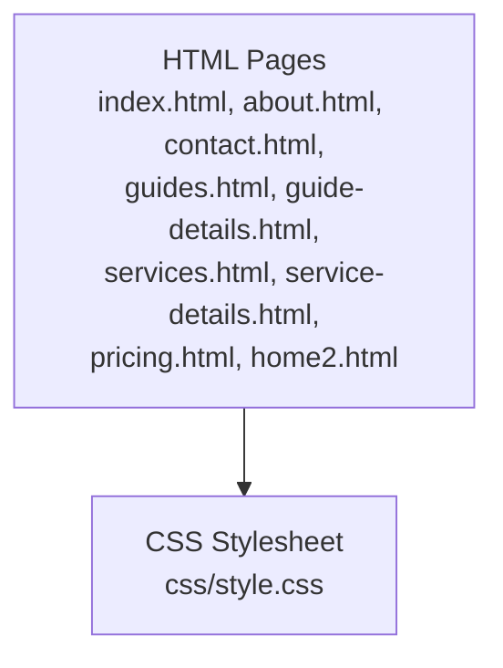
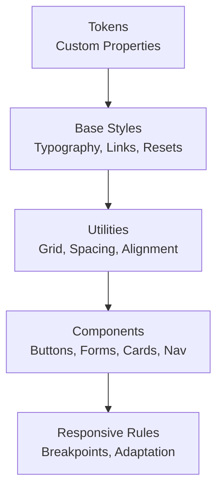
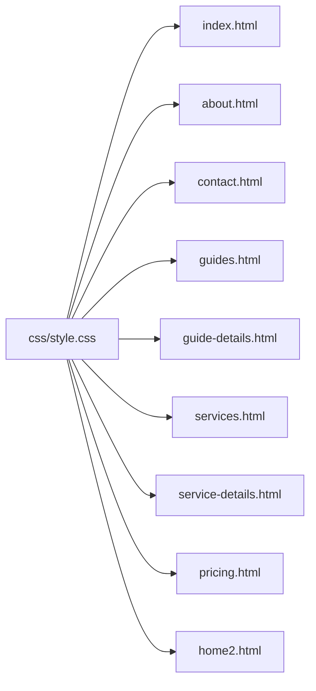

# Styling & Design System

<cite>
**Referenced Files in This Document**
- [style.css](file://css/style.css)
- [index.html](file://index.html)
- [about.html](file://about.html)
- [contact.html](file://contact.html)
- [guide-details.html](file://guide-details.html)
- [guides.html](file://guides.html)
- [home2.html](file://home2.html)
- [pricing.html](file://pricing.html)
- [service-details.html](file://service-details.html)
- [services.html](file://services.html)
</cite>

## Table of Contents
1. [Introduction](#introduction)
2. [Project Structure](#project-structure)
3. [Core Components](#core-components)
4. [Architecture Overview](#architecture-overview)
5. [Detailed Component Analysis](#detailed-component-analysis)
6. [Dependency Analysis](#dependency-analysis)
7. [Performance Considerations](#performance-considerations)
8. [Troubleshooting Guide](#troubleshooting-guide)
9. [Conclusion](#conclusion)
10. [Appendices](#appendices)

## Introduction
This document describes the styling and design system for the project, focusing on how styles are organized, how visual tokens are applied, and how responsive behavior is implemented across pages. It provides practical guidance for maintaining consistency, adding new styles, and creating reusable components while ensuring cross-browser compatibility and performance.

## Project Structure
The project uses a single global stylesheet referenced by HTML pages. The structure is minimal:
- css/style.css: Centralized stylesheet containing all design tokens, base styles, layout utilities, and component styles.
- HTML pages: Each page includes the stylesheet and composes UI elements using shared classes.

**Diagram sources**
- [index.html](file://index.html)
- [about.html](file://about.html)
- [contact.html](file://contact.html)
- [guides.html](file://guides.html)
- [guide-details.html](file://guide-details.html)
- [services.html](file://services.html)
- [service-details.html](file://service-details.html)
- [pricing.html](file://pricing.html)
- [home2.html](file://home2.html)
- [style.css](file://css/style.css)

**Section sources**
- [style.css](file://css/style.css)
- [index.html](file://index.html)

## Core Components
This section outlines the key building blocks defined in the stylesheet and used across pages.

- CSS Custom Properties (Design Tokens)
  - Colors: semantic tokens for primary, secondary, text, background, border, and state colors.
  - Typography: tokens for font families, sizes, weights, line-heights, and letter-spacing.
  - Spacing: tokens for margins, paddings, gaps, and container widths.
  - Borders and Shadows: tokens for radius, stroke width, and elevation levels.
  - Transitions: tokens for duration and easing to ensure consistent motion.

- Base and Reset
  - Box-sizing normalization.
  - Global typography defaults and link styles.
  - Consistent baseline rhythm via spacing tokens.

- Layout Utilities
  - Container and grid utilities based on CSS Grid/Flexbox.
  - Spacing helpers for margin and padding.
  - Utility classes for alignment, visibility, and overflow control.

- Component Styles
  - Buttons: variants for primary, secondary, outline, and disabled states with focus and hover behaviors.
  - Forms: inputs, selects, textareas, labels, checkboxes/radios, and validation feedback.
  - Cards: header/body/footer sections, image containers, badges, and action areas.
  - Navigation: top nav, links, active states, and mobile menu toggles.
  - Content Blocks: headings hierarchy, paragraphs, lists, tables, and media objects.

- Responsive Behavior
  - Mobile-first approach with progressive enhancement at larger breakpoints.
  - Breakpoints for small, medium, large, and extra-large screens.
  - Adaptive layouts for grids, navigation, and content density.

**Section sources**
- [style.css](file://css/style.css)

## Architecture Overview
The design system follows a token-driven architecture:
- Tokens (custom properties) define the visual language.
- Base styles apply tokens globally.
- Utilities compose tokens for common tasks.
- Components encapsulate reusable patterns.
- Media queries adapt layouts per breakpoint.

[No sources needed since this diagram shows conceptual workflow, not actual code structure]

## Detailed Component Analysis

### Color Palette and Visual Tokens
- Semantic color tokens provide a consistent palette across components.
- State colors support success, warning, error, and info contexts.
- Contrast guidelines ensure accessibility for text and interactive elements.

Guidelines:
- Prefer semantic tokens over hard-coded values.
- Extend the palette by adding new tokens rather than overriding existing ones.

**Section sources**
- [style.css](file://css/style.css)

### Typography System
- Font stack tokens define primary and fallback fonts.
- Type scale tokens standardize heading and body sizes.
- Line-height and letter-spacing tokens improve readability.
- Heading hierarchy maps to semantic HTML tags.

Guidelines:
- Use type scale tokens for consistent sizing.
- Maintain adequate contrast and line length for readability.

**Section sources**
- [style.css](file://css/style.css)

### Spacing Conventions
- Spacing tokens follow a modular scale for margins, paddings, and gaps.
- Utilities expose shorthand classes for quick composition.
- Consistent vertical rhythm improves scanning and flow.

Guidelines:
- Compose spacing from tokens; avoid arbitrary pixel values.
- Keep horizontal and vertical spacing harmonious.

**Section sources**
- [style.css](file://css/style.css)

### Button Styles
- Variants include primary, secondary, outline, ghost, and disabled.
- States cover hover, focus, active, and disabled.
- Sizes align with type scale tokens.

Guidelines:
- Use semantic tokens for colors and transitions.
- Ensure keyboard accessibility and visible focus indicators.

**Section sources**
- [style.css](file://css/style.css)

### Form Elements
- Inputs, selects, textareas, labels, and helper text share consistent spacing and typography.
- Validation states use semantic color tokens.
- Focus rings meet accessibility requirements.

Guidelines:
- Associate labels explicitly with inputs.
- Provide clear error messaging and recovery paths.

**Section sources**
- [style.css](file://css/style.css)

### Card Components
- Structure includes header, body, footer, and optional image area.
- Elevation and borders use token-based shadows and strokes.
- Action areas align with button tokens.

Guidelines:
- Keep card content scannable with clear hierarchy.
- Use consistent padding and gap tokens.

**Section sources**
- [style.css](file://css/style.css)

### Grid Systems and Layout Utilities
- Container widths constrain content at various breakpoints.
- Grid utilities create flexible column layouts.
- Flex utilities handle alignment and distribution.

Guidelines:
- Prefer utility composition over custom overrides.
- Test layouts at multiple breakpoints.

**Section sources**
- [style.css](file://css/style.css)

### Responsive Design Implementation
- Mobile-first strategy applies base styles first, then enhances at larger screens.
- Breakpoints are defined as tokens for consistency.
- Adaptive patterns adjust navigation, grids, and content density.

Guidelines:
- Start with single-column layouts and progressively add columns.
- Use relative units and fluid typography where appropriate.

**Section sources**
- [style.css](file://css/style.css)

### Cross-Browser Compatibility
- Normalize box model and default styles.
- Use vendor prefixes only when necessary.
- Validate CSS against modern standards and test across browsers.

Guidelines:
- Prefer widely supported features.
- Provide graceful degradation for advanced effects.

**Section sources**
- [style.css](file://css/style.css)

## Dependency Analysis
Styles are centralized in one stylesheet and consumed by all HTML pages. There are no additional CSS frameworks or libraries referenced.

**Diagram sources**
- [style.css](file://css/style.css)
- [index.html](file://index.html)
- [about.html](file://about.html)
- [contact.html](file://contact.html)
- [guides.html](file://guides.html)
- [guide-details.html](file://guide-details.html)
- [services.html](file://services.html)
- [service-details.html](file://service-details.html)
- [pricing.html](file://pricing.html)
- [home2.html](file://home2.html)

**Section sources**
- [style.css](file://css/style.css)
- [index.html](file://index.html)

## Performance Considerations
- Minify and compress CSS for production delivery.
- Leverage browser caching with cache headers.
- Avoid overly specific selectors to reduce reflow cost.
- Use efficient layout properties (flex/grid) and minimize expensive effects.
- Defer non-critical styles if necessary.

[No sources needed since this section provides general guidance]

## Troubleshooting Guide
Common issues and resolutions:
- Styles not applying: verify stylesheet path and link order.
- Inconsistent spacing: ensure tokens are used consistently and no overrides exist.
- Broken layouts at certain widths: check breakpoint definitions and container constraints.
- Accessibility problems: confirm focus indicators, contrast ratios, and label associations.

**Section sources**
- [style.css](file://css/style.css)

## Conclusion
The design system centers on a token-driven approach with a single stylesheet powering all pages. By adhering to the established tokens, utilities, and component patterns, teams can maintain visual consistency, simplify maintenance, and deliver performant, accessible experiences across devices.

[No sources needed since this section summarizes without analyzing specific files]

## Appendices

### Guidelines for Adding New Styles
- Define new tokens under the appropriate category before using them in components.
- Create utility classes for reusable patterns instead of ad-hoc rules.
- Follow naming conventions and keep specificity low.
- Test changes across breakpoints and devices.

**Section sources**
- [style.css](file://css/style.css)

### Creating Reusable Components
- Encapsulate markup and class names within components.
- Compose components from tokens and utilities.
- Document props/variants and usage examples.
- Ensure keyboard and screen reader accessibility.

**Section sources**
- [style.css](file://css/style.css)

### Examples of Common Styling Tasks
- Changing colors: update semantic tokens and verify contrast.
- Adjusting fonts: modify type tokens and review hierarchy.
- Tweaking layouts: use grid/flex utilities and container widths.
- Adding a new variant: extend tokens and component styles following existing patterns.

**Section sources**
- [style.css](file://css/style.css)